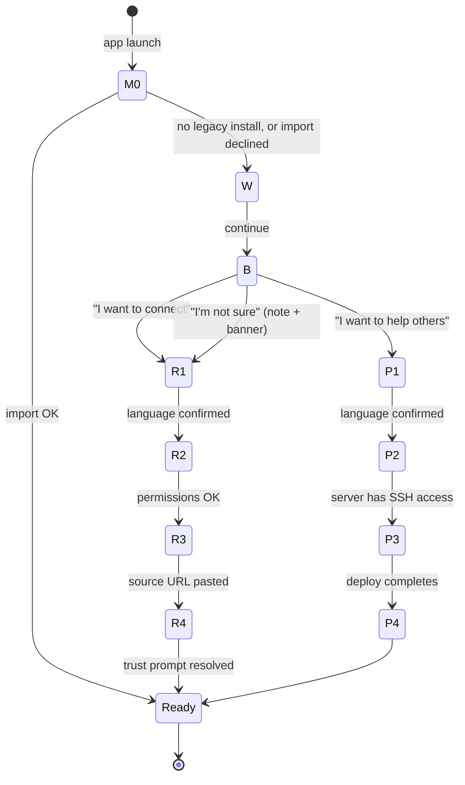

# Onboarding state machine v1 (D-2 §5B)

This document is the language-neutral specification of the Daal
first-run flow. Each platform (Tauri/React, Compose, SwiftUI)
implements the state machine using its own router idiom but follows
the screen names, transitions, and persistence rules defined here.

## Goals

1. A new user can finish onboarding in ≤ 90 s and either Connect or
   know exactly what to do next.
2. **Recipient** users (just want to connect) are visually weighted
   as the default at the branch.
3. **Publisher** users (diaspora helpers running a VPS) have a real,
   named onboarding lane.
4. Migration from the legacy private-codename install (M0) short-
   circuits the rest of onboarding when an existing install is
   detected on the platform-specific data path.
5. Deep links (`daal://...`) clicked while onboarding is in progress
   are buffered, not lost.

## States

### State definitions

| State | Title | Purpose |
|---|---|---|
| `M0` | Migration check | Detect legacy install on the platform data path. If found, prompt to import; success → `Ready` with banner "Imported N routes / M sources from previous Daal install". Fail or decline → fall through to `W`. |
| `W` | Welcome | Brand splash + one-line tagline + Continue button. |
| `B` | Branch ("Who are you?") | Two named lanes (recipient / publisher) and a tertiary "I'm not sure". Recipient is visually primary (gold-warm dot, larger card, top position in LTR / start-position in RTL). |
| `R1` | Recipient · language | Detect OS language; offer EN / FA toggle. RTL flips body when FA. |
| `R2` | Recipient · permissions | One-screen explainer per platform: VPN / Notifications / Local network. User taps Continue → OS permission prompts in sequence. |
| `R3` | Recipient · add source | Paste a `daal://sub/...` URL or paste a `.sbp`-like text blob. Decline-and-skip → goes to Ready with empty Sources. |
| `R4` | Recipient · trust prompt | Standard trust modal with EN+FA word grid. Three explicit choices (Trust / Once / Cancel). |
| `P1` | Publisher · language | Same as R1. |
| `P2` | Publisher · server access | Explainer for the FRP-5 wizard prerequisites (VPS, SSH key, ~€5/month, ~10 minutes). |
| `P3` | Publisher · run wizard | Hands off to the existing 7-screen FRP-5 wizard. |
| `P4` | Publisher · handoff | Shows QR + PIN + 6-word fingerprint grid (publisher's own key, EN + FA) for read-aloud. |
| `Ready` | Done | Marks `onboarding.completed = true` in platform-side preferences. Routes the user to the Connection section, with a one-time "Welcome back" or "All set" toast for first-runs. |

## Transition rules

- The branch screen treats "I'm not sure" as `R1` with a small
  banner explaining how to switch later (Settings → Advanced → "I am
  a publisher").
- Any screen except `Ready` can be backed out of (back arrow / OS
  back / Esc on desktop). `M0` → back is a no-op (returns to the
  same prompt).
- Deep-link arrivals during onboarding (any state except `Ready`)
  are **buffered** in a hold buffer. On reaching `Ready`, the buffer
  is consumed; the user lands on the deep-link target with a small
  "Resumed from link" breadcrumb at the top.

## Persistence

- Persistence is platform-side, not engine-side. The engine does not
  own UI state.
- Keys (in platform preferences, namespaced):
  - `onboarding.completed` — boolean.
  - `onboarding.lane` — `"recipient" | "publisher" | "unsure"`.
  - `onboarding.deep_link_buffer` — optional URL waiting on
    `Ready`.
- Setting `completed = true` happens at `Ready` and after a
  successful M0 import.

## Time-to-first-connect target

- ≤ 90 s clean-install → `Connected` on the recipient path with one
  well-formed test Source URL pasted.
- CI 90-second test (D-2 §9.2) drives the state machine through the
  recipient lane on a stubbed Source and fails the build if the
  total exceeds 90 s on the reference VM.

## Per-platform mapping

| Platform | Renderer |
|---|---|
| Tauri / React | `client-desktop/tauri/src/onboarding/Onboarding.tsx` (router stack rendered before the main app on first run). |
| Android Compose | `client-android/app/src/main/java/ai/daal/app/ui/onboarding/OnboardingNavHost.kt` (NavHost rendered before the main NavHost on first launch). |
| iOS SwiftUI | `client-ios/DaalApp/Sources/Onboarding/OnboardingStack.swift` (full-screen `NavigationStack` preceding the `TabView`). |

Each renderer exposes a single `OnboardingComplete` callback wired
to the host so the host can swap to the main UI without the
state-machine library knowing about hosts.

## i18n keys

Reserved namespace: `onboarding.*`. Examples:

| Key | English |
|---|---|
| `onboarding.welcome.title` | Welcome to Daal |
| `onboarding.welcome.body` | Internet routes that re-find you when networks change. |
| `onboarding.branch.title` | Who are you? |
| `onboarding.branch.recipient` | I want to connect |
| `onboarding.branch.publisher` | I want to help others |
| `onboarding.branch.unsure` | I'm not sure yet |
| `onboarding.r3.paste_label` | Paste a Daal source URL |
| `onboarding.p3.start_wizard` | Open the publisher wizard |
| `onboarding.ready.title` | You're all set |

Full catalog lives in `client-shared/i18n/en.json` and `fa.json`
once the localization sweep (D-2 §5G) is complete.

## Open / parked items

- Apple-specific copy adjustments to clear App Store review (e.g.
  the "may not be available in all regions" disclaimer) is parked
  for D-3 / store submission.
- Deep-link buffer length is bounded to 1; later arrivals overwrite
  the buffer with no warning. (Acceptable: the user only presses one
  Daal link at a time during a 90-second onboarding.)
