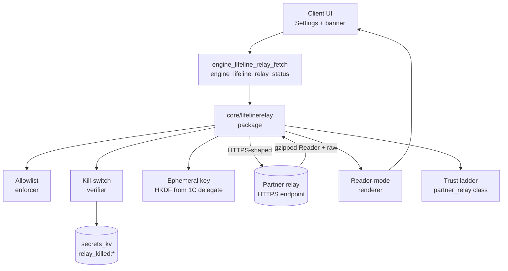
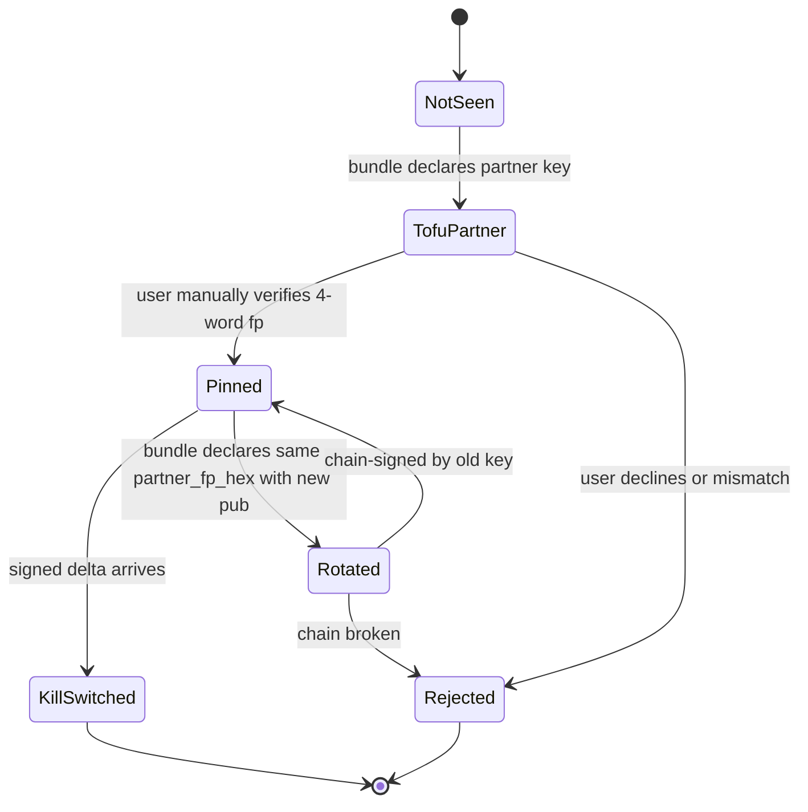
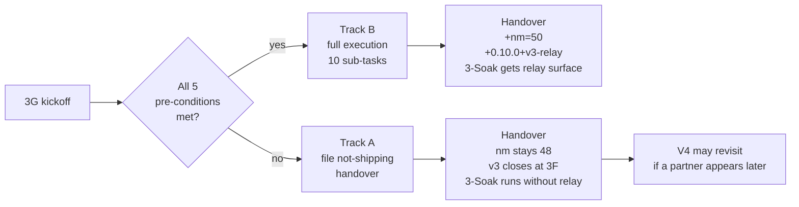

# Phase 3G — Optional Partner-Operated Lifeline Relay

**Status (current cycle):** LOCKED spec; **Mixed-track shipping** —
the spec below is implementation-ready, but actual code execution is
gated on the five hard pre-conditions in §3. The current cycle delivers
ONLY the not-shipping handover (`26-phase-3g-lifeline-relay.handover.md`).
**Roadmap line:** V3.7 — "Optional partner-operated lifeline relay
(only if a partner is ready)."
**Engine version (pre-execution):** `daal-core 0.9.0+v3-share` (unchanged).
**Engine version (Track B execution):** `daal-core 0.10.0+v3-relay`.
**ABI release surface (pre-execution):** **48** (unchanged from 3F).
**ABI release surface (Track B execution):** **48 → 50** (+2 release
symbols; append-only invariant preserved).

## 1 Strategic frame (verbatim from the roadmap)

> "Hard constraints (any single one not met = relay does not ship)…
> Operated by a partner, not the project. Default off. Disabled for
> the high-risk user class. Public-content only. No accounts.
> Permanent operator-visibility banner in the UI. No relay-side
> logging beyond rate limits and abuse counters. Strip + compress.
> Documented kill-switch."

3G is a **client integration** to a **partner-operated** server. The
project never operates a relay. The relay is narrow, opt-in,
public-content-only, and hard-disabled for the high-risk user class.
Lifeline *mode* (V2.5) continues to provide local-only value
regardless of whether 3G ships.

## 2 Locked decisions (16 invariants for 3G)

1. **Mixed-track shipping.** Write and lock the full implementation
   spec; deliver only the not-shipping handover today. Engine version
   stays `0.9.0+v3-share` and release surface stays 48 until/unless
   the five hard pre-conditions in §3 all flip true.
2. **No project-operated relay.** Hard NO at every version;
   documented in the MOU template and in `specs/lifeline-relay-v1.md`.
3. **ABI append-only, +2 symbols at execution-time only.** Surface
   48 → 50 (`engine_lifeline_relay_fetch`,
   `engine_lifeline_relay_status`). Until executed, surface stays 48.
4. **Default off.** User opts in via a Settings toggle that surfaces
   the operator-visibility banner first.
5. **Hard-disabled for high-risk user class.** Detected at engine
   init; `engine_lifeline_relay_fetch` returns
   `relay_disabled_for_high_risk` regardless of any toggle. Not
   togglable.
6. **Permanent operator-visibility banner.** Present every time the
   relay is in use; not dismissable; locked en/fa copy in
   `specs/lifeline-relay-v1.md`.
7. **Public-content allowlist enforced client-side AND server-side.**
   Defence in depth.
8. **No cookies, no auth headers, no accounts.** Each request uses a
   fresh ephemeral key.
9. **Per-session ephemeral keys derived from the existing 1C/3F
   delegate key.** HKDF over the delegate private key plus a
   per-session 32-byte random nonce. NO new long-term key custody at
   3G.
10. **Hybrid trust ladder (locked answer 2C).** Partner key is
    declared in the bundle's `lifeline_relays[]` entry; the user MUST
    manually verify the partner's 4-word fingerprint (TOFU prompt on
    first relay use); the partner key is then pinned and promoted to
    a NEW `partner_relay` trust class. Never silent. Mirrors 1C's
    TOFU-then-pin discipline; `partner_relay` never auto-promotes
    from `tofu_friend`.
11. **Render path: both (locked answer 3C).** Partner ships gzipped
    Reader-mode AND raw HTML on every successful fetch; client
    chooses based on the user's `relay_render_preference` setting
    (`reader` default, `raw` advanced). Doubles the audit surface but
    maximises user agency over the trade-off.
12. **Kill-switch reuses 3E's signed-delta pattern.** No new
    publisher key; the existing WASM kill-switch publisher key (CC.4
    hardware-token) signs `(partner_fp_hex, generation,
    relay_killed_bool)` deltas. Persisted under
    `secrets_kv:relay_killed:<partner_fp_hex>`; monotonic generation
    watermark in `secrets_kv:relay_killed:_generation`. Append-only
    within a generation.
13. **No new V0 failure categories.** Relay errors map onto existing
    `bundle_signature_invalid` (partner key untrusted),
    `route_unreachable` (relay endpoint unreachable / timeout), and a
    new cosmetic surface `relay_url_not_allowed` mapped onto
    `route_unreachable`. The closed Outcome enum (12 values, see §6)
    is observable via diagnostics, NOT a new V0 failure category.
14. **Soft-validation discipline preserved.** A bad
    `lifeline_relays[]` entry rejects only that entry; the rest of
    the bundle parses.
15. **`UpsertRoute` non-clobber preserved.** TOFU pins for partner
    keys live in the standard `publishers` row pinning path; relay
    state lives in `secrets_kv:relay_*` namespaces, NEVER on the
    route row.
16. **Position B (no telemetry) preserved.** No relay-usage stats
    leave the device. `last_relay_outcome` is local-only;
    `relay_killed_count` is local-only.

## 3 Pre-conditions for execution (any one missing → Track A)

| # | Pre-condition | Verification |
|---|---|---|
| 1 | Partner identified | Signed MOU on file (project-side) |
| 2 | Partner accepts liability | MOU clause cited verbatim in `specs/lifeline-relay-v1.md` |
| 3 | External audit complete | Audit report URL referenced from `client-desktop/docs/lifeline-relay-audit-summary.md` |
| 4 | Threat model document published | `specs/lifeline-relay-threat-model-v1.md` exists and is reviewed |
| 5 | Kill-switch tested in lab | Soak scenario `relay-kill-switch.json` PASSES the canonical regression `signed_delta_disables_partner` |

If ANY of the five is unmet → execute Track A (not-shipping).
Otherwise → Track B (full execution).

**Today's status: ALL FIVE pre-conditions are unmet.** Track A is
filed in `26-phase-3g-lifeline-relay.handover.md`.

## 4 Architecture (Track B)



## 5 Sub-task breakdown (12 sub-tasks)

| #  | Task | Track A | Track B |
|----|------|---------|---------|
| 0  | Lock spec | DONE | DONE |
| 1  | Verify the 5 pre-conditions | document the unmet ones | required (all met) |
| 2  | `core/lifelinerelay/` package: client, allowlist, ephemeral keys, render-mode selector, kill-switch verifier; +`-tags no_lifeline_relay` excluder | — | required; ≥12 unit tests |
| 3  | Bundle parser: `lifeline_relays[]` top-level + `routes[].relay_eligibility` + 5 new errors + `partner_relay` trust class | — | required; ~6 v3g tests |
| 4  | Routestore: 1 ALTER (`relay_eligibility` TEXT default `''`); new `secrets_kv:relay_killed:*` and `secrets_kv:relay_partner_pinned:*` namespaces; non-clobber test | — | required |
| 5  | ABI: 2 release symbols (`engine_lifeline_relay_fetch`, `engine_lifeline_relay_status`), 4 new diagnostics fields, version 0.9.0 → 0.10.0; build-tag pair `lifeline_relay_compiled.go` / `lifeline_relay_compiled_excluded.go` | — | required |
| 6  | Publisher CLI: `daal-publish relay-bundle` subcommand to mint partner-relay declarations | — | required |
| 7  | Engine: trust UI hooks for `partner_relay` class; TOFU prompt routing | — | required |
| 8  | UI specs (en + fa): toggle + banner copy + render-mode preference + chain-of-trust modal | — | required |
| 9  | Soak: 4 scenarios + v2-superset 26 → 30; in-engine RPC dispatchers | — | required |
| 10 | Specs: 2 NEW + 4 AMENDED | partial (2 NEW marked "deferred") | required |
| 11 | Handover doc; if Track A: name the unmet pre-condition; if Track B: nm count = 50 | required | required |

## 6 ABI additions (Track B only)

```c
// Release symbol 49 (when 3G ships)
const char* engine_lifeline_relay_fetch(
    const char* url,
    const char* render_preference  // "reader" | "raw"
);
//   Returns: gzipped HTML bytes (Reader-mode or raw per preference)
//            on success, or a JSON error envelope on failure:
//   {"error":"relay_disabled_for_high_risk"
//          |"relay_killed_for_partner"
//          |"relay_url_not_allowed"
//          |"relay_unreachable"
//          |"relay_partner_not_trusted"
//          |"relay_partner_signature_invalid"
//          |"relay_compiled_out"
//          |"relay_render_mode_invalid", "detail":"..."}
//   Empty / `relay_compiled_out` envelope under
//   -tags no_lifeline_relay.

// Release symbol 50 (when 3G ships)
const char* engine_lifeline_relay_status();
//   Returns JSON: {
//     "compiled_in": bool,
//     "active_partner_fp_hex": string,
//     "active_partner_words_en": string,
//     "active_partner_words_fa": string,
//     "allowlist_version": string,
//     "kill_switched_partners": [fp_hex, ...],
//     "high_risk_disabled": bool,
//     "render_preference": "reader" | "raw",
//     "last_outcome": string  // closed enum, see below
//   }
```

**Closed Outcome enum (locked):**
`ok` / `relay_disabled_for_high_risk` / `relay_killed_for_partner` /
`relay_url_not_allowed` / `relay_unreachable` /
`relay_partner_not_trusted` / `relay_partner_signature_invalid` /
`relay_compiled_out` / `relay_render_mode_invalid` /
`relay_partner_pin_changed` / `relay_session_expired` / `""` (initial).
12 values total.

**Diagnostics widen with 4 always-present fields:**

| Field | Type | Default | Notes |
|---|---|---|---|
| `lifeline_relay_compiled_in` | bool | `true` (default build); `false` under `-tags no_lifeline_relay` | mirrors 3D / 3E / 3F shape |
| `lifeline_relay_high_risk_disabled` | bool | `false`; `true` if user class is high-risk | hard-coded at init |
| `lifeline_relay_killed_partners_count` | int | `0` | count of partners with active kill-switch deltas |
| `last_lifeline_relay_outcome` | string | `""` | closed Outcome enum |

## 7 Bundle-format widening (additive; SBP-v1)

**New top-level entry: `lifeline_relays[]`.**

```jsonc
"lifeline_relays": [{
  "partner_name":         "ExamplePartner",
  "partner_fp_hex":       "<64-hex>",
  "partner_pub_b64":      "<base64 ed25519 32-byte pubkey>",
  "endpoint_url":         "https://relay.example.org/v1/fetch",
  "allowlist_version":    "v1",
  "allowlist_url_patterns": [
    "https://*.wikipedia.org/*",
    "https://news.bbc.co.uk/*"
  ],
  "supports_render_modes": ["reader", "raw"],
  "valid_until":          "<RFC3339>",
  "operator_banner_en":   "Lifeline relay operated by ExamplePartner; can see what public pages you request.",
  "operator_banner_fa":   "<persian copy>"
}]
```

**`routes[]` widening (1 new optional field):**

```jsonc
"routes": [{
  "id": "...",
  "transport_family": "...",
  "relay_eligibility": "none" | "via=<partner_fp_hex>"
}]
```

**5 new bundle parse errors:**

- `ErrLifelineRelayPartnerKeyInvalid`
- `ErrLifelineRelayEndpointInvalid`
- `ErrLifelineRelayAllowlistMalformed`
- `ErrLifelineRelayEligibilityMalformed`
- `ErrLifelineRelayBannerMissing` (en + fa both required)

## 8 Trust ladder additions (locked answer 2C — Hybrid)



- New trust class: `partner_relay`. Never silent-promoted; never
  auto-promoted from `tofu_friend`.
- Partner key chain-rotation discipline: a partner key MAY be rotated
  only if the new bundle's `lifeline_relays[]` entry carries a chain
  signature from the old key (mirrors publisher-key rotation in 1.5A).
- `engine_resolve_trust_prompt` reused — no new trust-resolution ABI.

## 9 Render-path discipline (locked answer 3C — Both)

The partner ALWAYS returns:

1. `reader_html_gzipped`: Reader-mode HTML, gzipped (default user
   surface).
2. `raw_html_gzipped`: raw HTML, gzipped (advanced user surface).

The client chooses per the user's `relay_render_preference` setting;
the unchosen body is discarded immediately. Audit-trail observation:
the partner sees only that the user requested URL X — not which
render mode they consumed.

**Audit-surface implication:** the partner is contracted to do BOTH
transformations on every fetch. The 3G external audit covers both
code paths. Daal's client-side audit surface is the gzip decoder
plus the OS scheme handler dispatch; everything else is rendered into
the system browser.

## 10 Soak coverage (locked answer 4C — 4 scenarios)

**`relay-allowlist-enforced.json`** (~14 days): driver requests 100
URLs, 50 on-allowlist + 50 off-allowlist; asserts the 50 off-allowlist
requests are refused **client-side** without contacting the partner;
asserts diagnostics surface
`last_lifeline_relay_outcome=relay_url_not_allowed`.

**`relay-high-risk-disabled.json`** (~14 days): sets the high-risk
user-class flag at init; asserts the relay is hard-disabled regardless
of toggle state; asserts `engine_lifeline_relay_fetch` returns
`relay_disabled_for_high_risk`; asserts
`engine_lifeline_relay_status.high_risk_disabled=true`; asserts the
canonical regression `high_risk_class_never_consults_partner`.

**`relay-kill-switch.json`** (~14 days): kill-switch publisher key
(the same 3E key) signs and pushes a `(partner_fp_hex, generation,
relay_killed=true)` delta; engine refuses to use the relay on next
attempt; asserts
`last_lifeline_relay_outcome=relay_killed_for_partner`; asserts
persistence across session reset via
`secrets_kv:relay_killed:<partner_fp_hex>`; asserts the canonical
regression `signed_delta_disables_partner`.

**`relay-partner-key-rotation.json`** (~14 days, NEW per locked
answer 4C): the bundle declares a rotated partner key chain-signed by
the old key; engine accepts the rotation transparently; asserts
`engine_lifeline_relay_status.active_partner_fp_hex` updates; asserts
a rotation chain WITHOUT a valid old-key signature is rejected with
`relay_partner_pin_changed`; asserts the canonical regression
`chain_signed_partner_rotation_terminates_in_pinned_key`.

`--scenarios v2-superset` widens **26 → 30** if 3G ships; stays at
**26** if Track A.

## 11 Spec deliverables

**2 NEW (Track A delivers stubs marked "deferred"; Track B fills
them in):**

- `specs/lifeline-relay-v1.md` — protocol, partner responsibilities,
  allowlist format, kill-switch integration, render-mode contract,
  audit summary cross-reference.
- `specs/lifeline-relay-threat-model-v1.md` — published separately;
  covers partner-side privacy + abuse handling + the BOTH-render-modes
  audit surface explicitly.

**4 AMENDED (Track B only):**

- `specs/sbp-v1.md` — `lifeline_relays[]` top-level +
  `relay_eligibility` field.
- `specs/engine-abi-v1.md` — surface 48 → 50, two new symbols.
- `specs/route-object-v1.md` — `relay_eligibility` field.
- `specs/trust-ui-v1.md` — `partner_relay` trust class +
  chain-rotation discipline + 4-word fingerprint TOFU prompt copy.

## 12 Build matrix at 3G exit

**Track A (not-shipping):**

- `nm libdaalcore.so | grep ' T engine_' | wc -l` = **48**
  (unchanged from 3F).
- Engine `Version` = `daal-core 0.9.0+v3-share` (unchanged).
- `26-phase-3g-lifeline-relay.handover.md` documents which of the 5
  pre-conditions failed.
- Locked spec at `phases of development/26-phase-3g-lifeline-relay.md`
  (this doc, replacing the prior pre-spec).
- All 3F regression tests still green.

**Track B (shipping):**

- `cd core && go build ./...` — green.
- `cd core && go build -tags no_lifeline_relay ./abi/...` — green;
  flag flips false.
- `cd core && go build -tags "no_psiphon no_wasm no_delegate_share no_lifeline_relay" ./abi/...` — green.
- `cd core && go test ./...` — green.
- `cd bundle/go && go build ./... && go test ./...` — green.
- `cd cmd/daal-soak-engine && go build -tags soak ./...` — green.
- `cd test-rigs/distribution-failure/soak-driver && go build ./... && go test ./...` — green.
- `nm libdaalcore.so | grep ' T engine_' | wc -l` = **50**.
- Engine `Version` = `daal-core 0.10.0+v3-relay`.

## 13 Out of scope (deferred to V4+ or never)

- Project-operated relay (hard NO at every version).
- Login-bearing pages, social-media post-creation, banking, personal
  email (hard NO; partner refuses server-side).
- Multi-partner federation (V4 candidate workstream `j` —
  government-of-foreign-country relations).
- Per-user accounts on the relay (hard NO).
- Client-side Readability.js port (locked answer 3C makes this
  unnecessary).
- Per-session ephemeral keys derived from anything other than the
  existing 1C / 3F delegate key.

## 14 Handover branches



## 15 What lands in the current cycle (Mixed track)

1. ✅ This locked spec, replacing the prior pre-spec at
   `phases of development/26-phase-3g-lifeline-relay.md`.
2. ✅ A short Track-A handover at
   `phases of development/26-phase-3g-lifeline-relay.handover.md`
   recording: (a) which of the 5 pre-conditions failed (all 5 today),
   (b) that surface stays at 48, (c) that the locked spec is "ready
   to execute when pre-conditions flip", (d) cross-reference to the
   3-Soak phase doc, which proceeds without relay.
3. No code changes. No new spec files in `specs/`. No new soak
   scenarios. No engine version bump.

## 16 Acceptance for the current cycle

- The locked spec exists at the canonical path.
- The not-shipping handover exists and names the 5 unmet
  pre-conditions verbatim.
- The 3F regression matrix (8 lines, locked at 3F exit) re-runs green
  at 3G close (sanity check that the 3G research touched no code).
- `nm libdaalcore.so | grep ' T engine_' | wc -l` is still 48.
- The 3-Soak phase plan picks up 3F's surface (48) as its locked
  input.

## 17 Handover to 3-Soak

3-Soak (V3 success-metric soak) receives:

- The full V3 transport surface (3A through 3F; 3G optional).
- The locked release ABI surface — 48 if Track A, 50 if Track B.
- The locked engine version — `0.9.0+v3-share` if Track A,
  `0.10.0+v3-relay` if Track B.
- The v2-superset scenario count — 26 if Track A, 30 if Track B.

If Track A is filed today and a partner appears later, the V3
re-opens to execute Track B without disturbing 3F's invariants. The
not-shipping outcome at 3G is an EXPECTED outcome of the roadmap, not
a failure.

End — locked at 3G kickoff.
