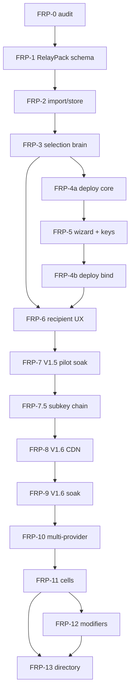

# Phase 28 (FRP-0) — Roadmap Reconciliation + Code Audit — Handover

**Status:** SHIPPED.
**Date:** 2026-05-02.
**Engine version at exit:** `daal-core 0.9.0+v3-share` (UNCHANGED from 3-Soak).
**ABI release surface at exit:** **48** (UNCHANGED from 3-Soak; source-count and binary `nm` verified in the unlock pass).
**FRP-1 gate:** **PASS** after the 2026-05-02 unlock pass.

Phase 28 shipped the FRP-track audit only. No engine, bundle, Rust, Tauri, Kotlin, Swift, test fixture, or scenario code was changed.

## What Shipped

- Per-module status matrix: 17 rows.
- Per-file gap detail for every non-`none` row.
- Missing-specs list with FRP-N ownership.
- Missing-UI list with FRP-N ownership.
- Command-backed invariant table for all 16 Phase 28 invariants.
- Dependency graph copied from `specs/frp-track-v1.md`.
- Open-decisions log updated with audit findings.
- Final regression sweep and FRP-1 gate verdict.

## What Phase 28 Did Not Change

| Surface | Locked at | Phase 28 value |
|---------|-----------|----------------|
| Release ABI exports | 3F | 48 unchanged by source count and binary `nm` |
| Engine `Version` | 3F | `daal-core 0.9.0+v3-share` unchanged |
| `--scenarios legacy` count | 1.5C | 5 unchanged |
| `--scenarios v2-superset` count | 3F | 26 unchanged |
| `--scenarios v3-superset` count | 3-Soak | 31 unchanged |
| Bundle format | 3-Soak | `.sbp` unchanged |
| `FamilySpecificConfig` slot | 3-Soak | unchanged at `bundle/go/bundle/types.go:211` |
| `RouteRow` schema | 3-Soak | unchanged at `core/routestore/store.go:127` |
| `StoreAdapter` boundary | 3-Soak | unchanged at `core/trust/state.go` |

## Per-Module Status Matrix

| Module path | Present? | Has RelayPack awareness? | Gap class | Evidence command/result | Gate to FRP-N |
|---|---:|---:|---|---|---|
| `bundle/go/bundle/` | y | partial | missing-spec | `types.go` has `Manifest` slots and `FamilySpecificConfig`; no `RelayPack` / `relay_pack` code hit in this module | FRP-1 |
| `bundle/go/importer/` | y | n | metadata-strip | `RouteInput` and `SaveImport` interface carry no RelayPack metadata; import path maps only base route fields | FRP-2 |
| `bundle/go/publisher/` | y | n | missing-feature | existing publisher CLI exists; no RelayPack validator package yet at FRP-0 (final shared path lands at `bundle/go/relaypackvalidate/` in FRP-2); no root `publisher/go.mod` | FRP-1, FRP-4a |
| `core/abi/` | y | n/a | none | `const Version = "daal-core 0.9.0+v3-share"`; release export source count = 48 | track-wide |
| `core/trust/` | y | n | metadata-strip | `StoreAdapter.SaveImport` persists base `RouteRow` fields only; no `RelayPackMeta` boundary | FRP-2 |
| `core/routestore/` | y | partial | metadata-strip | `RouteRow` has `FamilySpecificConfigJSON` but no exposure/risk/RelayPack typed fields | FRP-2 |
| `core/pathmanager/` | y | partial | missing-feature | `fsm.go` says shortlist racing, per-network memory, route budgets, mode-aware selection are not implemented there | FRP-3 |
| `core/budget/` | y | n/a | none | existing route-budget engine is present; no FRP-0 change owed | FRP-3 consumer |
| `core/diagnostics/` | y | partial | missing-feature | existing `WhyExplain`; no locked RelayPack `Explanation` struct | FRP-3, FRP-6 |
| `core/netmem/` | y | partial | missing-feature | `Snapshot.RouteFamilyStats` is family-keyed only; no `family x exposure_mode x public_risk_tag_signature` memory | FRP-2, FRP-3 |
| `publisher/deploy/` | n | n | missing-feature | `find publisher -maxdepth 3` returns only `publisher` | FRP-4a, FRP-10 |
| `publisher/cell/` | n | n | missing-feature | no `publisher/cell/` tree | FRP-11 |
| `client-android/` | y | n | missing-UI | import, share, why-this-route, pointer-rotation UI exist; no RelayPack explanation/wizard surfaces | FRP-6, FRP-10 |
| `client-desktop/tauri/` | y | n | missing-UI | `AddRoute`, `Diagnostics`, bridge exist; no FRP wizard, OperatorRecord, or RelayPack trust UI | FRP-5, FRP-6 |
| `client-ios/` | y | placeholder | placeholder | iOS app/tunnel skeleton exists; supplement leaves recipient iOS post-V3 | post-V3 |
| `specs/` | y | partial | missing-spec | `specs/frp-track-v1.md` exists; `relaypack-v1.md`, `selection-v1.md`, vectors absent | FRP-1, FRP-3 |
| `test-rigs/` | y | n | missing-fixture | soak-driver exists and v2/v3 counts pass; no RelayPack test vectors | FRP-2 |

## Per-File Gap Detail

- `bundle/go/bundle/types.go:52` defines `Manifest` with 3A/3B/3E/3F widening slots but no `relay_pack` slot yet. FRP-1 owns this.
- `bundle/go/bundle/types.go:194` defines `RouteManifestEntry`; `FamilySpecificConfig json.RawMessage` at line 211 is the correct `_relaypack` landing slot. FRP-1 owns parser/schema.
- `bundle/go/importer/importer.go:21` defines `State.SaveImport(p PublisherInput, routes []RouteInput) error`; no RelayPack metadata parameter.
- `bundle/go/importer/importer.go:56` defines `RouteInput` without `_relaypack`, exposure mode, risk tags, family class, or probing risk.
- `bundle/go/importer/importer.go:237` builds `RouteInput` from the manifest but does not preserve `FamilySpecificConfig` or any RelayPack metadata. FRP-2 owns this.
- `core/trust/state.go:35` implements `SaveImport`; `RouteRow` construction persists base fields only. FRP-2 must widen this boundary.
- `core/routestore/store.go:127` is the real `RouteRow` home. It already stores `FamilySpecificConfigJSON`, but lacks RelayPack typed fields.
- `core/routestore/schema.go:7` owns inline schema/migrations; there is no `core/trust/migrations/` tree. FRP-2 must add inline additive migrations here.
- `core/netmem/snapshot.go:38` stores `RouteFamilyStats map[string]FamilyStats`; FRP-3 needs the more specific memory key shape.
- `core/pathmanager/fsm.go:7` explicitly says shortlist racing, per-network memory, route budgets, and mode-aware selection are not implemented in the FSM. FRP-3 owns the new selection brain.
- `core/pathmanager/explain.go:26` has the existing `WhyExplain` struct; FRP-3 must lock a RelayPack-aware `Explanation` contract before FRP-6 UI binds to it.
- `client-desktop/tauri/src/lib/bridge.ts:16` `PreviewedBundle` exposes only base bundle preview fields.
- `client-desktop/tauri/src/pages/AddRoute.tsx` imports plain `.sbp`; no RelayPack trust diff/explanation.
- `client-desktop/tauri/src/pages/Diagnostics.tsx` renders existing "why this route"; no RelayPack explanation detail.
- `client-android/app/src/main/java/ai/daal/app/ui/AddRouteScreen.kt:26` has the existing import tabs; no RelayPack-specific copy.
- `client-android/app/src/main/java/ai/daal/app/ui/WhyThisRouteScreen.kt:15` renders the current structured why-this-route record; no RelayPack explanation.
- `client-android/app/src/main/java/ai/daal/app/vm/DaalViewModel.kt:23` state has trust prompt and route UI fields, but no RelayPack explanation state.
- `publisher/deploy/` and `publisher/cell/` are absent. FRP-4a, FRP-10, and FRP-11 create them.

## Missing Specs

| Spec path | Owning FRP-N | Status |
|---|---|---|
| `specs/relaypack-v1.md` | FRP-1 | missing |
| `specs/selection-v1.md` | FRP-3 | missing |
| `specs/frp-track-v1.md` | FRP-0 | locked |
| `specs/cell-v1.md` | FRP-11 | missing |
| `specs/federation-primitives-v1.md` | FRP-11 | missing |
| `specs/v1-5-closure-v1.md` | FRP-7 | missing |
| `specs/v1-6-closure-v1.md` | FRP-9 | missing |
| `specs/cell-closure-v1.md` | FRP-11 | missing |
| `specs/public-directory-v1.md` | FRP-13 | missing; supplement-blessed name, no version prefix |
| `specs/public-directory-closure-v1.md` | FRP-13 | missing if gate flips |
| `specs/modifiers/_template.md` | FRP-12 | missing |
| `specs/modifiers/client_desync.md` | FRP-12 | missing; PENDING reserved slot |
| `specs/modifiers/tls_fragment.md` | FRP-12 | missing; PENDING reserved slot |
| `specs/test-vectors/relaypack/` | FRP-2 | missing corpus directory |

## Missing UI Surfaces

| Surface | Platform | Current code evidence | Owning FRP-N |
|---|---|---|---|
| FRP wizard screens 0-6 | desktop | no wizard/OperatorRecord paths under `client-desktop/tauri/src` | FRP-5, FRP-4b |
| Provider credential UX | desktop | no provider-pick or key-gen wizard | FRP-5 |
| RelayPack trust prompt | desktop | `AddRoute.tsx` imports plain SBP only | FRP-6 |
| RelayPack explanation | desktop | `Diagnostics.tsx` only renders existing explanation | FRP-6 |
| EN/FA RelayPack copy | desktop + Android | existing strings only; no RelayPack copy | FRP-6 |
| Recipient import flow | Android | `AddRouteScreen.kt` has generic import tabs | FRP-6 |
| Route-health / rotation banner | Android | pointer rotation bridge exists; no RelayPack rotation banner | FRP-6, FRP-7 |
| Android publisher wizard | Android | no publisher wizard package | FRP-10 |
| iOS recipient | iOS | app/tunnel skeleton only | post-V3 placeholder |

## Invariant-Preservation Table

| # | Invariant | Command | Output | PASS? |
|---|---|---|---|---|
| 1 | ABI surface stays 48 | `rg -n '^//export engine_' core/abi --glob '*_export.go' --glob '!*_soak_export.go' \| wc -l`; `/usr/local/go/bin/go build -buildmode=c-shared -tags cshared -o /tmp/libdaalcore.so ./cmd/libdaalcore`; `nm /tmp/libdaalcore.so \| grep ' T engine_' \| wc -l` | source count `48`; binary count `48` | PASS |
| 2 | Engine `Version` unchanged | `rg -n '^const Version' core/abi/abi.go` | `core/abi/abi.go:44:const Version = "daal-core 0.9.0+v3-share"` | PASS |
| 3 | No new release symbols at FRP-0 | `git status --short` before doc edits | empty | PASS |
| 4 | v2/v3 superset counts unchanged | `cd test-rigs/distribution-failure/soak-driver && go test ./cmd/soak-driver -run 'TestV3SupersetCount\|TestV2SupersetCount'` | `ok daal/soak-driver/cmd/soak-driver 0.014s` | PASS |
| 5 | Bundle format stays `.sbp` | `rg -n 'sbp2\|RelayPackFormat' bundle/go core client-android client-desktop/tauri client-ios` | no output | PASS |
| 6 | Per-candidate metadata destination is `FamilySpecificConfig` | `rg -n 'type RouteManifestEntry struct\|FamilySpecificConfig' bundle/go/bundle/types.go` | `RouteManifestEntry` at 194; `FamilySpecificConfig` at 211 | PASS |
| 7 | Manifest slot update-required at FRP-1 | `rg -n 'SpecVersion|VerifyBundle|spec_version 1|spec_version 2' bundle/go/bundle/sbp.go bundle/go/publisher/bundle_cmd.go` | verifier accepts spec_version 1 and 2; publisher defaults to 2 | PASS; FRP-1 target = 3 |
| 8 | `freshness_url` additive at FRP-8 | `rg -n 'freshness_url' bundle/go core client-* specs daal-roadmap...` | only spec/supplement hits; no code implementation | PASS |
| 9 | Position B preserved | `rg -n 'http\.Post|http\.Client|net\.Dial|telemetry|metrics|analytics|OpenTelemetry|Sentry|crash' core bundle/go client-* --glob '!**/*_test.go' --glob '!**/opsec_test.go'` | vetted local/network primitives only: bootstrap fetcher, LAN receiver, crash labels/comments; no telemetry sink | PASS |
| 10 | `udp_gated` reused | `git grep -n 'udp_gated' bundle/go/bundle/types.go` | `bundle/go/bundle/types.go:201: UDPGated bool json:"udp_gated,omitempty"` | PASS |
| 11 | No new transport-family enum values | `rg -n '^\s*Transport[A-Za-z]+\s+TransportFamily' bundle/go/bundle/types.go` | existing families only: vless-reality, naive, websocket-tls, hysteria2, tuic, snowflake, webtunnel, masque, shadowsocks, tor-bridge, wireguard, amneziawg, psiphon, conjure, transport_module, lifeline_relay, other | PASS |
| 12 | Supplement v2.3.7 lock target | `head -20 daal-roadmap-v3-supplement-diaspora-helper.md \| grep 'Supplement version'` | `Supplement version: 2.3.7 ...` | PASS |
| 13 | `modifiers[]` not implemented before FRP-12 | `git grep -n 'modifiers' bundle/go/publisher/` | no output | PASS |
| 14 | FRP-12 modifier gates per kind | `rg -n 'Zero modifier kinds|client_desync|tls_fragment|PASS records' phases.../42-phase-frp-12-modifier-framework.md specs/frp-track-v1.md` | FRP-12 is framework-only; zero PASS records; pending slots only | PASS |
| 15 | FRP-13 requires closure/gate | `rg -n 'GATED|cell-closure|§17\.2|closure record' phases.../43-phase-frp-13-public-directory.md specs/frp-track-v1.md` | FRP-13 does not start until cell closure plus §17.2 gate | PASS |
| 16 | Phase 28 ships no executable code | `git diff --name-only` after this phase | documentation only | PASS |

## Dependency Graph



Reading guide: FRP-1 defines the on-disk RelayPack shape; FRP-2 proves import/store preservation; FRP-3 consumes that contract and freezes the `Explanation` UI contract; FRP-4a/FRP-5/FRP-4b split deploy core, key generation, and live binding; V1.5 closes at FRP-7; sub-key hygiene lands before V1.6 CDN; cells close before any public directory can even start.

## Open-Decisions Log

| # | Question | Status after FRP-0 | Target |
|---|---|---|---|
| 1 | `spec_version` target integer | locked by audit: current accepted/default version is 2; FRP-1 target is 3 | FRP-1 |
| 2 | Exact `Manifest` slot field name | locked in FRP-1 doc as `relay_pack` | FRP-1 |
| 3 | Freshness JSON schema details | open; slot reserved earlier, endpoint/schema owned later | FRP-8 |
| 4 | FRP-7 pilot recruitment plan | open; supplement minimum is 5 FRPs | FRP-7 |
| 5 | First post-track modifier to enable | deferred; FRP-12 ships zero PASS records | post-FRP-12 |
| 6 | FRP-13 directory gate criteria | open but gated by supplement §17.2; no calendar launch | FRP-13 |
| 7 | iOS placeholder scope | resolved for FRP-0: no V1.5/V1.6 iOS work owed beyond placeholder confirmation | FRP-6 confirmation |
| 8 | Import path location | resolved: `bundle/go/importer/importer.go` -> `core/trust/state.go` -> `core/routestore/{store,schema}.go` -> `core/netmem/` | FRP-2 |
| 9 | FRP-7.5 `spec_version` bump | open; likely bump because sub-key cert chain alters signed bundle material | FRP-7.5 |
| 10 | Public-surface rotation re-signing rules | open; Cloudflare path change must republish signed freshness bundle unless represented as same signed candidate indirection | FRP-8 |
| 11 | Supplement stale `RouteRow` references | resolved in unlock pass: supplement lines 234 and 1107 now point at `core/routestore/store.go:127` while preserving `core/trust/state.go` as the import boundary | FRP-1 unblocked |
| 12 | Local Go toolchain | resolved in unlock pass: `/usr/local/go/bin/go` is Go 1.24+ (`go1.27-devel`) and passes core tests/build checks | FRP-1 unblocked |

## Files Added / Modified

Phase 28 execution filled the handover and marked the FRP-0 status shipped in the track docs. The follow-up unlock pass patched the supplement erratum and fixed a date-sensitive auto-promotion test clock so the core suite remains stable on and after 2026-05-02.

```
phases of development/28-phase-frp-0-roadmap-reconciliation.handover.md MODIFIED (filled audit evidence)
phases of development/28-phase-frp-0-roadmap-reconciliation.md          MODIFIED (status -> SHIPPED)
specs/frp-track-v1.md                                                    MODIFIED (FRP-0 status/closure row)
daal-roadmap-v3-supplement-diaspora-helper.md                          MODIFIED (RouteRow erratum)
core/abi/auto_promotion_test.go                                          MODIFIED (pin pathmanager test clock)
```

## Final Regression Sweep

Commands run:

```
$ find "phases of development" -maxdepth 1 -type f -name '*phase-frp-*' -printf '%f\n' | sort
28-phase-frp-0-roadmap-reconciliation.handover.md
28-phase-frp-0-roadmap-reconciliation.md
29-phase-frp-1-relaypack-schema.md
...
43-phase-frp-13-public-directory.md

$ go version
go version go1.19.8 linux/amd64

$ /usr/local/go/bin/go version
go version go1.27-devel_d0c730e5 Sat Apr 18 08:24:58 2026 -0700 linux/amd64

$ cd bundle/go && env GOCACHE=/tmp/daal-gocache go test ./...
ok daal/bundle-go/bundle
ok daal/bundle-go/fountain
ok daal/bundle-go/publisher
ok daal/bundle-go/share
ok daal/bundle-go/uri

$ cd core && env GOCACHE=/tmp/daal-gocache go test ./...
go: errors parsing go.mod:
/home/daal/core/go.mod:3: invalid go version '1.24.0': must match format 1.23

$ cd core && /usr/local/go/bin/go test ./...
ok daal/core/abi 30.629s
ok daal/core/bootstrap
ok daal/core/share
... all core packages PASS

$ cd core && env GOCACHE=/tmp/daal-gocache /usr/local/go/bin/go build -buildmode=c-shared -tags cshared -o /tmp/libdaalcore.so ./cmd/libdaalcore
# no output

$ nm /tmp/libdaalcore.so | grep ' T engine_' | wc -l
48

$ cd test-rigs/distribution-failure/soak-driver && env GOCACHE=/tmp/daal-gocache go test ./cmd/soak-driver -run 'TestV3SupersetCount|TestV2SupersetCount'
ok daal/soak-driver/cmd/soak-driver 0.014s

$ rg -n '^//export engine_' core/abi --glob '*_export.go' --glob '!*_soak_export.go' | wc -l
48

$ git diff --name-only
core/abi/auto_promotion_test.go
daal-roadmap-v3-supplement-diaspora-helper.md
phases of development/28-phase-frp-0-roadmap-reconciliation.handover.md
phases of development/28-phase-frp-0-roadmap-reconciliation.md
specs/frp-track-v1.md
```

No production executable code was touched. The only Go code change is a test-only clock pin in `core/abi/auto_promotion_test.go`.

## FRP-1 Gate Verdict

**PASS.** The FRP track sequence, RelayPack schema placement, import/store ownership, selector-before-UX ordering, CDN milestone placement, cell/federation gate, and modifier framework are aligned with the roadmap and supplement. The two prior holds are closed: the supplement path erratum is patched, and `/usr/local/go/bin/go` runs the core suite plus c-shared ABI build with `nm = 48`. FRP-1 can start.

## Position B Preserved

No telemetry was added. The audit used local file reads, local test runs, and local grep/ripgrep checks. No client analytics, external counters, or project endpoints were introduced.

## Next Phase

FRP-1 (`phases of development/29-phase-frp-1-relaypack-schema.md`) is next. Its first implementation decision is already resolved by this audit: current bundle `spec_version` is 2, so the FRP-1 target bump is 3.
