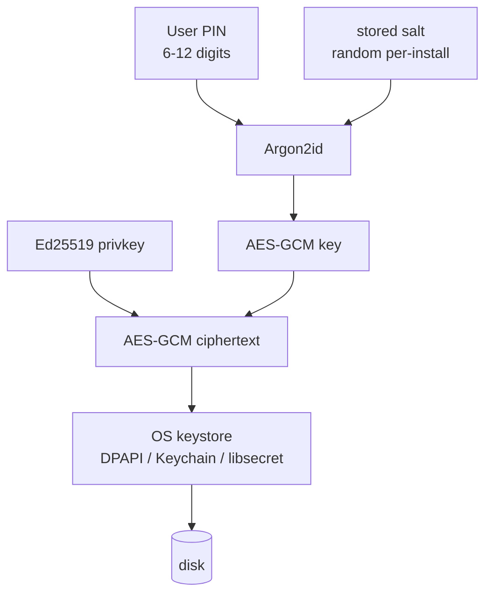

# Phase 33 (FRP-5) — Desktop FRP Wizard + Key/OperatorRecord Model

**Status:** SHIPPED 2026-05-03. 5 commits on main:
9efb234 (workspace crate + V001 schema), 1bbf081 (keystore +
Argon2id + AES-GCM + PIN lockout), 1e1245e (publisher_key +
cli_bridge + staging + commands), e7344bc (frontend screens +
i18n + schema xref test), 4925ddb (Tauri command shims +
OPSEC + integration + handover), plus post-ship readiness correction
(PIN consistency, Tauri shim API names, Send+Sync DB guard). Build
matrix green: 47 tests passing on daal-wizard (41 lib + 2
schema_xref + 4 key_opsec).
ABI: untouched. Position B: preserved. Handover doc:
docs/handovers/frp-5-handover.md.
**Roadmap line:** *"Tauri wizard screens 0–6, with a 'CDN-fronted candidates: coming in V1.6' line on the toolbox screen instead of a broken option. OS-keystore + PIN-derived AES-GCM defence-in-depth. SQLite OperatorRecord schema."* — `daal-roadmap-v3-supplement-diaspora-helper.md` §21.1
**Supplement target:** v2.3.7.
**Engine version target:** `daal-core 0.9.0+v3-share` **(UNCHANGED — desktop UI phase).**
**ABI release surface target:** **48** **(UNCHANGED — wizard runs in Tauri, not the engine).**
**Maturity:** UI + key-custody phase. Largest UI deliverable in the FRP track.
**Predecessor:** Phase 32 (FRP-4a) — deploy substrate exists.
**Successor:** Phase 34 (FRP-4b) — binds wizard's publisher key to deploy substrate; signs the RelayPack.

## 1. Strategic frame (verbatim from the supplement)

> **§9 Tauri wizard.** Screens 0–6 walk a diaspora user through: cloud-provider login (token), region/server-type choice (with cost disclosure from `Pricing()`), toolbox profile (`iran-default`), publisher key creation (or import), provisioning progress, RelayPack handoff (QR + share-via-Signal), and rotation UI shell.
>
> **§10 Token storage and trust boundary.** The cloud-provider token never leaves the FRP's machine. Stored encrypted with OS-keystore + PIN-derived AES-GCM defence-in-depth. The Helper holds tokens; the origin box never does.
>
> **§14.5 Wizard rotate-button copy adapts to mode.** At V1.5 only direct-mode copy is reachable. V1.6 adds CDN-mode copy variants.

FRP-5's job: build the Tauri wizard **shell**, generate the publisher Ed25519 keypair, persist the `OperatorRecord` skeleton to SQLite, custody the cloud-provider token under OS-keystore + PIN-derived AES-GCM, render the static (un-wired) screens for provisioning / signing / QR-handoff so the visual flow is reviewable, and reserve the `freshness_url` slot in the wizard's RelayPack output schema (empty string at V1.5; populated at FRP-8).

**Strict scope boundary at FRP-5: no live deploy, no live signing, no live QR emission.** Those three behaviours all live in **FRP-4b** per the `4a → 5 → 4b` track ordering. At FRP-5 ship, the wizard:

- generates and stores the publisher keypair (Ed25519, two-layer custody);
- collects the cloud-provider token (encrypted in keystore);
- collects user inputs for region / server-type / toolbox profile / publisher-key-import-vs-create;
- writes a partial `OperatorRecord` to SQLite (status: `pre-provision`);
- emits the partial OperatorRecord + publisher pubkey to a staging file at `~/.config/daal/staging/<id>.pre-provision.json`;
- presents screens 4–6 as **disabled-shell static layouts** with caption "Wired live at FRP-4b — review the layout, not the data".

FRP-4b reads the staging file, runs `Provider.Provision` via the FRP-4a CLI, signs the resulting `.sbp` via its `BindAndSign` binder, writes the signed `.sbp` to a second staging file, and updates the OperatorRecord status to `provisioned`. The wizard shell at screens 4–6 is wired live by FRP-4b at that phase.

## 2. Locked answers

| Question | Locked answer |
|---|---|
| Frontend stack | Tauri 2 + Rust backend (per existing `08-phase-1-5b-desktop-port.md`). New Tauri commands at `client-desktop/tauri/src-tauri/src/wizard/`. |
| Wizard screens | 7 screens (0–6) per supplement §9 description. Sequence locked in §5 below. **Screens 4–6 ship as disabled-shell static layouts at FRP-5; wired live at FRP-4b.** |
| Publisher key | Ed25519 (matches existing `bundle/go/publisher/keystore.go`). Generated locally; never leaves the FRP machine in raw form. |
| Key storage | **Two-layer defence-in-depth**: outer layer is OS-keystore (Windows DPAPI / macOS Keychain / Linux libsecret); inner layer is AES-GCM with key derived from a user-set 6-12 digit PIN via Argon2id. Either layer alone is acceptable in dev; production requires both. |
| Token storage | Same two-layer scheme as publisher key. Token rotated on user request via "Settings → Reset cloud token". |
| OperatorRecord persistence | SQLite at `~/.config/daal/operators.db` (Linux) / equivalent paths per OS. Schema in §6 below. At FRP-5 ship, status field reads `pre-provision` (no provision has happened yet); FRP-4b updates to `provisioned`. |
| Provisioning UI | **Disabled-shell only** at FRP-5. Screen 4 renders a static "Provisioning progress" layout (the four steps listed) but does not run them. FRP-4b wires the live `Provider.Provision` calls via FRP-4a CLI. |
| Signing UI | **Disabled-shell only** at FRP-5. Screen 5 renders a static "Signing your family's RelayPack" layout but does not run `BindAndSign`. FRP-4b wires the live binder. |
| QR handoff UI | **Disabled-shell only** at FRP-5. Screen 6 renders a placeholder QR-fountain frame with caption "QR appears after FRP-4b live binder runs". FRP-4b wires the live `.sbp` rendering using `specs/qr-fountain-v1.md`. |
| Cost disclosure | Live `Pricing()` call from FRP-4a's CLI (`daal-deploy pricing --provider hetzner --region <region> --server-type <type> --token-file <token>`); cached for 60 s; surfaced in EUR. (This is the only live FRP-4a CLI call at FRP-5 ship — read-only, no side effects.) |
| Toolbox profile UI | Checkbox grid on screen 2; `iran-default.json` is the seed; user can deselect families but cannot add new ones at V1.5. The selected set is written to `ProvisionOpts.EnabledFamilies`; empty means profile defaults. |
| CDN-fronted UI line | "CDN-fronted candidates: coming in V1.6" greyed-out checkbox on screen 2. Disabled. Per supplement §21.1. |
| Rotation UI | **Disabled-shell only** at FRP-5.** The `Rotate` button on screen 6 is disabled with caption "Available after first successful pilot run". FRP-7 wires the live rotation. |
| `freshness_url` slot | Empty string at FRP-5. The pre-provision OperatorRecord carries the field but with empty value. FRP-8 populates it. |
| Communication with FRP-4a CLI | Tauri backend shells out to `daal-deploy` binary via Rust's `std::process::Command`; parses JSON output; surfaces progress to the frontend. **At FRP-5 ship, only the read-only `pricing` subcommand is wired live.** |
| Multi-language | EN + FA files present at FRP-5 ship. Native-speaker FA review is a pilot-readiness follow-up tracked in the handover; it does not block FRP-4b because FRP-4b wires deployment/signing, not copy. |
| Telemetry | Zero. No usage analytics, no error reporting, no opt-in counters. The wizard never opens a network connection except to (a) the cloud-provider pricing API via the FRP-4a CLI (read-only at FRP-5). Verified by Tauri allowlist + Rust OPSEC test. |

## 3. Locked invariants

Tracks invariants 1–16 inherited. Phase-specific:

17. **No engine release symbols added.** ABI count stays 48; wizard is desktop-side.
18. **Publisher key never leaves machine in plaintext.** Verified by `client-desktop/tauri/src-tauri/tests/key_opsec_test.rs`.
19. **Cloud-provider token never written to disk in plaintext.** Same.
20. **Two-layer key custody mandatory in production.** Tauri build feature flag `dev-no-keystore` allows OS-keystore bypass for dev; production builds reject it at compile time.
21. **OperatorRecord JSON shape matches FRP-4a `OperatorRecord` Go struct exactly.** Verified by a JSON-schema cross-check at build time.
22. **`freshness_url` slot present, empty.** RelayPack canonicalisation includes the field; the empty string round-trips through `bundle/go/bundle/canonical.go` deterministically.
23. **Position B preserved.** No analytics, no error reporting. Verified by Tauri allowlist + Rust OPSEC test.
24. **EN/FA copy present; FA review tracked.** Native-speaker FA review is required before an external pilot, but does not block FRP-4b implementation.
25. **No live provisioning at FRP-5.** Screens 4–6 are static disabled shells. The only outbound call from the FRP-5 wizard is the read-only `Pricing()` lookup via FRP-4a CLI on screen 1.
26. **No wizard reach into engine internals.** Wizard talks to FRP-4a CLI via subprocess; never calls `core/abi/` directly.
27. **Rotation UI is a shell at FRP-5.** Wired live at FRP-7.
28. **Provisioning + signing + QR are FRP-4b's responsibility, not FRP-5's.** A reviewer can confirm at FRP-5 exit that NO `Provider.Provision` call site exists in the wizard codebase, and NO `BindAndSign` call site exists. They land at FRP-4b.

## 4. Sub-task breakdown

| #  | Task |
|----|------|
| 0  | Replace any prior FRP-5 stub with this locked spec at `phases of development/33-phase-frp-5-desktop-wizard.md`. |
| 1  | Read inputs end-to-end: supplement §9, §10, §14.5; FRP-4a handover (CLI command list + JSON shapes); existing `08-phase-1-5b-desktop-port.handover.md` (Tauri layout — confirms `client-desktop/tauri/{src,src-tauri}/`); `specs/qr-fountain-v1.md`; `bundle/go/publisher/keystore.go`. |
| 2  | Author Tauri command surface at `client-desktop/tauri/src-tauri/src/wizard/`. Modules: `commands.rs` (Tauri commands), `keystore.rs` (OS-keystore + AES-GCM), `operator_db.rs` (SQLite), `cli_bridge.rs` (subprocess to `daal-deploy`; **at FRP-5 only `pricing` subcommand is wired**). |
| 3  | Author SQLite schema migration `client-desktop/tauri/src-tauri/migrations/V001__operators.sql` per §6 below. Reversible. Status field defaults to `pre-provision`. |
| 4  | Author `keystore.rs` with two-layer scheme: outer = `keyring` crate (cross-platform OS-keystore wrapper); inner = AES-GCM via `aes-gcm` crate; key from `argon2` crate's Argon2id over user's 6-12 digit PIN with stored salt. PIN attempts rate-limited (5 attempts then 60 s lockout, increasing). |
| 5  | Author publisher-key generator: `ed25519-dalek` crate; key + fingerprint emitted to keystore. Fingerprint format mirrors `bundle/go/publisher/keystore.go` (hex + EN/FA wordlists). |
| 6  | Author wizard frontend at `client-desktop/tauri/src/wizard/`. 7 screens; navigation; progress indicator; cancel-and-cleanup. **Screens 4–6 ship as disabled-shell static layouts with caption "Wired live at FRP-4b".** |
| 7  | Author EN + FA copy bundles at `client-desktop/tauri/src/i18n/{en,fa}/wizard.json`. FA copy review note is stored in handover as a pilot-readiness follow-up. |
| 8  | Author cost-disclosure widget on screen 1: shells out to `daal-deploy pricing --provider hetzner --region fsn1 --server-type cx22 --token-file <encrypted-token-tempfile>`; caches result for 60 s; renders in EUR. (The only live FRP-4a CLI call at FRP-5.) |
| 9  | Author OperatorRecord pre-provision write: on completion of screen 3 (publisher key generated), write a `pre-provision` OperatorRecord to SQLite + emit a JSON staging file at `~/.config/daal/staging/<id>.pre-provision.json`. Include selected toolbox families for FRP-4b via FRP-4a's `ProvisionOpts.EnabledFamilies`. FRP-4b reads this file. |
| 10 | Author OPSEC test at `client-desktop/tauri/src-tauri/tests/key_opsec_test.rs`: round-trip key generation → keystore-write → keystore-read → keystore-delete; ensure no plaintext key material on disk; ensure Tauri allowlist disallows `http`/`https` from frontend; **ensure no `Provider.Provision` call site or `BindAndSign` call site exists in the wizard codebase** (grep on the frontend bundle + Tauri compiled output). |
| 11 | Author wizard-flow integration test using Tauri's testing harness: drive screens 0→3 with the live `pricing` call mocked; verify pre-provision OperatorRecord persists to SQLite; verify pre-provision JSON staging file emitted; verify screens 4–6 render as disabled shells with the expected captions. |
| 12 | Final regression sweep: Rust `cargo test` green; frontend static guards green; `nm` returns 48; engine `Version` UNCHANGED; EN/FA copy follow-up attached; FRP-4b gate verdict; handover. |

## 5. Wizard screen sequence (locked)

| # | Screen | At FRP-5 ship | Wired live at |
|---|---|---|---|
| 0 | Welcome + 1-paragraph FRP role explanation | LIVE — "Begin" button → screen 1 | FRP-5 |
| 1 | Cloud provider sign-in: Hetzner API token paste + user PIN set; pricing lookup | LIVE — token stored encrypted; live pricing call (read-only) validates token | FRP-5 |
| 2 | Region + server type + toolbox profile | LIVE — `ProvisionOpts` struct populated (not yet executed) | FRP-5 |
| 3 | Publisher key: "Create new" (default) or "Import existing"; PIN re-entry | LIVE — publisher keypair generated/imported; pubkey shown with EN/FA fingerprint; pre-provision OperatorRecord + JSON staging file emitted | FRP-5 |
| 4 | Provisioning progress: shows "Creating server", "Running cloud-init", "Verifying signed artefacts", "Polling health endpoint", "Closing SSH" | DISABLED-SHELL static layout. Caption: "Wired live at FRP-4b — review the layout" | FRP-4b |
| 5 | RelayPack signing notice: "Signing your family's RelayPack with publisher key…" | DISABLED-SHELL static layout. Caption: "Wired live at FRP-4b" | FRP-4b |
| 6 | RelayPack handoff: QR-fountain rendering placeholder; "Send via Signal" / "Print" buttons; "Rotate" button caption "Available after first successful pilot run" | DISABLED-SHELL with placeholder QR frame. Caption: "QR appears after FRP-4b live binder runs" | FRP-4b (QR live) + FRP-7 (rotate live) |

## 6. SQLite OperatorRecord schema (locked)

```sql
-- client-desktop/tauri/src-tauri/migrations/V001__operators.sql

CREATE TABLE operators (
  id                  INTEGER PRIMARY KEY,
  status              TEXT NOT NULL,    -- "pre-provision" (FRP-5 ship) | "provisioned" (FRP-4b sets) | "decommissioned"
  operator_record_json TEXT NOT NULL,    -- canonical JSON of FRP-4a OperatorRecord struct (partial at pre-provision)
  publisher_pub_hex   TEXT NOT NULL,
  publisher_priv_keystore_alias TEXT NOT NULL,  -- alias under which the OS-keystore stores the AES-GCM-wrapped privkey
  cloud_provider      TEXT NOT NULL,
  cloud_token_keystore_alias TEXT NOT NULL,
  created_at_unix     INTEGER NOT NULL,
  last_provisioned_at_unix INTEGER,           -- NULL at pre-provision; FRP-4b sets
  decommissioned_at_unix INTEGER              -- NULL until decommissioned
);

CREATE INDEX idx_operators_pubhex ON operators (publisher_pub_hex);

CREATE TABLE pin_attempts (
  id         INTEGER PRIMARY KEY,
  attempt_at_unix INTEGER NOT NULL,
  success    INTEGER NOT NULL  -- 0 or 1
);
```

## 7. Architectural detail — defence-in-depth key custody



To use the key the wizard:
1. Reads the AES-GCM ciphertext from OS keystore (the OS's auth flow gates this — Keychain prompts the user, DPAPI uses the login session, libsecret prompts via gnome-keyring).
2. Prompts the user for the PIN.
3. Re-derives the AES-GCM key via Argon2id over PIN + stored salt.
4. Decrypts the ciphertext to get the Ed25519 privkey.
5. Uses the privkey transiently in memory; zeroes the buffer when done.

A keystore compromise alone yields ciphertext but not the privkey (PIN unknown). A PIN compromise alone yields the AES-GCM key but no access to the keystore.

## 8. Build matrix at FRP-5 exit

```
$ cd client-desktop && cargo fmt -p daal-wizard --check
$ cd client-desktop/tauri/src-tauri && cargo fmt --check
$ cd client-desktop && cargo test -p daal-wizard                       # 47 tests green
$ cd client-desktop && cargo build --workspace                          # green
$ cd client-desktop/tauri/src-tauri && cargo build                      # green with GTK/WebKit dev packages
$ cd client-desktop/tauri/src-tauri && cargo build --release            # green with GTK/WebKit dev packages
$ cd client-desktop/tauri/src-tauri && cargo test                       # green
$ cd client-desktop/tauri && npm run build                              # green
$ cd client-desktop/tauri && npm audit --audit-level=moderate           # 0 vulnerabilities
$ nm /tmp/libdaalcore.so | grep ' T engine_' | wc -l                  # 48 (UNCHANGED)
$ # OPSEC: no http calls from frontend
$ rg -nE 'fetch\(|XMLHttpRequest' client-desktop/tauri/src/             # no matches
$ # Scope guard: no live provision / sign at FRP-5
$ rg -n 'Provider\.Provision|BindAndSign' client-desktop/tauri/         # no matches
```

## 9. Spec deliverables

**1 AMENDED:**
- `docs/family-relay-publisher-v1.md` — gains the wizard screens documentation (per FRP-4a handover note).

**EN/FA copy:** string files present. Native-speaker FA review is tracked as a pilot-readiness follow-up in the handover.

## 10. Out of scope (deferred)

- Live rotation logic — **FRP-7.**
- `cdn_fronted` wizard path — **FRP-8.**
- Cell membership UI — **FRP-11.**
- Multi-provider UI (Vultr, Stark dropdowns) — **FRP-10.**
- Sub-key rotation UI — **FRP-7.5.**
- Freshness endpoint static-host configuration — **FRP-8.**
- Mobile FRP wizard — V2 (FRP-10 handover lists; out of scope here).
- Daal-publish CLI integration (the CLI from 1A is already shipped; FRP-5 wizard does not replace it; both coexist).

## 11. Handover requirements

The FRP-5 handover must contain:

1. Status: SHIPPED. Date.
2. Tauri command surface enumerated.
3. SQLite schema attached with migration test result.
4. Keystore round-trip test result.
5. PIN attempt rate-limit verified.
6. EN/FA copy status and pilot-readiness follow-up.
7. Wizard-flow integration test pass.
8. `nm` count = 48 unchanged.
9. OPSEC grep result.
10. Confirmation that screens 4–6 ship as disabled-shell static layouts, with screenshot.
11. Confirmation that no `Provider.Provision` or `BindAndSign` call site exists in the wizard codebase (grep result attached).
12. FRP-4b gate verdict.
13. Open follow-ups: any FRP-4b binder requirements not yet exposed.

## 12. Track ordering rationale

FRP-5 between FRP-4a and FRP-4b because the wizard is the publisher-key-producing step, and FRP-4b cannot bind a key that doesn't exist. The split (deploy core → wizard → deploy bind) preserves the schema-before-wizard discipline (FRP-1/2/3 all locked before any UI ships) while also keeping the wizard's UI choices from leaking into the deploy substrate. The "rotation UI shell only" decision means FRP-7 can wire live rotation without re-doing the screen layout.

End — locked at FRP-track planning. Next: FRP-4b (direct-mode deploy integration).
