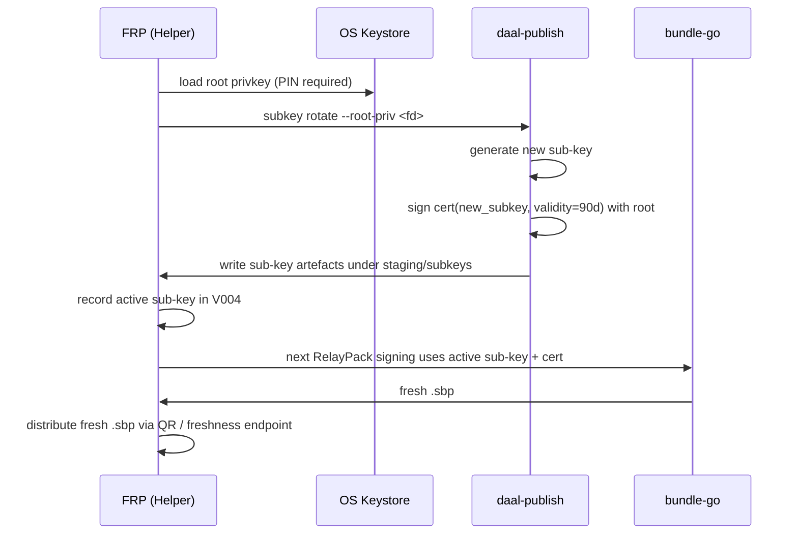

# Phase 37 (FRP-7.5) — Publisher Sub-Key Cert Chain

**Status:** SHIPPED 2026-05-03 (engineering surface).
**Roadmap line:** *"bundle-go cert chain (Phase 1.5 candidate): teach `VerifyBundle` to accept a manifest signed by a sub-key whose cert is embedded in `trust/subkey-cert.json` and signed by the bundle's `publisher.pub`. Once this lands, drop the 'staged' guard in `publisher.Bundle`."* — `phases of development/04-phase-1a-publisher-cli.handover.md` deferred-followup.
**Supplement target:** v2.3.7.
**Engine `Version` target:** `daal-core 0.9.0+v3-share` **(UNCHANGED — sub-key chain is bundle-side hardening; supplement holds engine `Version` constant through V1.5).**
**ABI release surface target:** **48** **(UNCHANGED).**
**Maturity:** hardening phase. Closes the 1A handover deferred-followup. Bumps `spec_version` (sub-key cert is a new bundle field).
**Predecessor:** Phase 36 (FRP-7) — V1.5 closure record exists; V1.5 packaging tag in place; engine `Version` unchanged.
**Successor:** Phase 38 (FRP-8) — V1.6 CDN expansion; long-running FRPs need sub-key rotation working before they go to CDN-fronted production.

## 1. Strategic frame (verbatim from the 1A handover)

> **Phase 1A handover, "Decisions worth carrying forward" point 1.** Sub-key signing on bundles is staged. `bundle.VerifyBundle` in bundle-go currently checks the bundle signature against the `publisher.pub` shipped inside the archive. Embedding a sub-key cert in `trust/subkey-cert.json` is supported, but `Bundle()` refuses to sign the manifest itself with a sub-key until bundle-go's verifier learns the cert chain. This is the right ordering — the chain is a Phase 1.5 trust feature — but Phase 1B should plan to implement the verifier-side cert chain so journalists can actually rotate sub-keys without a root touch.

The 1A deferred-followup never landed because the V0/V1 cycle prioritized client features over publisher-side hardening. The FRP track makes this urgent: long-running FRPs *will* need to rotate sub-keys for hygiene; without verifier-side cert chain, every rotation requires a root-key touch in the field. FRP-7.5 closes this between V1.5 ship (FRP-7) and V1.6 expansion (FRP-8).

## 2. Locked answers

| Question | Locked answer |
|---|---|
| Cert chain shape | Per 1A: `trust/subkey-cert.json` embedded in the `.sbp` archive, signed by the bundle's `publisher.pub`. Bundle manifest signed by the sub-key. Verifier walks: pub→cert→subkey→manifest signature. |
| `spec_version` bump | Yes. The sub-key cert in `trust/subkey-cert.json` is a new in-archive shape that pre-V1.5b verifiers don't understand. Bump = current+1 (current was bumped at FRP-1; this bump is the second on the FRP track). |
| Cert validity window | Sub-key cert carries `valid_from` / `valid_until`. Verifier rejects out-of-window. Default lifetime: 90 days; configurable down to 7 days. |
| Sub-key rotation cadence | Wizard prompts FRP at sub-key 75% lifetime elapsed; auto-prompt at 95%. Manual rotation always available. |
| Wizard rotation surface | New "Settings → Rotate sub-key" screen in client-desktop. Generates a fresh sub-key, has the publisher root sign the new cert, records the active sub-key in V004, and makes the next RelayPack signing call use the active sub-key + cert. |
| Backward compat for old recipients | A pre-V1.5b recipient receiving a sub-key-signed bundle hard-rejects (signature doesn't verify against `publisher.pub` directly). Same update-required failure mode as 3A/3B/3E/3F. |
| Existing 1A `subkey.go` reuse | Yes. `publisher/subkey.go` already has `Subkey`, `SubkeyCert`, and `VerifySubkeyCert`. FRP-7.5 keeps that issuer-side shape and mirrors the verifier logic inside `bundle/` without adding a reverse import. |
| Removal of staged guard | `publisher.Bundle()` currently refuses to sign with a sub-key (per 1A handover decision 1). FRP-7.5 lifts that guard once `bundle.VerifyBundle` accepts the chain. |
| Telemetry | None. Verified by 1A's `opsec_test.go` carry-forward. |

## 3. Locked invariants

Tracks invariants 1–16 inherited. Phase-specific:

17. **Cert chain is the only new in-archive entry.** No other archive structure changes; canonical bytes contract preserved.
18. **`spec_version` bumps once.** A pre-V1.5b verifier rejects with explicit "sub-key cert chain not understood; please update Daal" message.
19. **Root-key touch eliminated for routine rotation.** Verified by an end-to-end test: generate root → generate sub-key → sign cert → sign bundle with sub-key → verify bundle (root never touched after cert sign).
20. **Cert validity enforced.** Verifier rejects out-of-window certs. Tests cover `valid_from` future and `valid_until` past cases.
21. **No engine release symbols added.** ABI count stays 48; cert chain is bundle-side.
22. **Position B preserved.** Sub-key generation is wizard-side, no telemetry.
23. **Old bundles (no cert chain) keep working.** A bundle without `trust/subkey-cert.json` falls back to the existing direct-publisher-signature path. Verified by a fixture test.
24. **Sub-key compromise is bounded.** FRP-7.5 is forward-only: the verifier enforces the cert validity window and the wizard can rotate to a fresh active sub-key, but sub-key-specific revocation-list semantics are deferred. Root/publisher revocation from `specs/revocation-v1.md` remains the emergency recovery path for a compromised active sub-key before expiry.

## 4. Sub-task breakdown

| #  | Task |
|----|------|
| 0  | Replace any prior FRP-7.5 stub with this locked spec at `phases of development/37-phase-frp-7-5-publisher-subkey-chain.md`. |
| 1  | Read inputs end-to-end: `04-phase-1a-publisher-cli.handover.md` decisions §1 + §"Inline revocation shape"; `bundle/go/publisher/subkey.go` (existing); `bundle/go/bundle/sign.go` (existing); `bundle/go/bundle/sbp.go` `VerifyBundle` (existing — verifier lives in `sbp.go`, not a separate `verify.go`); `specs/sbp-v1.md`. |
| 2  | Extend `VerifyBundle` in `bundle/go/bundle/sbp.go` to recognize `trust/subkey-cert.json` in the archive. If present: parse the bundle-local mirror of `publisher.SubkeyCert`; verify the cert's canonical root signature against the bundle's `publisher.pub` without importing `publisher/`; verify the manifest signature against the sub-key subject; reject on validity window violation. |
| 3  | Bump `spec_version` constant in `bundle/go/bundle/types.go`. Add a parser guard that surfaces "sub-key chain not understood; please update Daal" when an old verifier sees a sub-key bundle. |
| 4  | Lift the staged guard in `bundle/go/publisher/bundle_cmd.go` (`Bundle()` function). Re-enable signing with a sub-key when one is provided in the keystore. |
| 5  | Wire wizard rotation screen at `client-desktop/tauri/src/wizard/screens/SubkeyRotateModal.tsx`. Tauri command (in `client-desktop/tauri/src-tauri/src/`) opens the root publisher key from the keystore, writes a temporary 0o600 root-key file, shells out to `daal-publish subkey rotate --root-priv <temp> --out-dir <staging-subkeys> --json`, deletes the temp file, and records the active sub-key artefact paths + cert metadata in V004. |
| 6  | Wire wizard rotation auto-prompt: at 75% sub-key lifetime, banner appears in main desktop UI; at 95%, banner is mandatory. Lifetime read from cert's `valid_until`. |
| 7  | Author tests at `bundle/go/bundle/sbp_subkey_test.go` (sibling of existing `sbp_test.go`). Required coverage: chain happy path; out-of-window `valid_from` reject; out-of-window `valid_until` reject; cert signed by wrong root reject; manifest signed by wrong sub-key reject; malformed cert reject; spec-version-too-old reject; old-bundle-no-cert-chain still works; chain depth = 1 only (no transitive sub-keys at V1.5b). |
| 8  | Author end-to-end "rotation without root touch" test: generate root keypair; generate sub-key 1; sign cert 1 with root; sign bundle 1 with sub-key 1; verify bundle 1 — root touched ONCE (cert signing). Generate sub-key 2; sign cert 2 with root (still requires root touch — this is the cert refresh, expected). Sign bundle 2 with sub-key 2; verify bundle 2 — root not touched between bundles. |
| 9  | Author wizard test: drive the rotation path; verify V004 contains the active sub-key; verify the next `sign_relaypack` call passes the active sub-key private key plus `--subkey-cert` to `daal-deploy bind-and-sign`. |
| 10 | Update `specs/sbp-v1.md` to document the `trust/subkey-cert.json` shape and the verifier walk. |
| 11 | Add a new sample artefact at `specs/test-vectors/bundles/samples/subkey-signed-A.sbp` (sub-key signed bundle, root used only for cert sign). |
| 12 | Final regression sweep: `cd bundle/go && go build ./... && go test ./bundle/... ./publisher/...`; `cd publisher && go build ./... && go test ./...`; `nm` returns 48; all 1A samples still work; FRP-8 gate verdict; handover. |

## 5. Verifier walk (locked)

```
Given a .sbp archive:
  1. Parse archive structure.
  2. If trust/subkey-cert.json is absent:
       Verify manifest signature against bundle's publisher.pub directly. (1A path; unchanged.)
  3. If trust/subkey-cert.json is present:
       a. Parse the bundle-local SubkeyCert mirror.
       b. Verify cert.Signature against bundle.publisher.pub using the shared canonical cert body.
       c. Reject if `now < cert.valid_from` or `now >= cert.valid_until`.
       d. Verify manifest signature against `cert.subkey_pub_hex`.
       f. On all-pass, the bundle is accepted as signed by the publisher (transitively).
```

## 6. Sub-key rotation flow (locked)



## 7. Build matrix at FRP-7.5 exit

```
$ cd bundle/go && gofmt -l ./...
$ cd bundle/go && go build ./bundle/... ./publisher/... ./cmd/...
$ cd bundle/go && go test ./bundle/... ./publisher/...     # ≥15 new tests (added inline next to sbp_test.go)
$ /tmp/daal-publish subkey rotate --help                   # subcommand exists
$ /tmp/daal-publish verify specs/test-vectors/bundles/samples/subkey-signed-A.sbp
   # green: sub-key chain verified
$ /tmp/daal-publish verify specs/test-vectors/bundles/samples/signed-A.sbp
   # green: 1A direct-publisher path still works
$ nm /tmp/libdaalcore.so | grep ' T engine_' | wc -l       # 48 (UNCHANGED)
$ git grep -n 'spec_version' bundle/go/bundle/types.go      # bumped (now FRP-1 + FRP-7.5)
```

## 8. Spec deliverables

**1 AMENDED:**
- `specs/sbp-v1.md` — gains a §"Sub-key cert chain" section.
- `specs/relaypack-v1.md` — gains a cross-reference to the sub-key flow.

**1 NEW sample artefact:**
- `specs/test-vectors/bundles/samples/subkey-signed-A.sbp`

## 9. Out of scope (deferred)

- HSM integration (`--hsm` flag from 1A) — 1A reserved; not promoted at FRP-7.5; defer to V4.
- Multi-level sub-keys (root → tier-1 → tier-2) — out of scope; chain depth = 1 only at FRP-7.5.
- Transitive cell-key signing — **FRP-11.**
- Sub-key rotation via mobile FRP wizard — V2.

## 10. Handover requirements

The FRP-7.5 handover must contain:

1. Status: SHIPPED. Date.
2. `bundle/go/bundle/sbp.go` `VerifyBundle` diff summary.
3. Test count + 15-row test table (one row per scenario in §4 step 7).
4. End-to-end "no root touch" test result.
5. New sample artefact path.
6. `spec_version` before/after.
7. `nm` count = 48 unchanged.
8. `specs/sbp-v1.md` page count delta.
9. FRP-8 gate verdict.

## 11. Track ordering rationale

FRP-7.5 between FRP-7 (V1.5 ship) and FRP-8 (V1.6 expansion) because: (a) the bug exists post-1A and was always going to need fixing — the FRP track is the right time because FRPs are the first long-running publishers; (b) doing it before V1.5 ships would have delayed V1.5 by a sub-phase for a bug that affects only long-tail rotation, not initial deployment; (c) doing it after V1.6 would mean V1.6 ships with a known root-touch hazard for FRPs who add CDN candidates and accumulate operational scar. The "between V1.5 and V1.6" placement closes the bug at the natural breakpoint without delaying V1.5 or V1.6.

End — locked at FRP-track planning. Next: FRP-8 (V1.6 CDN-fronted mode + freshness endpoint).
