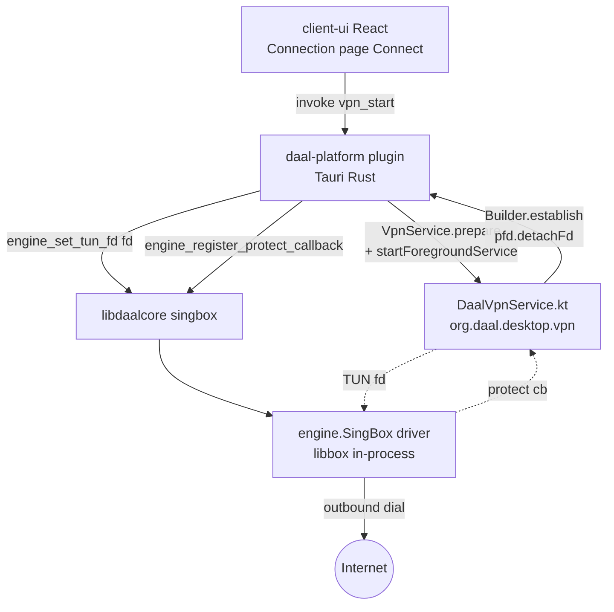

# Phase 45 — Data plane: in-process sing-box + Android VpnService

**Status:** ACTIVE build spec.
**Branch:** `gap-dataplane-and-delivery` (orphan / force-push pattern continues; tag bump at the end).
**Position:** slots after Phase FRP-14 (`44-phase-frp-14-pack-to-person.md`) and the v0.1.0 tractable-gap follow-up.
**Exit gate (single, non-negotiable):** **real tunneled traffic on the Android device**. A `curl` issued from the device through the VPN tunnel returns the relay's egress IP. Disconnect tears everything down cleanly.

## Why this phase exists

The v0.1.0 "tractable" gaps (5 — posture FSM tightening; 1 — publisher recipient dashboard; 4-recipient — subscription panel + scheduler tick) were implemented in the FRP-14 follow-up session and validated by webview flow checks on the Samsung One UI 16 device (192.168.0.172:43951). Those gaps produce no tunneled traffic by nature.

Real tunneled traffic requires two large, interdependent pieces:

1. **Gap 2** — a real in-process sing-box `engine.Driver` selected by `//go:build singbox`. The stub currently linked into the release `.so` (`core/abi/abi.go:213` → `engine.NewStub()`) silently swallows `Start/Stop/Stats/Subscribe` calls; until that is replaced, `engine_set_route` configures a route table that no one reads.
2. **Gap 3** — Android `VpnService` lifecycle + a new `engine_set_tun_fd(int)` ABI so the Kotlin service can hand the TUN file descriptor straight to the in-process driver, and a `protect()` callback ABI so the driver's own upstream sockets are excluded from the TUN (no loopback).

Gap 3 cannot tunnel without Gap 2's real driver consuming the fd, and Gap 2 cannot be validated end-to-end without Gap 3's VpnService delivering one. Doing them as one phase with **one** exit gate (real traffic) is the cheapest way to ship them correctly.

Per the locked decisions from the v0.1.0 retro:

- **Gap 2 = in-process Go library behind `//go:build singbox`** (NOT bundled sidecar). Desktop and Android converge on a single mechanism.
- **Milestone order = both in parallel** (desktop tunnel + Android stack proven together).
- **Protect loop = JNI `protect()` callback** via a new `engine_register_protect_callback` ABI. NOT `addDisallowedApplication(self)` — the engine's own subscription / revocation refresh traffic must traverse the tunnel exactly like any other app's traffic.
- **Gap 4-publisher (canonical hosting) and Gap 4 transport rotation hosting** are explicitly out of scope here; they belong in a follow-on phase whose exit gate is "publisher publishes → recipient pastes URL → routes refresh on tick against live origin". The plumbing for that (live `Put` on R2 / GH-Pages, `publish-subscription` CLI subcommand, wizard UX) is independent of the data plane.

## Verified starting point (re-confirmed at the top of this session)

| Fact | Source |
|---|---|
| `engine.Driver` constructor in `abi.go` is `engine.NewStub()` | `core/abi/abi.go:213` |
| `engine.Driver` interface is `Start/Stop/Stats/Subscribe` | `core/engine/engine.go` |
| `BuildSingBoxConfig` already produces valid sing-box outbound JSON (+`udp_gated`) | `core/engine/config.go` |
| No `//go:build singbox` files exist anywhere in the tree | `grep //go:build singbox core/...` |
| Release cshared ABI = **53** symbols pre-Phase-45 (cshared without `soak`; the 3 soak-tagged exports — `engine_set_now_unix`, `engine_soak_force_wg_handoff`, `engine_soak_set_wg_memory_kib` — only link in soak builds) | `nm libdaalcore.so \| grep -c ' T engine_'` against the v0.1.0 build |
| ABI growth pattern = triplet (`X.go` logic / `X_export.go` cshared / `X_gomobile.go` parity) | `core/abi/tunnel{,_export,_gomobile}.go` |
| `plugins/daal-platform/` contains only `README.md`, `android/DaalVpnService.kt` (legacy stub, package `ai.daal.app`, missing `DaalCoreBridge`, closes fd after `establish`), `ios/PacketTunnelProvider.swift`. NO `Cargo.toml`, NO `src/`, NO `android/build.gradle.kts`, NO `android/src/main/AndroidManifest.xml`. Not a Cargo workspace member. | `find plugins/daal-platform` |
| `gen/android/...` is gitignored and regenerated (`.gitignore:25:client-shell/tauri/src-tauri/gen/android/`) | `git check-ignore -v` |
| ⇒ Service registration + permissions MUST arrive via the plugin's Android manifest, merged by Gradle at build time. | (consequence) |
| `libsing_box.so` (58 MB, arm64-v8a only) is referenced **nowhere** in Rust source | `grep -rn libsing_box client-shell/tauri/src-tauri/src daal-desktop-core/src` |
| sing-box not yet vendored | `grep -c sagernet core/go.sum` = `0` |
| Tauri plugins currently registered: `tauri-plugin-dialog`, `tauri-plugin-opener` | `src-tauri/Cargo.toml` + `src-tauri/src/lib.rs:1926-1927` |
| App package: `org.daal.desktop`; MainActivity at `gen/android/app/src/main/java/org/daal/desktop/MainActivity.kt` exposes `instance` for JNI lookup | `MainActivity.kt:21-25` |
| `client-shell/tauri/daal-desktop-core/src/tun_helper.rs` reads JSON response only — **no `recvmsg` for SCM_RIGHTS fd** (desktop sidecar fd handoff is incomplete) | source-read |

## Architecture



Single mechanism on both Android and Linux desktop:

- Android: the VpnService gives us the fd; the in-process driver runs the TUN inbound + outbound graph.
- Linux desktop: the privileged `daal-tun-helper` opens `/dev/net/tun`, sends the fd over `SCM_RIGHTS`; the in-process driver consumes the same fd via the same `engine_set_tun_fd` ABI. The Phase 1.5B external sing-box sidecar (`Singbox::spawn`) and the Clash REST control path are **retired** as a follow-up within this phase once the Android exit gate is green; the desktop convergence is tracked as Part 4 below.

## Invariants locked at the end of this phase

1. **`engine.NewDefaultDriver()` is the single constructor call site** in `core/abi/abi.go`. Build tag `singbox` selects the real driver; absent tag keeps the stub for unit tests + ABI-stability soak. Pinned by `TestDriverSelectionByBuildTag` (twin test files per build tag).
2. **Append-only ABI growth: 53 → 56 in release builds (cshared without `soak`).** Three new symbols: `engine_set_tun_fd(int) → int`, `engine_clear_tun_fd() → int`, `engine_register_protect_callback(uintptr) → int`. No existing symbol is renamed, deleted, or has its signature changed. Pinned by `nm libdaalcore.so | grep -c ' T engine_'` CI gate = 56 (release) / 59 (cshared+soak).
3. **`engine_set_tun_fd` takes ownership of the fd.** After a successful call the caller MUST NOT `close(fd)`. The engine closes it on `engine_clear_tun_fd` or `engine_shutdown`. Pinned by `TestSetTunFdOwnershipSemantics` (mock Driver + sentinel close).
4. **`VpnService.protect()` is reachable from Go via the registered callback.** Each upstream socket the in-process driver opens is offered to the callback before its first connect / sendto; the Kotlin side calls `this.protect(fd)`. Pinned by `TestProtectCallbackInvoked` (in-tree mock) + the device exit gate (real traffic actually reaches a remote IP, which is only possible if protect was called).
5. **`libsing_box.so` is gone.** All ABI copies under `gen/android/app/src/main/jniLibs/*/libsing_box.so` are deleted; only `libdaalcore.so` + `libdaal_desktop_tauri_lib.so` ship in jniLibs after this phase. (The 58 MB file is referenced nowhere in source.)
6. **Plugin's `<service>` + VPN permissions land in the merged manifest at every build.** Even though `gen/android/.../AndroidManifest.xml` is gitignored and regenerated, the Tauri plugin's `android/src/main/AndroidManifest.xml` is part of the source tree and merges into the app manifest via Gradle. Pinned by inspecting `app/build/intermediates/merged_manifest/.../AndroidManifest.xml` after a clean build.
7. **Real traffic exit gate.** On a fresh install, accepting the VPN consent dialog and connecting to a relay route causes a `curl https://ip.example/` issued from the device to return the relay's egress IP (not the device's WAN IP).

## Build spec

### Part 1 — Gap 2: in-process sing-box driver behind `//go:build singbox`

Files:

- `core/go.mod` / `core/go.sum`: add `github.com/sagernet/sing-box` and the necessary supporting modules. sing-box is gated by its per-feature tags; we adopt only what the engine needs:
  - `with_gvisor` — required by `sing-tun` for the userspace netstack
  - `with_quic` — QUIC outbounds (Hysteria, Tuic, MASQUE family)
  - `with_wireguard` — WG outbounds
  - `with_utls` — uTLS fingerprinting for VLESS / Trojan / VMess
  - `with_clash_api` — runtime stats (the Clash REST endpoint stays bound to loopback inside the engine; the desktop sidecar / external clash-api is retired)
- `core/engine/engine_default.go` (NEW, `//go:build !singbox`):
  ```go
  package engine
  func NewDefaultDriver() Driver { return NewStub() }
  ```
- `core/engine/engine_singbox.go` (NEW, `//go:build singbox`):
  ```go
  package engine
  func NewDefaultDriver() Driver { return newSingBox() }
  // type singBox struct { ... } implementing Driver:
  //   Start(cfg) -> parse cfg via BuildSingBoxConfig contract,
  //                inject TUN inbound from registered fd (set via Driver-level
  //                method called by tun_fd.go), honor route.udp_gated by
  //                blocking the udp outbound when set, libbox.NewInstance,
  //                instance.Start.
  //   Stop()    -> instance.Close.
  //   Stats()   -> hour-bucketed bytes-in/out from clash stats hook.
  //   Subscribe -> emits engine.Event (Connected / Disconnected / SocketProtected).
  ```
- `core/abi/abi.go:213` (UPDATE, one-line): `engine.NewStub()` → `engine.NewDefaultDriver()`.
- `tools/build-engine-android.sh` (UPDATE): `-tags cshared` → `-tags cshared,singbox`.
- `tools/build-engine-ios.sh` (UPDATE): same.
- Unit test build flow (`go test ./core/...`) intentionally stays **without** the `singbox` tag so the stub remains the test target — the real driver is exercised only on-device.

Tests:

- `core/engine/driver_selection_singbox_test.go` (`//go:build singbox`) — asserts `NewDefaultDriver()` returns something whose `Start` actually configures libbox.
- `core/engine/driver_selection_stub_test.go` (`//go:build !singbox`) — asserts `NewDefaultDriver()` returns a `*Stub`.

### Part 2 — Gap 3a: TUN-fd + protect ABI (append-only, 56 → 59)

Triplet, mirroring `tunnel{,_export,_gomobile}.go`:

- `core/abi/tun_fd.go` (NEW, no build tag) — logic. Exposes:
  - `SetTunFD(fd int) (string, error)` — stores fd in package-level guarded slot, calls a Driver-level `OnTunFD(fd)` hook (added to `engine.Driver`, default impl `error("unsupported")` in `Stub`, real impl in `singBox`). Returns the same JSON shape as other set_* calls (`{"ok":true}` on success).
  - `ClearTunFD() (string, error)` — symmetric.
  - `RegisterProtectCallback(cb unsafe.Pointer) (string, error)` — stores the C function pointer; `singBox` reads it at upstream-socket-open time.
- `core/abi/tun_fd_export.go` (NEW, `//go:build cshared`):
  ```go
  //export engine_set_tun_fd
  func engine_set_tun_fd(fd C.int, out unsafe.Pointer, outLen C.int) C.int { ... }
  //export engine_clear_tun_fd
  func engine_clear_tun_fd(out unsafe.Pointer, outLen C.int) C.int { ... }
  //export engine_register_protect_callback
  func engine_register_protect_callback(cb C.uintptr_t, out unsafe.Pointer, outLen C.int) C.int { ... }
  ```
- `core/abi/tun_fd_gomobile.go` (NEW, `//go:build gomobile`) — `(h *DaalCore) SetTunFD / ClearTunFD / RegisterProtectCallback` method parity.

Tests:

- `core/abi/tun_fd_test.go`:
  - `TestSetTunFdOwnershipSemantics` — installs a mock Driver whose `OnTunFD` records the fd; opens a temp `os.Pipe()` to get a real fd; calls `SetTunFD(fd)`; asserts ownership flag set; calls `ClearTunFD()`; asserts the fd was closed exactly once (using a sentinel `close()` wrapper).
  - `TestProtectCallbackInvoked` — installs a mock Driver that calls back into the registered C function pointer with a sentinel fd; the test registers a Go-backed `cgo.NewHandle`-style callback that records invocations; asserts the sentinel fd was offered.

### Part 3 — Gap 3b: Tauri mobile plugin + Android VpnService (real)

**Rust plugin: `client-shell/tauri/plugins/daal-platform/`**

- `Cargo.toml` (NEW) — package `tauri-plugin-daal-platform`, edition 2021, depends on `tauri`, `serde`, `serde_json`, `thiserror`. Android target deps: `jni`, `ndk-context`, `log`, `android_logger`.
- `build.rs` (NEW) — `tauri_plugin::Builder::new(COMMANDS).android_path("android").build();`
- `src/lib.rs` (NEW) — plugin init + the `connect / disconnect / status` commands (Android branch invokes JNI into `DaalVpnService`; desktop branch is a no-op).
- `src/commands.rs` (NEW) — `#[tauri::command] async fn vpn_start(route_id: String) / vpn_stop() / vpn_status()`.
- `src/models.rs` (NEW) — request/response shapes.
- `permissions/default.toml` (NEW) — Tauri capability allowing the three commands.
- `android/build.gradle.kts` (NEW) — minimal Android library module pulling Tauri's mobile plugin gradle pieces.
- `android/src/main/AndroidManifest.xml` (NEW) — see below.
- `android/src/main/java/org/daal/desktop/vpn/DaalVpnService.kt` (NEW, replacing the legacy stub).

**Service rewrite (the most important file):**

```kotlin
// android/src/main/java/org/daal/desktop/vpn/DaalVpnService.kt
package org.daal.desktop.vpn

import android.app.Notification
import android.app.NotificationChannel
import android.app.NotificationManager
import android.content.Intent
import android.net.VpnService
import android.os.ParcelFileDescriptor

class DaalVpnService : VpnService() {

  override fun onStartCommand(intent: Intent?, flags: Int, startId: Int): Int {
    startForeground(NOTIFICATION_ID, buildNotification())

    val routeId = intent?.getStringExtra(EXTRA_ROUTE_ID) ?: return START_NOT_STICKY
    val builder = Builder()
      .setSession("Daal")
      .addAddress("10.20.30.40", 30)
      .addRoute("0.0.0.0", 0)
      .addRoute("::", 0)
      .addDnsServer("1.1.1.1")
      .setMtu(1500)
    val pfd: ParcelFileDescriptor = builder.establish()
      ?: return START_NOT_STICKY
    val fd = pfd.detachFd()       // engine takes ownership; we do NOT close(pfd)

    // 1. Wire protect() so the engine's upstream sockets escape the TUN.
    DaalCoreBridge.registerProtectCallback { socketFd -> protect(socketFd) }
    // 2. Hand the fd to the engine.
    DaalCoreBridge.setTunFd(fd)
    // 3. Activate the route (this triggers Start on the singBox driver).
    DaalCoreBridge.setRoute(routeId)
    return START_STICKY
  }

  override fun onRevoke() { teardown() }
  override fun onDestroy() { teardown(); super.onDestroy() }

  private fun teardown() {
    DaalCoreBridge.clearRoute()
    DaalCoreBridge.clearTunFd()
    stopForeground(STOP_FOREGROUND_REMOVE)
    stopSelf()
  }

  private fun buildNotification(): Notification = /* ... */

  companion object {
    const val ACTION_START = "org.daal.desktop.vpn.START"
    const val EXTRA_ROUTE_ID = "route_id"
    const val NOTIFICATION_ID = 0xDAA1
    const val CHANNEL_ID = "daal.vpn"
  }
}
```

`DaalCoreBridge` is a Kotlin singleton that uses JNI to reach the Tauri plugin's Rust code (which in turn calls the `engine_*` ABI symbols in `libdaalcore.so`). It is declared inside the plugin and exposes:

```kotlin
object DaalCoreBridge {
  external fun setTunFd(fd: Int): Int
  external fun clearTunFd(): Int
  external fun setRoute(routeId: String): Int
  external fun clearRoute(): Int
  external fun registerProtectCallback(cb: (Int) -> Boolean): Int
  init { System.loadLibrary("daal_desktop_tauri_lib") }
}
```

**Plugin AndroidManifest:**

```xml
<manifest xmlns:android="http://schemas.android.com/apk/res/android"
          package="org.daal.desktop">

  <uses-permission android:name="android.permission.FOREGROUND_SERVICE"/>
  <uses-permission android:name="android.permission.FOREGROUND_SERVICE_SPECIAL_USE"/>
  <uses-permission android:name="android.permission.POST_NOTIFICATIONS"/>

  <application>
    <service
        android:name="org.daal.desktop.vpn.DaalVpnService"
        android:permission="android.permission.BIND_VPN_SERVICE"
        android:foregroundServiceType="specialUse"
        android:exported="false">
      <property
          android:name="android.app.PROPERTY_SPECIAL_USE_FGS_SUBTYPE"
          android:value="vpn"/>
      <intent-filter>
        <action android:name="android.net.VpnService"/>
      </intent-filter>
    </service>
  </application>
</manifest>
```

These permissions / `<service>` declarations merge into the app's regenerated `gen/android/.../AndroidManifest.xml` at Gradle build time. This is the only durable place to put them.

**Wire into the shell:**

- `client-shell/tauri/src-tauri/Cargo.toml`: add `tauri-plugin-daal-platform = { path = "../plugins/daal-platform" }`.
- `client-shell/tauri/src-tauri/src/lib.rs:1926-1927`: chain `.plugin(tauri_plugin_daal_platform::init())` after the existing two plugins.
- `client-ui/src/lib/connection.ts` (or wherever the Connect button lands): on Android, `invoke('plugin:daal-platform|vpn_start', { routeId })` instead of `invoke('set_route', { routeId })`. The first invocation surfaces the system VPN consent prompt; the plugin's `vpn_start` handles `VpnService.prepare()` and re-invokes after the consent Activity returns OK.

### Part 4 — Cleanup + desktop convergence

1. **Delete** `client-shell/tauri/src-tauri/gen/android/app/src/main/jniLibs/arm64-v8a/libsing_box.so` and any sibling per-ABI copies. The file is gitignored anyway (part of `gen/`) but the regeneration path (a stale `tauri android init` artifact) is plugged here: we do not stage it back.
2. **Flip** `plugins/daal-platform/README.md` from "Source preservation only" to "Active plugin" with the new file layout.
3. **Desktop convergence (deferred within this phase, after Android exit gate is green):**
   - Switch `daal-desktop-core/src/state.rs` to drive the in-process `singBox` driver directly (no `Singbox::spawn`, no Clash REST control path, no SOCKS5 inlet on loopback).
   - `daal-tun-helper` continues to open `/dev/net/tun` and `SCM_RIGHTS`-send the fd; the Rust client (`tun_helper.rs`) gains a `recvmsg` path (currently missing — only the JSON response is read) and forwards the received fd to `engine_set_tun_fd`.
   - `daal-desktop-core/src/singbox.rs` (the sidecar wrapper) and the Clash REST client become dead code → delete.
   - Desktop `vpn_start(route_id)` is a thin wrapper that delegates to the same `engine_set_route` path, since the helper has already delivered the fd at GUI startup.

## Build / test / validate

1. `go test ./core/...` (default, no `singbox` tag) stays green, including the two new invariant tests.
2. `PATH=/usr/local/go125/bin:$PATH ANDROID_NDK_HOME=/opt/android-sdk/ndk/27.0.12077973 bash /home/daal/tools/build-engine-android.sh` builds `libdaalcore.so` with `-tags cshared,singbox` for arm64-v8a, armeabi-v7a, x86_64 (the iOS arm64 build uses `build-engine-ios.sh` with the same tag set).
3. `nm gen/android/app/src/main/jniLibs/arm64-v8a/libdaalcore.so | grep -c ' T engine_'` == **56** (release cshared without `soak`). Per-ABI `.so` size budget ≤ 60 MB.
4. `cd /home/daal/client-ui && npm run build` (auto-syncs i18n).
5. `cd /home/daal/client-shell/tauri && PATH=/root/.cargo/bin:$PATH ANDROID_HOME=/opt/android-sdk ANDROID_NDK_HOME=/opt/android-sdk/ndk/27.0.12077973 npx tauri android build --apk`.
6. Inspect `app/build/intermediates/merged_manifest/universalRelease/.../AndroidManifest.xml` — confirm `<service ... DaalVpnService>` + `BIND_VPN_SERVICE` + `FOREGROUND_SERVICE_SPECIAL_USE` are present.
7. Install on the device (192.168.0.172:43951 — port subject to change between sessions; verify with `adb devices`): `adb install -r gen/android/app/build/outputs/apk/universal/release/app-universal-release.apk`.
8. **Device exit gate:**
   - Launch the app: `adb shell monkey -p org.daal.desktop -c android.intent.category.LAUNCHER 1`.
   - Import a real relay `.sbpx` (subscription pasted via the FRP-14 paste flow or a test bundle dropped to `/sdcard/Download/`).
   - Tap Connect → system VPN consent dialog appears → accept.
   - Foreground notification appears: "Daal — Tunnel active".
   - In-app probe (or `adb shell curl https://api.ipify.org`) returns the relay's egress IP (NOT the device WAN IP).
   - Tap Disconnect → notification clears → `adb shell dumpsys connectivity` shows no active VPN network.

## Risks / mitigations

- **CGO cross-compile of the sing-box graph** (gvisor, quic-go) for 4 Android ABIs is the most likely failure point. Mitigation: build arm64 first as the device-validation target; only after arm64 is green proceed to armeabi-v7a + x86_64. Trim further sing-box feature tags if a transitive cgo build blows up.
- **APK size.** sing-box's transitive deps can push `libdaalcore.so` per ABI well past current ~15 MB. Budget ≤ 60 MB per-ABI; ≤ 250 MB universal APK; strip `-s -w` in release build via `-ldflags`. Deleting `libsing_box.so` reclaims 58 MB at the same time.
- **`protect()` ordering.** The callback MUST be registered BEFORE the first outbound dial inside libbox. Order in `DaalVpnService.onStartCommand`: register protect, set TUN fd, set route. Pinned by a (failing-fast) integration check in `DaalCoreBridge` that no upstream socket is opened before the callback is non-null.
- **Manifest merge.** First clean build verifies merged manifest at `app/build/intermediates/merged_manifest/universalRelease/.../AndroidManifest.xml`. If the plugin manifest is not picked up, the Tauri plugin gradle wiring needs `tauri android init` re-run.
- **Desktop sidecar retirement** strictly follows the Android exit gate; if Android is green but desktop convergence stalls, Phase 45 ships with Android tunnel only and desktop convergence becomes Phase 45.1.

## Phase exit checklist

- [ ] `go test ./core/...` (no tag) green incl. `TestDriverSelectionByBuildTag` (`!singbox`).
- [ ] `go test -tags singbox ./core/...` green incl. `TestDriverSelectionByBuildTag` (`singbox`) + `TestSetTunFdOwnershipSemantics` + `TestProtectCallbackInvoked`.
- [ ] `libdaalcore.so` built with `-tags cshared,singbox` for all 4 Android ABIs.
- [ ] `nm libdaalcore.so | grep -c ' T engine_'` = **56** on every ABI (release cshared without `soak`).
- [ ] APK builds and installs cleanly on the device.
- [ ] Merged manifest contains the `<service>` + VPN permissions.
- [ ] On first Connect, the system VPN consent dialog appears; on accept, the foreground notification renders.
- [ ] In-tunnel probe returns the relay's egress IP.
- [ ] Disconnect clears the VPN network and the notification.
- [ ] `libsing_box.so` removed; APK shrinks by ~58 MB (offset by sing-box link-in into `libdaalcore.so`).
- [ ] Handover doc written; v0.2.0-dev tag bumped or the tractable v0.1.0 tag moved per the orphan-branch pattern.
