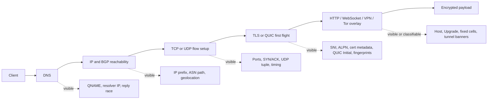
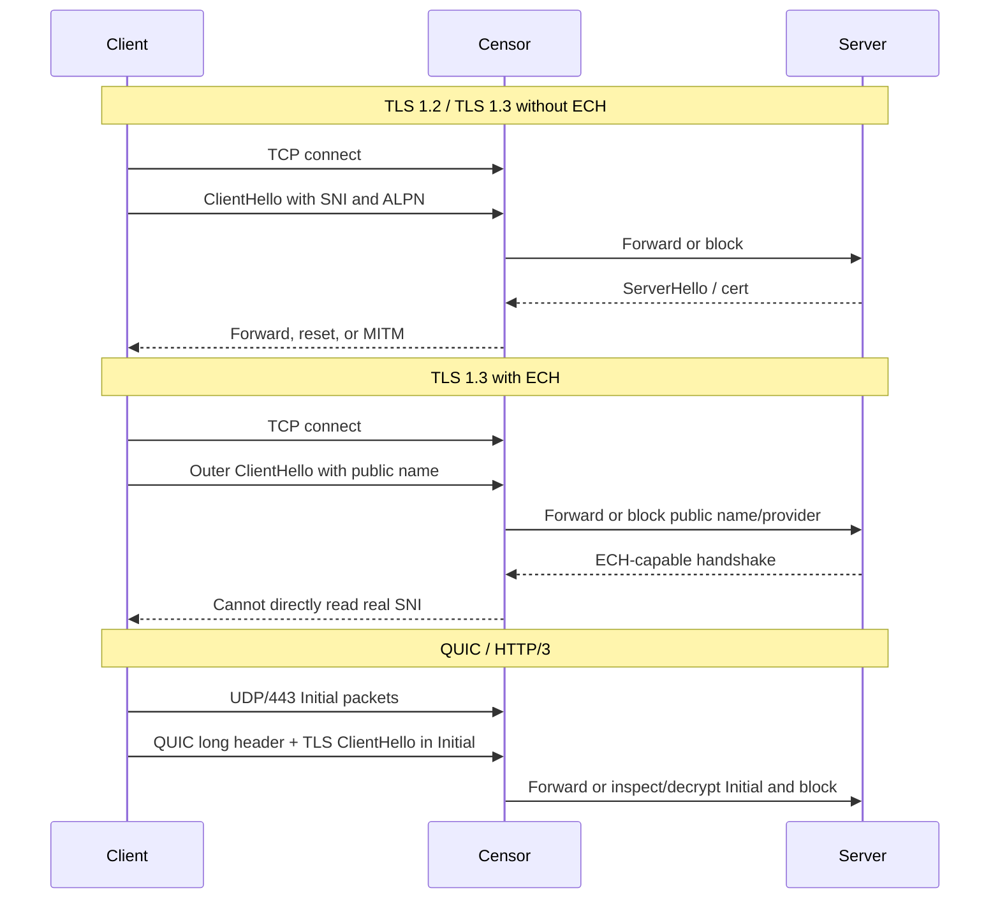

# Protocol Surfaces for Internet Censorship and Protocol-Level Circumvention

## Executive summary

Internet censorship works best where protocols expose stable, low-cost metadata before encryption or routing decisions are finalized. Across the modern stack, the highest-value choke points are classic DNS, IP prefix reachability, TCP/UDP flow setup, TLS/QUIC handshakes, and a small set of application-layer hints such as HTTP `Host`, WebSocket `Upgrade`, TLS SNI/ALPN, or Tor/VPN-specific fingerprints. Once payload encryption becomes widespread, censors usually shift from content filtering to metadata filtering: DNS manipulation, IP/port blocking, route manipulation, SNI-based blocking, TLS interception, QUIC Initial inspection, packet-size/timing heuristics, and active probing of suspected circumvention endpoints. citeturn29view0turn24search2turn25search1turn30search6turn23search3

From a protocol-design perspective, the most censorship-resistant systems are not the “strongest crypto” in isolation, but the systems that either minimize exposed metadata or hide inside already-popular traffic classes. That is why DoH generally fares better than DoT, why WebSocket-over-HTTPS and MASQUE-style HTTP tunnels can be effective cover channels, and why Tor’s pluggable transports, Snowflake, and WebTunnel materially outperform vanilla Tor in hostile environments. By contrast, protocols with distinctive ports or fixed handshakes—classic DNS, DoT on `853/tcp`, IKEv2/IPsec on `500/4500/udp`, vanilla WireGuard, bare OpenVPN, vanilla Tor—are efficient and secure but comparatively easy to classify and block. TLS 1.3 with ECH improves the web stack substantially by hiding the real SNI and ALPN, but recent Russian blocking of ECH shows that deployment concentration can turn the privacy feature itself into a censor trigger. citeturn24search2turn31search0turn32search0turn23search1turn23search2turn30search0turn30search1turn12search4

## Scope and selection

I selected these 18 protocols because they cover the main enforcement points that contemporary censorship systems and measurement platforms repeatedly target: naming, web application protocols, handshake encryption, transport, IP/routing, VPN and remote-access tunnels, and anonymity overlays. I omitted narrower workload protocols such as SMTP, SIP, and RTP not because they are unimportant, but because they are less central to today’s mass web censorship and protocol-level circumvention ecosystem than DNS, HTTP/TLS/QUIC, VPNs, and Tor-related transports. Most standards references below are official RFCs from the entity["organization","RFC Editor","internet standards publisher"] and the entity["organization","Internet Engineering Task Force","standards body"]; where no canonical RFC exists, I use the maintainer’s official protocol documentation. Measurement examples draw heavily on the entity["organization","Open Observatory of Network Interference","ooni project"] and peer-reviewed censorship research. citeturn22search13turn28search21turn29view0turn13view0

## Where censors see protocol metadata

The key analytical point is that censorship is cumulative, not single-layer. A censor can lose at the content layer and still win at the resolver, IP, transport, or first-flight layer. Most practical bypasses therefore either remove metadata from the earliest observable phase, or encapsulate the target protocol inside a more common one before the censor’s classifier fires. citeturn29view0turn11search1turn13view0turn24search2turn25search1

For censorship, the meaningful differences are: HTTP/1.1 leaks everything if unencrypted; HTTP/2 mostly collapses into TLS metadata unless the censor can intercept TLS; TLS 1.2 and TLS 1.3 both leak SNI without ECH; TLS 1.3 + ECH hides the real SNI/ALPN but still exposes IPs and an outer public name; QUIC/HTTP/3 encrypts quickly but still exposes UDP metadata and a tamper-resistant yet classifiable first flight, and recent research shows that QUIC Initial packets can be inspected by censors at scale to recover the hostname signal. citeturn10search0turn10search1turn10search3turn12search4turn12search5turn25search1turn14search1

## Protocol catalog

### Name resolution

**DNS (classic DNS / STD 13).** **Primary specs:** RFC 1034/1035; DNS over TCP requirements in RFC 7766. **Layer / ports:** application layer over `53/udp` and `53/tcp`. **Censorship surface:** plaintext QNAME, QTYPE, resolver IP, response codes, and the race between authentic and forged replies. **Common controls:** forged answers, NXDOMAIN substitution, bogon A/AAAA records, resolver tampering, resolver IP blocking, and collateral damage from off-path injectors. **Protocol-level bypass:** alternate recursive resolvers, TCP fallback, query padding/minimization, or—more robustly—migration to encrypted DNS. **Limits / risks:** DNS is intrinsically metadata-rich and trivially spoofable on-path; resolver bootstrap is a persistent weakness. **Case study:** the Great Firewall has for years used DNS injection, and OONI documented DNS injection against services including Signal and OONI in entity["country","China","east asia"]. citeturn15search0turn15search3turn19search21turn1search6turn1search0

**DNS over TLS (DoT).** **Primary spec:** RFC 7858. **Layer / ports:** DNS over TLS, typically `853/tcp`. **Censorship surface:** the payload is encrypted, but the endpoint IP, the highly distinctive port `853`, TLS handshake fingerprints, and sometimes the endpoint name used for bootstrap or SNI remain visible. **Common controls:** port-based blocking, TCP connect failure, TLS handshake interruption, resolver-domain DNS tampering, and endpoint IP blocking. **Protocol-level bypass:** IP-literal resolvers can sometimes avoid resolver-domain tampering; non-default ports and tunneling through another cover protocol can help operationally, but native DoT itself stands out. **Limits / risks:** DoT’s dedicated port makes it easy to identify and cheap to block. **Case study:** OONI found that a majority of tested DoT endpoints were blocked on at least one network in entity["country","Iran","middle east"], and later cross-country measurements found strong DoT interference patterns in Iran, China, and Kazakhstan. citeturn15search1turn24search1turn24search2turn24search11

**DNS over HTTPS (DoH).** **Primary spec:** RFC 8484. **Layer / ports:** application-layer DNS mapped onto HTTPS, usually `443/tcp`. **Censorship surface:** the DNS message is hidden inside HTTPS, but the resolver hostname, IP reputation, TLS metadata, known DoH URI paths, and bootstrap DNS still matter. **Common controls:** SNI-based block of the DoH provider, IP blocking of public resolvers, TLS handshake interference, and DNS tampering against the resolver domain itself. **Protocol-level bypass:** blending with ordinary HTTPS makes DoH significantly more survivable than DoT; multiplexing over mainstream `443/tcp` infrastructure, HTTP/2 or HTTP/3 transport, and eventually ECH all improve cover. **Limits / risks:** widely known public resolvers become easy reputational targets, and bootstrapping a DoH endpoint can itself be censored. **Case study:** OONI found that Iran in September 2022 began blocking domain-based DoH endpoints through both DNS tampering and TLS interference. citeturn15search2turn24search2turn24search8

### Web and encrypted web

**HTTP/1.1.** **Primary spec:** RFC 9112. **Layer / ports:** application layer over `80/tcp` or over TLS on `443/tcp`. **Censorship surface:** in plaintext deployments the request line, `Host`, headers, paths, keywords, and response codes are exposed end-to-end. **Common controls:** URL or keyword filtering, transparent proxies, injected block pages, TCP reset injection, and throttling. **Protocol-level bypass:** moving to HTTPS is the main improvement; weak or legacy DPI can sometimes be evaded with header case changes, segmentation, chunking, or domain-fronting-style separation between visible and hidden names, but these are brittle and increasingly normalized away. **Limits / risks:** cleartext HTTP is the easiest protocol in this report to censor precisely. **Case studies:** OONI documented HTTP blocking and reset injection in entity["country","Uganda","east africa"], while older OONI work in Iran found standardized HTTP proxying and block pages. citeturn10search0turn26search1turn26search17turn29view0

**HTTP/2.** **Primary spec:** RFC 9113; ALPN signaling in RFC 7301. **Layer / ports:** application layer on TCP, typically negotiated on `443/tcp`. **Censorship surface:** HTTP/2’s binary framing and header compression matter only if the censor can see inside the session; otherwise censorship reduces to TLS metadata such as IP, port, SNI, and ALPN (`h2`). **Common controls:** SNI/ALPN filtering, IP/port blocking, and TLS interception by enterprise or state-installed roots. **Protocol-level bypass:** multiplexing and connection coalescing help blend flows; HTTP/2 also serves as a good substrate for HTTPS-based tunnels. **Limits / risks:** without ECH, the ALPN offer and SNI still expose that the session is web traffic; in practice h2 censorship is usually TLS censorship by another name. **Variant difference:** compared with HTTP/1.1, HTTP/2 meaningfully improves privacy only after TLS is established, not before. citeturn10search1turn13view0turn12search4

**TLS 1.2.** **Primary specs:** RFC 5246, RFC 6066, RFC 7301. **Layer / ports:** session/presentation over TCP, typically `443/tcp`. **Censorship surface:** the ClientHello is plaintext: SNI, offered ALPNs, ciphersuites, and fingerprintable extension order are visible; the certificate chain is also exposed after the server hello. **Common controls:** SNI blocking, certificate-based filtering, active man-in-the-middle using a locally trusted root, resets during handshake, and IP blocking. **Protocol-level bypass:** TLS 1.2 can reduce content visibility but cannot hide the target name by itself; practical workarounds usually require another layer, such as wrapping a tunnel inside HTTPS or migrating to TLS 1.3 plus ECH. **Limits / risks:** this is secure against passive surveillance but weak against metadata censors. **Case study:** OONI documented recurrent TLS interference and MITM patterns in entity["country","Kazakhstan","central asia"]. citeturn11search0turn11search1turn13view0turn2search3turn2search19

**TLS 1.3 with ECH.** **Primary specs:** RFC 8446, RFC 9848, RFC 9849, and DNS HTTPS/SVCB records in RFC 9460. **Layer / ports:** session layer over TCP, usually `443/tcp`. **Censorship surface:** TLS 1.3 alone still leaves the ClientHello metadata exposed; ECH changes that by encrypting the real ClientHello, including the true SNI and ALPN, while exposing only an outer public name and provider-level metadata. **Common controls:** block the provider IPs, the outer public name, the ECH extension itself, or the DNS HTTPS/SVCB bootstrap path; block or pressure the CDN carrying the anonymity set. **Protocol-level bypass:** ECH is the most important standards-based upgrade for resisting name-based TLS censorship on the web, especially when many sites share the same outer name or provider. **Limits / risks:** ECH only works where client, DNS, and server/CDN all support it; narrow deployment can make blocked public names conspicuous. **Case study:** OONI and entity["organization","Human Rights Watch","human rights ngo"] reported that entity["country","Russia","eastern europe"] began blocking entity["company","Cloudflare","web infrastructure company"] ECH-based access in November 2024. citeturn10search3turn12search4turn12search5turn12search6turn30search0turn30search1turn30search6

**QUIC v1 and HTTP/3.** **Primary specs:** RFC 9000, RFC 9001, RFC 9114; related tunneling extensions include RFC 9221, RFC 9297, RFC 9298, and RFC 9484. **Layer / ports:** transport plus HTTP mapping over `443/udp`. **Censorship surface:** QUIC exposes UDP metadata, version, connection IDs, and a distinctive first flight; the TLS ClientHello rides inside QUIC Initial packets, and recent research shows those Initials can be inspected at scale by censors to recover the hostname signal. **Common controls:** blanket UDP/443 blocking, QUIC-version or packet-shape classification, SNI-based blocking on decrypted Initials, and adaptive throttling. **Protocol-level bypass:** TCP fallback remains common; more advanced approaches tunnel arbitrary UDP or even IP through HTTP/3/MASQUE, or alter QUIC fingerprints and packet timing. **Limits / risks:** if a censor is willing to cause collateral damage by blocking UDP/443, native QUIC loses much of its advantage. **Case studies:** OONI found QUIC censorship in multiple countries, and 2025 research showed that the Great Firewall began domain-specific QUIC blocking in 2024. citeturn14search0turn14search1turn10search2turn31search0turn32search0turn25search2turn25search1

### Transport, network, and routing

**TCP.** **Primary spec:** RFC 9293. **Layer / ports:** transport layer, any TCP port. **Censorship surface:** SYN/SYN-ACK/ACK, sequence and acknowledgment numbers, flags, ports, MSS/window/options, and long-lived flow state. **Common controls:** SYN dropping, TCP reset injection, sequence-desynchronization attacks, flow tracking, and protocol inference from early bytes. **Protocol-level bypass:** client/server-side packet mutation—TTL tricks, out-of-order segments, crafted sequence numbers, deliberate desynchronization, or ignoring forged RSTs—can bypass stateful censors, as Geneva showed. **Limits / risks:** these methods are operationally fragile, may require kernel or library changes, and tend to stop working once the censor patches the parser. **Case studies:** RST injection remains a classic Great Firewall mechanism, and Geneva re-derived and extended TCP-level evasions against censors in China, India, Iran, and Kazakhstan. citeturn16search0turn29view0turn19search0turn2search2

**UDP.** **Primary spec:** RFC 768. **Layer / ports:** transport layer, any UDP port. **Censorship surface:** source/destination IP and port, datagram length, packet timing, and application-specific first packets. **Common controls:** full UDP blocking, selective port blocking, rate limiting, heuristic classification by packet size/timing, and collateral-damage-heavy throttling. **Protocol-level bypass:** port agility, application padding/keepalives, or encapsulation inside QUIC/HTTP tunnels can help; for raw UDP, the most powerful standards-based cover today is HTTP-mediated proxying such as CONNECT-UDP. **Limits / risks:** where UDP is categorically blocked, native UDP protocols simply fail. **Operational implication:** UDP is fast and simple, but politically it invites coarse blocking. citeturn16search1turn31search0turn25search2turn25search1

**IP, including IPv4 and IPv6.** **Primary specs:** RFC 791 and RFC 8200. **Layer / ports:** network layer; no ports at this layer. **Censorship surface:** destination/source IPs, prefix membership, TTL/Hop Limit, fragmentation behavior, and—for IPv6—extension-header handling. **Common controls:** IP or prefix blocking, anycast or CDN blacklist entries, geofencing, fragment-based heuristics, and uneven IPv4/IPv6 enforcement. **Protocol-level bypass:** the most pragmatic IP-layer bypasses are address-family and path diversity: IPv6 when IPv4 enforcement lags, alternate anycast/CDN edges, and HTTP-mediated CONNECT-IP tunnels that move IP packets through regular web infrastructure. **Limits / risks:** fragment or extension-header evasions are notoriously brittle because many middleboxes drop them, and recent research suggests IPv6 enforcement gaps are real but shrinking. **Case study:** 2025 measurements found many censors less comprehensive on IPv6 than on IPv4, creating temporary but not guaranteed bypass headroom. citeturn17search0turn17search1turn20search0turn32search0

**BGP-4.** **Primary spec:** RFC 4271. **Layer / ports:** interdomain routing control plane on `179/tcp`. **Censorship surface:** route advertisements and withdrawals, origin AS, AS path, communities, and more-specific prefixes. **Common controls:** blackholing, route hijack, traffic steering, selective reachability failure, and “accidental” propagation of censorship-oriented routes. **Protocol-level bypass:** for operators, the best defenses are RPKI/ROV, multi-homing, careful prefix engineering, and upstream coordination; for end users, there is very little direct protocol-level agency. **Limits / risks:** BGP is powerful but blunt; errors cause global collateral damage. **Case study:** in 2008, entity["country","Pakistan","south asia"] Telecom’s hijack of YouTube propagated globally, documented by entity["organization","RIPE NCC","internet registry"] and Google. citeturn16search3turn1search2turn1search5

### Tunnels, overlays, and mimicry

**SSH.** **Primary specs:** RFC 4251, RFC 4253, RFC 4252, RFC 4254. **Layer / ports:** secure remote-login and stream-tunneling over `22/tcp` by default. **Censorship surface:** cleartext version banner (`SSH-2.0`), key-exchange negotiation patterns, default port `22`, and the statistical shape of long-lived interactive sessions. **Common controls:** port-22 blocking, banner/KEX fingerprinting, throttling, and resets. **Protocol-level bypass:** arbitrary ports, wrapping SSH inside TLS or WebSocket, or obfuscating the initial handshake materially improves survivability. **Limits / risks:** moving away from port 22 helps only against naive filters; bare SSH lacks good native mimicry. **Case study:** classic Iran measurements found SSH transfers throttled to roughly 15 percent of available bandwidth, and simple obfuscation of the visible SSH handshake restored performance. citeturn18search0turn18search1turn18search2turn28search0turn29view0

**IKEv2 and IPsec.** **Primary specs:** RFC 7296, RFC 4303, RFC 3948, RFC 8229. **Layer / ports:** IKEv2 control traffic on `500/udp` and `4500/udp`; data in ESP; NAT traversal via UDP encapsulation; optional TCP encapsulation exists as fallback. **Censorship surface:** the IKE_SA_INIT and IKE_AUTH exchange, NAT-T behavior, ESP presence, and distinctive UDP ports. **Common controls:** block ESP outright, block `500/udp` or `4500/udp`, fingerprint IKE proposals, or suppress UDP generally. **Protocol-level bypass:** NAT-T improves deployability, and RFC 8229 explicitly standardizes IKE/IPsec-over-TCP for environments that block UDP. **Limits / risks:** even when it works, IPsec remains relatively easy to classify compared with HTTPS-like tunnels, and TCP encapsulation is a fallback rather than the common path. citeturn9search1turn9search2turn9search3turn9search0

**OpenVPN 2.x.** **Primary specs:** OpenVPN’s official protocol documentation and OpenVPN 2.6 manual. **Layer / ports:** VPN tunnel at OSI layer 2 or 3, commonly `1194/udp` or `1194/tcp`, but often re-homed to `443/tcp` or `443/udp`. **Censorship surface:** OpenVPN’s control/data channel split is fingerprintable; in TCP mode a 16-bit packet length is sent in plaintext, and the control channel uses specific `P_CONTROL_*`, `P_ACK_*`, and `P_DATA_*` messages. **Common controls:** default-port blocking, TLS/control-channel fingerprinting, IP blocking of providers, and generic UDP suppression. **Protocol-level bypass:** `tcp/443`, `tls-crypt`, and `tls-crypt-v2` improve camouflage by encrypting control-channel metadata; wrapping OpenVPN in TLS/WebSocket/obfs-like layers helps further. **Limits / risks:** bare OpenVPN is much easier to fingerprint than ordinary HTTPS, and its performance/camouflage tradeoffs become worse as more wrapping is added. **Case context:** recent Russian policy and measurement reporting show increasing pressure on mainstream VPN protocols and services. citeturn33view0turn33view1turn8search2turn8search8turn8search15turn22search1

**WireGuard.** **Primary specs:** WireGuard’s official protocol and whitepaper. **Layer / ports:** layer-3 VPN over UDP, default `51820/udp` though any UDP port is possible. **Censorship surface:** WireGuard’s Noise_IK handshake is compact and distinctive: initiation, response, then a first encrypted data packet from initiator to confirm the session. **Common controls:** UDP blocking, handshake fingerprinting, endpoint IP blocking, and statistical classification of packet patterns. **Protocol-level bypass:** the official project is explicit that obfuscation should happen above WireGuard, not inside it; in practice that means QUIC/HTTPS/MASQUE wrappers or provider-specific obfuscation layers. **Limits / risks:** WireGuard is elegant and efficient, but native WireGuard is not designed to look like anything other than WireGuard. **Case context:** Russian digital-rights reporting and later human-rights reporting indicate growing protocol-level pressure on mainstream VPN stacks, including WireGuard-type deployments. citeturn33view2turn4search1turn4search5turn21search5turn22search1

**WebSocket.** **Primary spec:** RFC 6455. **Layer / ports:** application layer using `ws://` on `80/tcp` or `wss://` on `443/tcp`. **Censorship surface:** the opening HTTP `Upgrade` handshake, `Host`, path, `Sec-WebSocket-*` headers, SNI if `wss`, and then the presence of long-lived bidirectional frames. **Common controls:** block or filter the `Upgrade` request, SNI/IP blocking, path-based filtering, and active probing of suspicious endpoints. **Protocol-level bypass:** `wss://443` gives WebSocket excellent cover because the tunnel begins as normal HTTPS; ordinary-looking paths, headers, and co-hosted web content improve indistinguishability. **Limits / risks:** long-lived, tunnel-like behavior can still be classified statistically, and active probing remains a concern. **Case study:** the Tor ecosystem’s new WebTunnel deliberately exploits WebSocket-like HTTPS appearance as an anti-censorship substrate. citeturn3search3turn23search1turn6search3

**Tor protocol and pluggable transports.** **Primary specs:** the Tor protocol specification, directory protocol v3, and the pluggable transport specification, plus official Tor support documentation for bridges, obfs4, Snowflake, and WebTunnel. **Layer / ports:** overlay anonymity network over TCP; public relays often use historical ORPorts such as `9001/tcp` or `443/tcp`, while bridges and pluggable transports use arbitrary ports. **Censorship surface:** vanilla Tor leaks public relay IPs, directory bootstrap behavior, and recognizable relay/bridge traffic patterns; bridges reduce public discoverability but not necessarily protocol fingerprintability. **Common controls:** IP blocking of public relays, DPI on Tor-like handshakes, active probing and scanner follow-up, bridge enumeration, and provider-level pressure. **Protocol-level bypass:** unpublished bridges, obfs4 for “look-like-nothing” obfuscation, Snowflake for WebRTC/video-call-like cover, and WebTunnel for HTTPS/WebSocket-like cover. **Limits / risks:** bridge distribution is a discovery bottleneck, and stronger mimicry usually costs performance or capacity. **Case studies:** OONI documented Tor IP blocking in Russia beginning December 2021, while research on China documented active probing against bridges. The entity["organization","Tor Project","privacy network nonprofit"] now recommends bridges such as obfs4, Snowflake, and WebTunnel for censored regions. citeturn33view3turn33view4turn7search3turn23search0turn23search3turn23search2turn23search6turn23search1

## Cross-protocol comparison

The table below is an analytic synthesis of the protocol properties and field measurements above. “Effectiveness” means **protocol-level bypass headroom only**—not whether a specific provider or endpoint is currently reachable in a given country. Distribution, IP reputation, legal coercion, and client deployment can dominate real outcomes. citeturn29view0turn25search1turn30search6turn22search1

| Protocol | Dominant censorship vectors | Most useful protocol-level bypass | Effectiveness | Detection risk |
|---|---|---|---|---|
| DNS | Injection, forged replies, resolver tampering, IP blocking | Move to encrypted DNS or alternate resolvers | Low | High |
| DoT | Port 853 blocking, TLS interruption, resolver-domain blocking | IP-literal endpoints; tunnel DoT inside more common traffic | Low to medium | High |
| DoH | Resolver-domain blocking, IP/SNI blocking, TLS interference | Blend into mainstream HTTPS; use ECH where available | Medium to high | Medium |
| HTTP/1.1 | Keyword/Host filtering, block pages, RST injection | Upgrade to HTTPS; weak-parser header/segmentation tricks | Low | High |
| HTTP/2 | TLS-layer SNI/ALPN/IP controls | Hide inside standard HTTPS; leverage multiplexing/coalescing | Medium | Medium |
| TLS 1.2 | SNI filtering, cert filtering, MITM | Wrap in camouflaged tunnels; move to TLS 1.3 + ECH | Medium | High |
| TLS 1.3 + ECH | Provider/IP blocking, outer-name blocking, ECH-trigger blocks | ECH with broad anonymity sets and resilient DNS bootstrap | Medium to high | Medium |
| QUIC / HTTP/3 | UDP/443 blocking, Initial inspection, SNI filtering | Fallback to TCP; MASQUE-style HTTP/3 tunnels; fingerprint shaping | Medium | Medium to high |
| TCP | RST injection, desync, flow-state heuristics | Packet mutation and desynchronization | Medium | Medium |
| UDP | Blanket UDP blocking, port filtering, timing heuristics | CONNECT-UDP/HTTP cover; port agility | Low to medium | High |
| IP v4/v6 | Prefix/IP blocking, geofencing, fragment heuristics | IPv6/path diversity; CONNECT-IP over HTTP | Medium | Medium |
| BGP-4 | Route hijack, blackholing, withdrawal/policy abuse | Operator-side RPKI/ROV and path engineering | Low for end users | High |
| SSH | Port 22 blocks, banner/KEX fingerprinting, throttling | Wrap in TLS/WebSocket; obfuscate handshake | Medium | Medium to high |
| IKEv2/IPsec | UDP/500/4500 or ESP blocking, IKE fingerprinting | NAT-T; TCP encapsulation fallback | Low to medium | High |
| OpenVPN | DPI on control channel, default-port blocking, UDP suppression | `tcp/443`, `tls-crypt`, extra TLS/obfs wrapping | Medium | Medium to high |
| WireGuard | UDP blocking, distinctive handshake fingerprint | Obfuscation above WG via QUIC/HTTPS wrappers | Low to medium | High |
| WebSocket / WSS | Upgrade-header filtering, SNI/IP blocking, active probing | `wss://443` with ordinary web appearance | Medium to high | Medium |
| Tor with PTs | Relay IP blocking, DPI, active probing, bridge enumeration | obfs4, Snowflake, WebTunnel, unpublished bridges | High | Medium to high |

## Open questions and limitations

ECH and QUIC are moving targets. Two things changed materially between 2024 and 2026: Russia started blocking Cloudflare ECH patterns, and the Great Firewall developed more capable QUIC censorship. Any operational advice built around those two protocols must therefore be treated as time-sensitive even if the underlying RFCs are stable. citeturn30search0turn30search6turn25search1

I intentionally emphasized official specifications and protocol-maintainer documentation. That means some operationally important but non-standardized systems—provider-specific “stealth” VPN modes, Shadowsocks/V2Ray/Trojan ecosystems, AmneziaWG-style wrappers, and proprietary mobile obfuscators—are outside the scope of the 18 selected protocols even though they matter a great deal in practice.

Finally, protocol-level circumvention does not solve discovery, trust, or legal-risk problems. A protocol may be technically strong yet still fail because the resolver is blocked, the bridge is known, the server IP is blacklisted, the CDN is pressured, or users cannot safely obtain the necessary bootstrap material. That is why the strongest real-world systems usually combine protocol design, distribution strategy, endpoint churn, and user-safety engineering rather than relying on protocol semantics alone. citeturn23search5turn22search1turn30search1