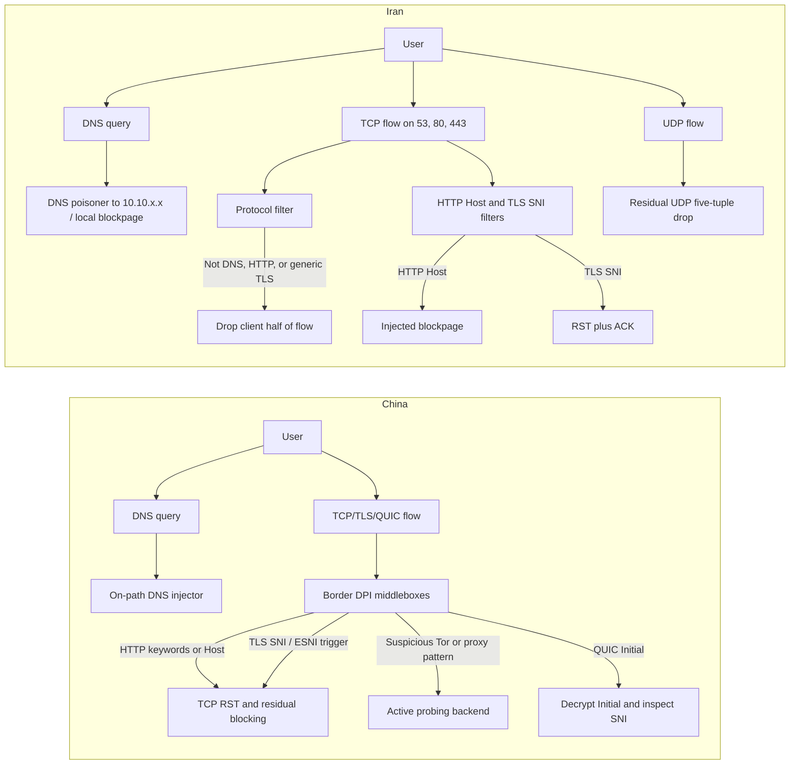
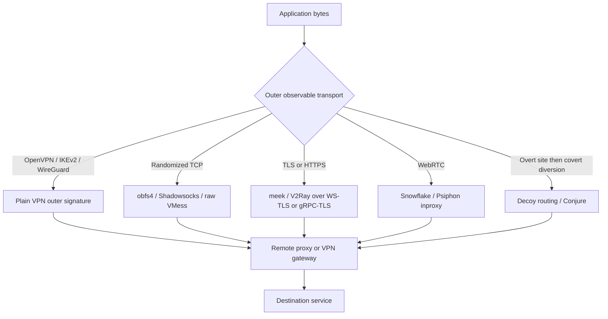

# Technical Analysis of Internet Sensor Bypass in Iran and China

## Executive summary

The most important technical difference between the two countries is that China’s censorship system is broader, more modular, and better studied as a long-running national border censorship platform, while Iran’s system appears more centralized around fewer chokepoints and more willing to use coarse policy instruments such as protocol allowlisting, DNS poisoning to domestic sinkholes, service-level shutdowns, and broad collateral damage. In China, the open literature shows a stack that includes on-path DNS injection, HTTP keyword and Host filtering, TLS SNI filtering, active probing of suspected proxy servers, passive classification of fully encrypted proxy traffic since late 2021, targeted interference with QUIC since April 2024, and now at least some documented regional/provincial censorship devices alongside the national system. In Iran, the open literature shows DNS poisoning, HTTP blockpage injection, HTTPS connection teardown based on SNI, a 2020 protocol filter that only permits DNS/HTTP/HTTPS-like traffic on ports 53/80/443, encrypted-DNS blocking, UDP traffic disruption, and a 2025 service-level shutdown model that selectively hit tunneling and infrastructure services without relying on large-scale BGP withdrawals. citeturn18view0turn19view0turn21view0turn22view1turn22view0turn23view0turn26view0turn11view0turn12view0turn14view0turn15view0turn13view0turn16view0turn17view3

The practical consequence is that circumvention in both countries is less about “using encryption” in the abstract and more about choosing the right *traffic shape* and *exposure model*. Plain VPNs help when a censor has not yet classified or blocked the server IP and protocol fingerprint, but they fare poorly against IP blocking, protocol fingerprinting, and service-level port suppression. More resilient approaches either imitate an allowed protocol or service class, as with meek-style fronting and WebRTC-based Snowflake; defend against active probing with out-of-band secrets and authenticated handshakes, as with obfs4; or diffuse exposure across many short-lived proxies, as with Snowflake and newer Psiphon inproxy designs. The best-performing systems are therefore layered systems: a covert rendezvous channel plus an obfuscated or fronted transport plus rapid reconfiguration of addresses and bridges. citeturn37view0turn37view1turn35view0turn35view1turn36view0turn38view0turn38view2turn30view0turn29view0

A second key conclusion is that the censor’s *sensor model* matters more than the brand name of the tool. A tool defeats DNS tampering only after a tunnel is established; it defeats SNI filtering only if the censor cannot see the forbidden name in the outer handshake; it defeats active probing only if unauthorized scanners cannot elicit a characteristic response; and it defeats passive “fully encrypted traffic” classifiers only if its first-flight packets do not look like randomized proxy traffic. By that logic, raw Shadowsocks, raw VMess, and raw obfs4 are much more exposed than the same inner protocols when wrapped in a higher-level cover transport such as TLS/WebSocket, gRPC/TLS, or WebRTC. citeturn30view0turn29view0turn35view0turn32view0turn32view1turn32view2

Finally, legal and operational risk remains high in both countries. China’s regulatory framework has long constrained unlicensed cross-border VPN use and channels traffic toward approved arrangements, while Iran has pursued licensing and enforcement against unauthorized VPN use and also blocks app stores, extension repositories, and circumvention tool sites to raise the cost of obtaining and updating tools. That means the most technically capable tool is not always the safest one to possess, run, or distribute. citeturn7search0turn7search1turn7search2turn7search4turn15view0

## Scope and evidence base

This report prioritizes peer-reviewed measurement studies, operator documentation, protocol specifications, and standards over advocacy or press accounts. The core empirical base comes from measurements by entity["organization","OONI","net measurement project"], entity["organization","Censored Planet","internet censorship observatory"], papers at entity["organization","USENIX","systems research association"] and ACM venues, protocol documentation from the entity["organization","IETF","internet standards body"], routing and address data from entity["organization","RIPE NCC","internet registry"], and legal/regulatory context from entity["organization","Freedom House","rights watchdog"] and the Chinese MIIT notice on internet access regulation. The strongest public evidence is for filtering middleboxes and transport interference; the public technical record is noticeably stronger on censorship than on true in-line lawful intercept or bulk HTTPS decryption. For China in particular, the literature explicitly finds SNI-based filtering and no evidence of bulk HTTPS decryption in ordinary TLS, while QUIC is different because its Initial packet is decryptable by design to passive observers. For Iran, foundational peer-reviewed evidence is strongest for SNI-based teardown rather than transparent, general-purpose TLS man-in-the-middle at national scale, though some recent 2025 preprints argue for broader “TLS interception” behaviors during wartime shutdown conditions. citeturn21view0turn23view0turn14view0turn10search0turn18view0turn13view0turn7search0turn7search1turn7search2

There are also useful local-language and operator-community sources that matter for timeliness even when they are not the strongest evidentiary layer. Chinese-language community disclosures around V2Ray/VMess weaknesses and the GFW often surfaced before formal papers, while Iran-focused civil-society work has documented more recent shutdown tactics in English and Persian-adjacent reporting ecosystems. Where I rely on those sources, I treat them as supporting or contextual rather than primary proof. citeturn32view3turn6search2

The analytical frame throughout is sensor-centric. Instead of asking whether a named tool “works,” I ask which observable fields a censor can see at each stage: DNS names, IP addresses, TCP/UDP ports, HTTP Host, TLS SNI, QUIC Initial payloads, packet sizes and timing, replay behavior, and server responses to active probes. That frame is what best predicts success or failure across Iran and China. citeturn18view0turn21view0turn11view0turn23view0turn29view0

## Censorship architectures in Iran and China

China’s architecture is best understood as a centralized policy system implemented by multiple classes of middleboxes distributed around border autonomous systems, with newer evidence of regional augmentation. Longitudinal DNS work shows an on-path or man-on-the-side injector that forges DNS replies for censored domains, often using globally routable wrong IP addresses rather than domestic sinkholes, and GFWatch measured 311,000 censored domains over nine months while reverse-engineering regular-expression-like block rules and 1,781 IPv4 plus 1,799 IPv6 forged addresses. The same broad system also performs application-layer filtering: keyword-triggered HTTP censorship terminates flows with injected TCP RST packets and places client-server pairs in a short residual penalty box; the 2021 keyword study found context-dependent rules, including harsher inspection when the HTTP request also contains the word “search,” and found no evidence of bulk HTTPS decryption even though SNI triggers censorship. OONI’s 2019 Wikipedia measurements showed defense-in-depth with both DNS injection and SNI filtering for all `*.wikipedia.org` language editions, and OONI’s 2023 report showed the same combination, plus TLS-handshake interference, used against OONI itself. citeturn18view0turn21view0turn22view1turn22view0

China also invested heavily in identifying and suppressing circumvention infrastructure rather than only end destinations. By 2015, researchers had documented reactive active probing in which suspicious client traffic, including Tor-like TLS handshakes, triggered probes from mostly Chinese IP space; more than half of probes in one study arrived in under one second, and header/timestamp analysis suggested that many source IPs were controlled by a much smaller probing backend. Later work showed that the GFW moved beyond active probing alone: Shadowsocks detection in 2020 relied on the length and entropy of the first data packet followed by multiple classes of active probes, and a 2023 USENIX paper showed a broader passive detector for “fully encrypted” traffic that applied heuristics over the first TCP payload, such as protocol-fingerprint exemptions, fraction of set bits, and ASCII-character statistics, affecting Shadowsocks, VMess, obfs4, Outline, Lantern, Psiphon, and Conjure at least partially. citeturn19view0turn20view0turn20view1turn20view2turn30view0turn29view0

Since April 2024, China has added a new capability against QUIC. The 2025 QUIC study found that the GFW decrypts QUIC Initial packets at scale to recover SNI-equivalent information, then drops subsequent UDP packets on matching flows. The system uses heuristics to constrain cost, including ignoring cases where the source port is less than or equal to the destination port, and it blocks most connections within one second when triggered. Importantly, this makes China the first well-documented censor to conduct targeted nationwide QUIC censorship based on decrypted Initials rather than simply blanket-blocking QUIC. At the same time, the same paper shows that QUIC censorship acts more like a “secondary” blocking plane because normal web access is often already blocked at DNS, HTTP, or TLS SNI. citeturn23view0turn24view0turn25view1

China is no longer purely national in its censorship topology. The 2025 “Emerging Regional Censorship in China” study documented a provincial firewall in Henan that performs outbound HTTP Host and TLS SNI filtering independently of the national GFW. It blocked 4.2 million domains in one measurement window, often using broader and more volatile rules than the national system, including aggressive second-level country-code patterns. That is important analytically because it means a transport may clear the national border sensor but still fail against a regional one with different parsing and reset behavior. citeturn26view0

Iran’s architecture is differently shaped. The 2025 IRBlock paper uses the term “Great Firewall of Iran” to describe a national filtering system that combines DNS poisoning, HTTP blockpage injection, HTTPS connection disruption, and UDP-based dropping, while also showing that enforcement is not perfectly homogeneous across all IP space. Its DNS filter injects forged replies containing routable-within-Iran `10.10.x.x` addresses that lead to domestic blockpages; its HTTP filter tracks the initial TCP handshake and first HTTP request, then injects a blockpage when it sees a blocked Host/domain; and its HTTPS filter inspects unencrypted TLS ClientHello SNI and injects RST+ACK to terminate the connection. IRBlock measured 6.8 million IPs affected by DNS poisoning and HTTP blockpage injection, 5.4 million IPs affected by UDP-based disruption, over 6 million censored FQDNs, and blanket blocks on entire TLD patterns such as `.il` and `.porn`. citeturn13view0turn14view0turn14view1turn14view2turn14view3

A particularly important Iranian capability is the protocol filter documented in 2020. That system, reappearing after earlier 2013 observations, monitors only TCP traffic on ports 53, 80, and 443 and permits only traffic that resembles DNS, HTTP, or generic TLS. If a flow on one of those ports fails the expected fingerprint, the filter does not RST the whole connection; instead it drops all subsequent packets from the client side of the flow for a period, leaving server-to-client packets visible but effectively blackholing the session. The study reverse-engineered its fingerprints and found that the HTTPS branch checks only the opening TLS record structure and version fields, not any specific SNI or certificate details. That means generic TLS-looking traffic can pass the protocol filter even if it later faces separate SNI-based censorship, and conversely that raw non-TLS obfuscation on port 443 is intrinsically fragile in Iran. citeturn11view0turn12view0

Iran also escalated censorship around encrypted DNS and access to circumvention infrastructure. OONI’s 2020 DoT experiment found that 57% of tested DNS-over-TLS endpoints were blocked on at least one Iranian ISP, mostly through interference with the TLS handshake. In autumn 2022, OONI observed a shift: previously reachable DoH endpoints began failing through DNS tampering in addition to TLS-level interference, and Iran simultaneously blocked apps, app stores, browser extension repositories, and many circumvention tool websites. That is an important pattern because it shows Iran attacking both the transport layer and the software supply/update path. citeturn10search2turn15view0

By June 2025, Iran had moved from coarse shutdowns toward service-level control. The 2026 WWW paper on the June 2025 event found no large-scale BGP withdrawals like the 2019 shutdown; instead, it documented a phased, progressive action targeting specific services and ASes. The first phase precisely hit infrastructure and tunneling services, with notable impact on DNS, NTP, IKEv2, and L2TP; later phases expanded to web, mail, file-transfer, and remote-access services, ultimately affecting 98 of the top 100 ASes and 49 of the top 50 network services. This matters directly for circumvention because it means some transports fail not simply by fingerprint, but because the whole service category or port family is temporarily suppressed. citeturn16view0turn17view0turn17view2turn17view3

The table below compresses the main observed timeline.

| Country | Period | Mechanism | What the sensor actually observes or does | Representative evidence |
|---|---|---|---|---|
| China | late 1990s onward | National border firewall architecture | Middleboxes distributed across border ASes under centralized policy control. | citeturn18view0 |
| China | 2000s onward | DNS injection | On-path forged DNS replies with wrong routable IPs; large and evolving fake-IP pool. | citeturn18view0 |
| China | 2006 onward | HTTP keyword / URL filtering | Injected TCP RSTs for forbidden HTTP content; residual blocking after trigger. | citeturn21view0 |
| China | 2011–2015 documented | Active probing | Suspicious Tor/SSH/VPN-like traffic triggers probes from Chinese IP space; many probes arrive within seconds. | citeturn19view0turn20view1turn20view2 |
| China | 2019 | DNS + SNI defense in depth | All Wikipedia language editions blocked through both DNS injection and SNI filtering. | citeturn22view1 |
| China | 2021 | Passive fully encrypted traffic classifier | Heuristic detection on first TCP payload shape, entropy, bits set, printable ASCII, then dynamic blocking. | citeturn29view0 |
| China | 2023 | Measurement-infrastructure suppression | OONI blocked through DNS injection plus TLS interference. | citeturn22view0 |
| China | 2024 onward | QUIC censorship | QUIC Initial decryption at scale; SNI-based targeted UDP dropping with heuristic shortcuts. | citeturn23view0turn24view0 |
| China | 2023–2025 documented | Regional firewalling | Henan provincial firewall adds its own Host/SNI filtering and volatile regional blocklists. | citeturn26view0 |
| Iran | 2013 observed, 2020 documented | Protocol filtering / whitelisting | Only DNS/HTTP/HTTPS-like first packets allowed on 53/80/443; client half of disallowed flows dropped. | citeturn11view0turn12view0 |
| Iran | 2020 onward | Encrypted-DNS blocking | DoT blocked primarily through TLS handshake interference; later DoH also blocked via DNS tampering. | citeturn10search2turn15view0 |
| Iran | 2024–2025 measured | DNS/HTTP/HTTPS/UDP filtering at scale | `10.10.x.x` DNS poisoning, HTTP blockpage injection, SNI-based RST+ACK, and UDP five-tuple disruption. | citeturn13view0turn14view0turn14view2 |
| Iran | 2025 | Service-level shutdown | Phased suppression of tunneling and infrastructure services, then broader application-layer services, without major BGP withdrawals. | citeturn16view0turn17view0turn17view2turn17view3 |

The following diagram summarizes the observable control planes. It is a synthesis of the measurement literature above rather than a vendor diagram. citeturn18view0turn19view0turn21view0turn23view0turn26view0turn11view0turn13view0turn16view0

## Circumvention mechanisms and protocol engineering

The protocol engineering of ordinary VPNs is well understood, but their censor resistance depends heavily on the visibility of the outer transport. OpenVPN is a user-space tunneling protocol carried over UDP or TCP with its own control and data packet types, packet opcodes, and TLS-based key negotiation; over TCP it exposes a plaintext packet-length field before its encrypted payload framing, and over either transport it offers clear structural cues for protocol fingerprinting unless additionally disguised. WireGuard uses a minimalist UDP design with Curve25519 key exchange, ChaCha20-Poly1305 AEAD, BLAKE2s, and HKDF, with a time-based rekeying rhythm and small, regular handshake messages. IKEv2/IPsec begins with an IKE_SA_INIT exchange and then IKE_AUTH, normally over UDP/500, and shifts to UDP/4500 with a four-zero prefix for NAT traversal; if NAT is detected, future traffic uses UDP-encapsulated ESP. In other words, all three are excellent tunnel protocols, but each also has a recognizable outer signature unless hidden inside another cover transport. citeturn33view0turn33view1turn34view0turn34view2turn34view3

That visibility explains why “plain VPNs” often lose against both countries. In China, ordinary VPNs can be hit by IP blocking, SNI/TLS fingerprinting, and active or passive classification depending on the wrapping. In Iran, they may also fail category-wide during service-level shutdowns that directly target tunneling services such as IKEv2 and L2TP, and raw non-HTTP/non-TLS traffic on ports 53/80/443 runs straight into the protocol filter. A useful way to think about them is that they are tunnels, not disguises. They defeat DNS tampering only after the tunnel is up, and they do not inherently defeat the sensor that blocks the tunnel itself. citeturn17view3turn11view0turn12view0turn19view0turn23view0

Vanilla Tor similarly provides routable anonymity once connected, but its unmodified entry behavior is not enough against the current Chinese threat model. China’s Tor blocking work showed that distinctive Tor-like TLS handshakes could trigger active probing and subsequent TCP-layer blocking, while later systems targeted obfuscated and fully encrypted tools more broadly. That is why the Tor ecosystem moved toward pluggable transports rather than relying on a fixed TLS presentation. citeturn19view0turn20view0turn29view0

The most important Tor pluggable transport for active-probing resistance is obfs4. Its specification explicitly states that it is an obfuscation layer for TCP protocols with two phases: an authenticated key-establishment phase followed by exchange of “super-enciphered” traffic. Unlike obfs3, obfs4 uses an authenticated ntor-based key exchange, Curve25519 keys hidden with Elligator 2, server authentication, and protection goals that explicitly include passive DPI, active probing, and limited packet-size/timing fingerprint resistance. That means obfs4’s core idea is not just “random-looking bytes,” but *secret-bearing authentication before any protocol-identifying behavior emerges*. A censor cannot confirm the service unless it has the bridge parameters distributed out of band. citeturn35view0

meek and other domain-fronted or CDN-fronted transports solve a different problem. The seminal 2015 paper defines domain fronting as sending different domain names at different layers: the DNS query and TLS SNI carry an allowed “front” domain, while the forbidden destination appears only in the encrypted HTTP Host header. From the censor’s perspective, DNS, IP address, and SNI all look like an allowed HTTPS connection, so blocking the flow without collateral damage becomes much harder. The same paper also explains why CDNs are especially useful: the edge server can decrypt the HTTPS request and route it internally based on the hidden Host header. The weakness is not cryptography but economics and traffic analysis: the 2019 meek paper notes that fronted traffic is very strong against metadata-based DPI, yet vulnerable to machine-learning classifiers based on packet sizes and timing, and availability depends on fronting-capable infrastructure that providers may restrict. citeturn37view0turn37view1

Snowflake pushes in a different direction: enormous address agility. According to the 2024 USENIX paper and Tor documentation from the entity["organization","Tor Project","anonymity software nonprofit"], Snowflake uses temporary volunteer-run WebRTC proxies, a broker that matches clients to proxies, and a centralized bridge behind them. The client uses a secure rendezvous protocol to learn a currently available proxy; the proxy is ephemeral and lightweight enough to run in a browser tab or extension; and the client switches proxies on the fly when one disappears. The bridge-facing inner secure channel is still Tor, while the outside hop uses WebRTC DataChannels and STUN/NAT traversal machinery that makes the traffic look closer to video/chat flows than to a classical static proxy. Its strength is that censors struggle to enumerate and sustain blocking against a rapidly changing proxy population; its weakness is that it can be hurt if a censor is willing to broadly interfere with WebRTC, STUN, or broker reachability. citeturn35view1turn36view0

Shadowsocks sits between “simple proxy” and “probe-resistant tool.” The current protocol family uses AEAD constructions specified in SIP004/SIP007, but the network-level design leaves the first application data flight looking highly random. That helped it for years because it did not resemble Tor, HTTP, or TLS. But China adapted. The 2020 IMC paper shows detection via the length and entropy of the first data packet followed by seven types of active probes, while the 2023 fully encrypted traffic paper shows that once China generalized from Shadowsocks-specific probing to broader first-payload heuristics, raw Shadowsocks became part of a wider class of “looks like nothing” protocols that the censor could suppress passively. citeturn4search4turn30view0turn29view0

V2Ray is better understood as a transport framework than as one protocol. The official V2Fly documentation says the platform can run multiple protocols, including VMess and VLESS, over multiple outer transports such as TCP, QUIC, gRPC, and WebSocket, and can masquerade as normal HTTPS with packet obfuscation and replay protection. VMess itself is the original encrypted V2Ray protocol; in the current developer docs it supports AEAD-authenticated headers, though older MD5-based header modes are deprecated. The older manual describes VMess as stateless and handshake-free at the transport level, with a time-derived authentication credential and encrypted command/data sections. That design is flexible, but it also means censor resistance depends greatly on the outer wrapper. Raw VMess/TCP looks like fully encrypted traffic and is exposed to China’s 2021 passive classifier; VMess over WebSocket+TLS or gRPC+TLS shifts the outer appearance closer to ordinary HTTPS and is therefore materially more robust against SNI/Host-only policies and against Iran’s protocol allowlisting, which admits generic TLS-like first packets on 443. At the same time, older VMess deployments had replay-based probe weaknesses discussed by GFW Report and later patched. citeturn32view0turn32view1turn32view2turn32view3turn29view0turn12view1

entity["organization","Psiphon","circumvention software company"] uses an agile, centrally managed architecture rather than a single static protocol. Its own technical description emphasizes thousands of geographically diverse one-hop proxy servers, server-subset distribution so that any one user only learns a slice of the network, protocol obfuscation against DPI, obfuscated SSH with per-server obfuscation keys, optional HTTP prefixes to trigger permissive HTTP classification, and remote server lists distributed through high-collateral-damage infrastructure. Its older design document also stresses automatic transport switching among VPN and SSH-style modes, while newer Cure53 audit material on Psiphon Conduit describes a Snowflake-like inproxy feature: clients talk to proxies over WebRTC DataChannels, brokers are reached using domain fronting that encapsulates a Noise session, and proxies relay TCP or UDP flows onward. That makes Psiphon less a single tunnel protocol than a transport agility platform. citeturn38view0turn38view1turn38view2

Decoy routing and refraction networking move the trust anchor into cooperating networks outside the censor’s perimeter. The design goal is that the user appears to connect to an innocuous overt destination, while a cooperating router or middlebox outside the censored network recognizes a covert registration and diverts the flow to the circumvention system. Recent work on Conjure emphasizes that registration can be hidden inside encrypted packets with random-looking source and destination addresses rather than through a direct connection to a visible proxy, which is exactly why the approach is interesting against IP blocking. But it is operationally demanding because it requires cooperation from infrastructure providers, and a 2025 Iran measurement study indicates that even refraction systems can be attacked indirectly through TLS-fingerprint-based blocking. citeturn2search2turn6search10

Traffic morphing and steganographic methods are best thought of as *auxiliary obfuscation layers* rather than standalone systems. ScrambleSuit and obfs4 were explicitly designed to alter packet-size and timing cues, and the obfs4 spec even includes optional timing obfuscation. The same logic appears in later work on meek, where timing and packet-size distributions are the attack surface. In practice, large-scale circumvention now relies more on padding, timing randomization, packet fragmentation, and cover-protocol mimicry than on “true” covert-channel steganography, because the censor’s first pass is usually a cheap statistical or syntactic filter, not full semantic interpretation of hidden channels. citeturn3search6turn35view0turn37view1

Satellite and mesh hardware solve a different layer of the problem: they try to leave the censored ISP path entirely or move traffic locally until it reaches a non-censored uplink. Technically, that can defeat national DNS, SNI, and IP blocks because the censorship middleboxes no longer sit on the traffic path. But the tradeoff moves from network forensics to physical exposure: terminal availability, sky view, RF observability, cost, local possession risk, power, and the need for either a satellite backhaul or a trusted mesh exit node. Public measurement literature on these approaches in Iran and China is much thinner than it is for software transports, so they should be treated as strategically important but less rigorously characterized in the open literature than Tor-, proxy-, and VPN-based systems. citeturn7news44

The diagram below shows the key engineering distinction: the inner tunnel and the outer cover are not the same thing. citeturn33view0turn33view1turn34view0turn35view0turn36view0turn37view0turn32view0turn38view2

## Sensor-by-sensor effectiveness and country countermeasures

The most reliable way to map evasion is against each sensor class. DNS tampering is the easiest layer to beat *once* a secure outer tunnel exists, because the resolver query can then occur inside the tunnel. That means plain VPNs, Tor transports, Shadowsocks, V2Ray, Psiphon, and decoy-routing systems all defeat DNS poisoning *after establishment*. What does **not** follow is that they defeat the censoring of the establishment channel itself. China and Iran both exploit that distinction by blocking tool websites, update channels, or the initial proxy handshake even when post-tunnel DNS would be private. citeturn15view0turn22view0turn13view0

SNI and Host filtering are harder because they strike during connection setup. A transport defeats SNI filtering only when the forbidden hostname is absent from the outer handshake. meek domain fronting does this by putting an allowed front domain in DNS and SNI and hiding the real destination only inside encrypted HTTP. Snowflake does it differently: its outer observable flow is WebRTC to an ephemeral volunteer proxy, not direct TLS to the final destination. V2Ray can do something similar when wrapped in WebSocket+TLS or gRPC+TLS to an allowed-looking endpoint. By contrast, plain OpenVPN, IKEv2, WireGuard, raw Shadowsocks, and raw VMess do not inherently hide an outer forbidden name because they generally present either a distinctive VPN handshake or fully encrypted random-looking traffic rather than a popular fronted service. citeturn37view0turn36view0turn32view0turn33view0turn33view1turn34view0

Active probing is mainly a China problem in the open literature. obfs4 was designed for exactly this threat model: the spec states that unauthorized active attackers should not be able to verify an obfs4 server without the server’s node ID and identity key, and the authenticated ntor-style handshake prevents the “say anything and see what comes back” strategy that killed older obfs2/3 and many weak VMess or Shadowsocks deployments. Snowflake is also comparatively strong here because there is no stable bridge address to enumerate at the client-facing layer; the censor can only block the currently assigned proxy, after which the broker can supply another. meek is different again: it does not defeat probing by authenticating a server, but by making the visible endpoint a high-collateral-damage HTTPS service. Plain Tor, older Shadowsocks variants, and older VMess implementations are much weaker because they either produced probe-elicitable behavior or sat behind infrastructure that could be probed after passive suspicion. citeturn35view0turn36view0turn37view0turn30view0turn32view3turn19view0

Passive classification of fully encrypted traffic is where China’s 2021 shift matters most. The 2023 USENIX paper shows that the GFW no longer needed a product-specific rule for every “random-looking” proxy: instead, it exempted traffic that resembled known benign protocols and treated much of the remainder as suspicious. That makes raw Shadowsocks, raw VMess, raw obfs4, and similar fully randomized first flights structurally vulnerable unless they adopt first-packet modifications, protocol camouflage, or a cover transport that makes the outer layer resemble something common and costly to block. An important analytical consequence for Iran follows from its 2020 protocol filter: even without China-style passive FEP classification, Iran’s allowlisting on 53/80/443 creates a similar pressure toward *outer-layer camouflage*, because raw fully encrypted first packets do not resemble DNS, HTTP, or TLS and therefore do not fit the whitelist. That is an inference from the obfs4/Shadowsocks/VMess designs and the Iran protocol filter behavior, but it is a strong one. citeturn29view0turn35view0turn30view0turn32view1turn12view0turn12view1

QUIC introduces a newer twist. In theory, QUIC was attractive for circumvention because it encrypts the handshake payload, resists some TCP-specific manipulation, and blends with HTTP/3. In practice, China now decrypts QUIC Initial packets to recover the TLS ClientHello carried inside them and then blocks on SNI, though the same work exposes implementation shortcuts and computational cost ceilings. So QUIC-based circumvention tools can no longer assume “encrypted Initial means opaque to the censor” in China. Iran is different: the literature gathered here documents broad UDP and service-level disruption, especially during the 2025 phased shutdown, rather than a China-style nationwide QUIC Initial decryptor. citeturn23view0turn24view0turn25view1turn17view3

The table below summarizes the mapping at a practical level. The ratings are comparative and synthesize the protocol specifications and measurement studies rather than representing a guarantee for any provider or configuration.

| Technique family | Defeats DNS tampering | Defeats IP blocking | Defeats SNI / Host filtering | Defeats active probing | Defeats passive FEP classification | Robust to service-level port suppression | Main country countermeasures |
|---|---|---|---|---|---|---|---|
| Plain OpenVPN / WireGuard / IKEv2 | Yes, after tunnel is up | Partial | No / limited | No | No | No | China: IP, protocol, and traffic fingerprinting; Iran: protocol whitelisting, targeted tunnel-service shutdowns |
| Vanilla Tor | Yes, after tunnel is up | Partial | Partial | No | Partial at best | No | China: Tor TLS fingerprinting and active probing |
| obfs4 | Yes, after tunnel is up | Partial | No, unless additionally wrapped | Yes, by design | Partial; weaker once treated as generic random traffic | Weak in Iran if raw on whitelisted ports | China: FEP classifier and bridge blocking; Iran: protocol allowlisting |
| meek / CDN fronting | Yes | Partial | Yes | Strong in practice | Strong against simple metadata DPI, weaker against traffic analysis | Moderate | China/Iran: block fronts, fronting-capable CDNs, or learn size/timing signatures |
| Snowflake | Yes | Strong | Yes, indirectly | Strong | Better than raw FEPs because outer hop is WebRTC | Moderate | Block WebRTC/STUN/broker channels or tolerate collateral damage |
| Shadowsocks / raw VMess TCP | Yes | Partial | No | Weak to moderate | Weak in China since 2021 | Weak in Iran on whitelisted ports | China: first-packet entropy/length, active probes, passive FEP rules; Iran: allowlisting/UDP suppression |
| V2Ray over WebSocket+TLS or gRPC+TLS | Yes | Partial | Better than raw VMess | Better than raw VMess | Better than raw FEPs | Moderate | China: SNI/IP blocking, traffic analysis; Iran: SNI blocking if outer hostname is known |
| Psiphon transport-agile stack | Yes | Stronger than single-protocol tools | Often, depending on selected transport | Better than static tools | Better than static tools | Better, because it can switch modes | China/Iran: block discovery, websites, app updates, and specific active transports |
| Decoy routing / Refraction / Conjure | Yes | Strong | Strong | Strong against direct enumeration | Strong | Moderate | Deployment complexity; possible fingerprint-based blocking on registration channel |
| Satellite / mesh hardware | Yes | Strong | Strong | N/A at network middlebox layer | Strong | Strong if out-of-band backhaul persists | Physical seizure, RF detection, jamming, terminal logistics |

The main sources underlying the matrix are the OpenVPN, WireGuard, and IKEv2 protocol docs; the obfs4 specification; Tor’s Snowflake paper and docs; the domain fronting and meek papers; the Shadowsocks, VMess, Psiphon, fully encrypted traffic, QUIC, Iran protocol-filter, and Iran shutdown studies. citeturn33view0turn33view1turn34view0turn35view0turn35view1turn36view0turn37view0turn37view1turn30view0turn32view0turn32view1turn38view0turn38view2turn29view0turn23view0turn11view0turn17view3

## Comparative assessment and open questions

If the comparison is limited to the user’s requested operational attributes, the strongest pattern is that *the most stealthy methods are rarely the easiest or fastest.* Plain VPNs tend to offer the best throughput and lowest setup complexity, but they are among the most detectable against modern state sensors. meek/domain fronting and Snowflake provide much better resistance to SNI/IP filtering and bridge enumeration, but at a cost in latency and bandwidth efficiency. obfs4 sits in the middle: technically elegant and strong against active probing, but less naturally camouflaged than HTTPS- or WebRTC-shaped systems and therefore more exposed to first-packet classification and allowlisting. V2Ray/Psiphon-style transport agility is powerful precisely because it is not a single point in this trade space. citeturn33view0turn33view1turn35view0turn36view0turn37view0turn29view0turn38view0

| Method | Detectability to national sensors | Latency | Throughput | Setup complexity | Resilience | Legal / operational risk |
|---|---|---|---|---|---|---|
| Plain OpenVPN / WireGuard / IKEv2 | High | Low | High | Low | Low to moderate | High |
| obfs4 | Moderate | Moderate | Moderate | Moderate | Moderate to high | High |
| meek / CDN fronting | Low to moderate for simple DPI; higher under traffic analysis | High | Low to moderate | Moderate | High where fronting exists | High |
| Snowflake | Moderate | High | Low to moderate | Low for user, high for ecosystem | High against IP enumeration | High |
| Shadowsocks / raw VMess | High in China now | Low to moderate | High | Low to moderate | Low to moderate | High |
| V2Ray over TLS cover transports | Moderate | Moderate | Moderate | Moderate to high | Moderate to high | High |
| Psiphon | Moderate | Moderate | Moderate | Low for user, high for operator | High through transport agility | High |
| Decoy routing / Refraction | Low once deployed | Moderate | Moderate | Very high | Very high | High for operators, moderate for users |
| Satellite / mesh hardware | Low at ISP sensor layer, high physically | Variable | Variable | High | High if uplink survives | Very high |

These ratings are intentionally relative rather than absolute. “Detectability” refers to the visible outer transport under current public research, not to whether a tool leaves no forensic trace. “Resilience” means resilience to the combined sensor stack described earlier, not merely to one blocking mechanism. Legal and operational risk is high across the board because both countries regulate or criminalize unlicensed circumvention in practice, and operator-side exposure is especially severe for bridge relays, fronted infrastructure, and physical hardware. citeturn7search0turn7search1turn7search2turn7search4

Three unresolved issues deserve emphasis. First, the public literature is much stronger on filtering than on full lawful intercept, especially for HTTPS: there is strong evidence of SNI and handshake interference, but much weaker open evidence for routine nationwide decryption of ordinary TLS in either country. Second, domain fronting remains strategically important in the literature, but the set of willing or accidentally frontable CDNs changes over time, so any static claim about today’s fronting surface ages quickly. Third, satellite and local mesh bypasses are strategically significant but much less well measured in peer-reviewed country-specific work than software transports, so technical discussion of them remains more conceptual than directly evidenced. citeturn21view0turn37view0turn4search7turn4search11

The high-confidence bottom line is this: China’s sensor stack rewards transports that either imitate popular protocols extremely well or deny the censor a stable probe target, while Iran’s stack rewards transports whose *outermost observable packets* look like generic TLS or otherwise avoid protocol-whitelisted chokepoints. In China, the hardest problems are active probing, passive classification of randomized first flights, and now QUIC Initial decryption. In Iran, the hardest problems are DNS/HTTP/SNI interference, protocol whitelisting on major ports, and broad service-class suppression during crisis periods. For that reason, the best current designs are not raw tunnels but layered systems that combine covert rendezvous, outer-layer camouflage, and fast bridge or proxy rotation. citeturn23view0turn29view0turn36view0turn11view0turn12view0turn15view0turn17view3