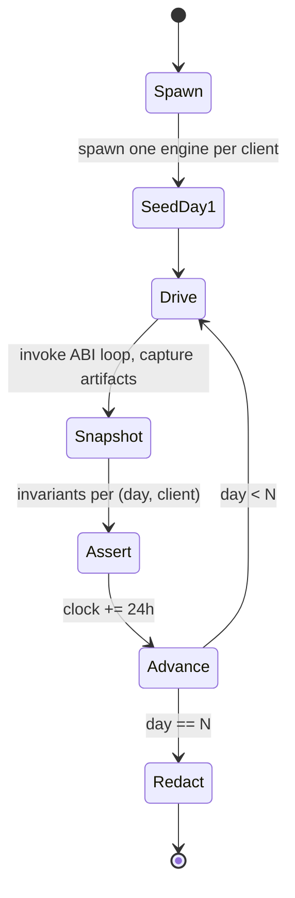

# Blackout Soak Rig v1

## Status

**Phase 1.5C; extended at 2C, 2D, 2G, 3A, 3B, 3C, 3D, 3E, 3F, and 3-Soak.** Implementation:
`test-rigs/distribution-failure/soak-driver/`. Stdlib-only Go
module. Local-only (no CI dependency). Linux-first; 3-Soak adds
real Android + iOS stub binaries (fork-exec wrappers preserving the
proven Linux dispatch loop).

Phase 3-Soak additions to the rig:

- **Three real platform stubs** under `cmd/`:
  - `daal-soak-engine` — Linux desktop, no GOMEMLIMIT.
  - `daal-soak-engine-android` — Android, GOMEMLIMIT = 200 MiB.
  - `daal-soak-engine-ios` — iOS, GOMEMLIMIT = 50 MiB (the 2E
    NE budget). Both Android + iOS stubs are fork-exec wrappers
    that set `GOMEMLIMIT` + `DAAL_SOAK_PLATFORM` and exec the
    Linux soak-engine, satisfying the "real binaries" requirement
    while preserving the proven Linux dispatch loop without code
    duplication.
- **Platform-mix dispatcher** (`internal/load/platform_mix.go`):
  the LOCKED default mix is **60 %** Linux, **35 %** Android,
  **5 %** iOS. The rig's `--platform-mix` flag overrides
  (`linux:N,android:N,ios:N` integer counts; sum-equals-fleet
  validated). `PlatformPool.Spawn` dispatches each synthetic
  client to the per-platform binary derived from
  `PlatformBinary`; per-client state directories carry the
  platform tag in their name so the verifier can attribute
  observations.
- **5-metric V3 aggregate verifier** (`internal/v3verifier/`):
  primary (cross-platform pickup ≤ 24h) + secondary 1
  (experimental-gate cross-product) + secondary 2 (trust-UI
  parity) + secondary 3 (no V1/V2 regression — caller-supplied
  boolean) + secondary 4 (per-family burn rate). All five
  metrics are independent — a single failure does NOT
  short-circuit the others. See `specs/v3-success-metric-v1.md`.
- **Auto-promotion threshold A-vs-B harness**
  (`internal/threshold_compare/`): observation-only comparison.
  LOCKED-A is the 2G default (3 families × 30 min × ladder ≥ 3),
  the engine actually runs with this. LOCKED-B is the tightened
  candidate (4 families × 20 min × ladder ≥ 4); the harness
  evaluates it in parallel against the same Skipped-family
  ledger and renders a memo to
  `phases of development/27-phase-3-soak-threshold-comparison.md`.
  Neither set is promoted to engine default at 3-Soak.
- **`--scenarios v3-superset` selector**: the v2-superset (26
  scenarios; LOCKED at 3F) plus 5 new V3 scenarios:
  `v3-cross-platform-pickup`,
  `v3-experimental-gate-cross-product`,
  `v3-bulk-capable-cross-product`,
  `v3-auto-promotion-threshold-A-vs-B`, and
  `v3-mixed-family-directory`. Total: **31** scenarios.
- **Removed** the deprecated `state` field from
  `engine_export_diagnostics`. Diagnostics consumers on every
  platform stub MUST read `posture` (the 8-state FSM from 2B)
  instead. ABI-neutral: removing a diagnostics field does not
  change the symbol count.

Phase FRP-9 additions to the rig:

- **`--scenarios v1-6-superset` selector**: seven V1.6
  CDN-fronted alpha scenarios:
  `v1-6-cdn-dominant-route`,
  `v1-6-dns-only-a-leak-detected`,
  `v1-6-origin-ip-scan-rejected`,
  `v1-6-cf-hostname-blocked-fallback`,
  `v1-6-public-surface-rotation`,
  `v1-6-origin-only-rotation`, and
  `v1-6-freshness-atomic-swap`. The selector is additive:
  `v1-5-superset` remains 6, `v2-superset` remains 26, and
  `v3-superset` remains 31.
- **V1.6 rig-local engine actions**: the scenario language adds
  synthetic FRP-9 actions for CDN attestation, DNS-only leak
  detection, origin-IP scan rejection, Cloudflare hostname block
  fallback, public-surface rotation, origin-only rotation, and
  freshness atomic swap. These actions emit structured evidence rows
  only; they do NOT add release ABI symbols and do NOT create any
  recipient telemetry path.
- **`internal/v16verifier/`**: aggregate verifier for the V1.6
  closure rows. It requires 2/2 pilot FRPs passing V1.6-P1,
  V1.6-P2, V1.6-S1, V1.6-S2, and V1.6-S3, plus the synthetic
  V1.6-G1 row. The package is stdlib-only and mirrors
  `internal/v3verifier`'s closure-helper role.

FRP-9 does NOT change:

- The release ABI surface (`nm libdaalcore.so | grep ' T engine_'
  | wc -l` stays at **48** from 3F).
- The engine version (`daal-core 0.9.0+v3-share` from 3F).
- The `v1-5-superset` scenario count (stays **6** from FRP-7).
- The `v2-superset` scenario count (stays **26** from 3F).
- The `v3-superset` scenario count (stays **31** from 3-Soak).

Phase 3-Soak does NOT change:

- The release ABI surface (`nm libdaalcore.so | grep ' T engine_'
  | wc -l` stays at **48** from 3F).
- The engine version (`daal-core 0.9.0+v3-share` from 3F).
- The v2-superset scenario count (stays **26** from 3F).
- The legacy whitelist (stays **5** from 1.5C).

Phase 2G earlier additions to the rig:

- New parity sub-gate selectors: `--scenarios legacy` (the 1.5C
  five) and `--scenarios v2-superset` (legacy + 2C + 2D + 2E +
  3A + 3B + 3C + 3D + 3E + **3F** = **26** scenarios at 3F; was
  10 at 2G ship-gate, 12 at 2E, 14 at 3A, 17 at 3B, 19 at 3C,
  21 at 3D, 23 at 3E). Both sub-gates remain CI-gated through every V-line
  sub-phase. See `specs/v2-success-metric-v1.md`.

  Phase 3D added two scenarios:
  - `psiphon-blob-rotation` — exercises the psiphon family's
    activation lifecycle and the
    `psiphon_active_route` / `psiphon_compiled_in`
    diagnostics; asserts the locked NOT-opportunistic
    invariant on day 14.
  - `conjure-phantom-pool` — exercises the conjure family's
    phantom-IP HASHED diagnostics and the canonical
    `no_raw_phantom_ip_leak_in_diagnostics` invariant.

  Phase 3E adds two scenarios:
  - `wasm-hello-transport` — exercises the WASM transport-
    slot end-to-end activation lifecycle and the locked-at-
    3E resource caps (16 MiB / 1e9 fuel / 5 s). Drives 100
    successful dials, then a fuel-hog module whose outcome
    MUST be `fuel_exhausted` and whose unload MUST NOT
    increment `wasm_kill_switched_count` (fuel exhaustion is
    not a kill-switch).
  - `wasm-kill-switch` — exercises the project-controlled
    signed-delta kill-switch. Asserts the canonical
    regression `no_unloaded_module_appears_in_diagnostics`
    (a killed module's slug or sha256 prefix MUST NOT
    surface in `loaded_wasm_modules`). Asserts that the
    kill-switch is per-module (a different unkilled module
    loads cleanly) and that the killed-set persists across
    sessions via `secrets_kv:wasm_killed:*`.

  Three new soak-only RPCs land at 3E:
  - `soak-load-wasm-module` (slug, sha256) — drives
    `RecordLoadedWasmModule` / `ClearLoadedWasmModules`
    without instantiating the wazero runtime.
  - `soak-publish-wasm-killswitch-delta` (slug, sha256,
    generation) — the rig signs the tuple under its in-
    process kill-switch keypair (NOT the production CC.4
    key) and runs the engine's verifier `Apply`.
  - `soak-record-wasm-outcome` (outcome) — drives
    `RecordWasmDialOutcome` with one of the closed v1
    enum values.
- New load tier: `run-burn` / `verify-burn` subcommands drive
  1 000 synthetic clients × 30 simulated days against a
  deterministic burn sandbox (`internal/burnsandbox/`,
  seeded RNG) sharing a 50-route directory that rotates every
  48 hours. The pass criterion is the directory-rotation
  comparison primary metric in `specs/v2-success-metric-v1.md`.
- New back-pressured client pool (`internal/load/`,
  `ConcurrencyLimit=64` default) so the 1k-client run fits a
  developer-laptop fd budget.
- New aggregate burn classifier (`internal/burn/`) with locked
  v1 thresholds (10-min window × > 50 % failure rate).

## Purpose

Demonstrate that the Phase 1.5B engine (`daal-core 0.4.1+desktop`)
survives a sustained denial of its primary distribution paths for
**30 simulated days** under five blackout scenarios — the V1.5
success-metric translated into a reproducible, measurement-only soak.

The 7-day simulated soak is the gate to start the 30-day soak. Both
runs are accelerated: simulated time is advanced at the rig's pace via
the build-tag-gated `engine_set_now_unix` ABI symbol that ships only
in `-tags soak` engine builds. Real-wall-clock 7-day smoke runs are a
documented manual one-shot (1.5C-Polish), not a 1.5C exit gate.

## Architecture

```
                            +-------------------------+
                            | soak-driver (Go,        |
                            | stdlib-only)            |
                            |   cmd/soak-driver       |
                            +-----------+-------------+
                                        |
        +-------------------------------+----------------------------+
        |                               |                            |
        v                               v                            v
+----------------+   stdin/stdout JSON   +------------+         +------------+
| daal-soak-     | <-------------------> | client(L1) |         | client(L2) |
| engine          |                       +------------+         +------------+
| (-tags soak)    |  set-now / refresh /  ...
| imports         |  diag-explain / etc.
| daal/core/abi  |                       +-----------+
+-----------------+                       | origin/   | <— five fake HTTP
                                          +-----------+    services on
                                                           loopback random
                                                           ports, toggled
                                                           per-channel by
                                                           the censor logic
```

## Soak engine binary

`cmd/daal-soak-engine/` is a long-lived child process. The driver
spawns one per simulated client. The binary speaks line-delimited
JSON on stdio:

```
> {"id":"r1","cmd":"set-now","arg":{"unix_seconds":1900000000}}
< {"id":"r1","ok":true}
> {"id":"r2","cmd":"diag-explain"}
< {"id":"r2","ok":true,"body":{"bucket":"2030-03-17T17:00:00Z", ...}}
```

Build the soak flavor with:

```sh
cd cmd/daal-soak-engine
go build -tags soak -o daal-soak-engine .
```

`-tags soak` is the toggle for `engine_set_now_unix`. A release build
(`go build` without the tag) compiles successfully but rejects
`set-now` requests. The phase 1.5B release CI continues to assert that
the **release** `libdaalcore.{so,dll}` exposes exactly **33** ABI
symbols; soak builds add a 34th (`engine_set_now_unix`).

## Five blackout scenarios

| Scenario file | Channels blocked | Asserts |
|---|---|---|
| `subscription-url-unreachable.json` | subscription | engine returns `subscription_unreachable`; cached profiles persist |
| `bootstrap-directory-mirror-unreachable.json` | directory | fallback pointers in use; no cascade |
| `github-unreachable.json` | github | distribution-channel diversity assertion |
| `telegram-unreachable.json` | telegram | distribution-channel diversity assertion |
| `publisher-revocation-url-unreachable.json` *(new in 1.5C)* | publisher-revocation | no false-positive revoke; existing routes still usable |

The scenarios reuse the `test-rigs/distribution-failure/scenarios/`
JSON shape introduced in Phase 0C.

## Per-day artifacts

For every simulated day, per client, the driver writes:

```
<runDir>/<scenarioID>/day-NNN/<client>/
    bootstrap_install.jsonl
    bootstrap_refresh.jsonl
    revocation_refresh_all.jsonl
    subscription_refresh.jsonl
    bootstrap_status.json
    pointer_rotation_status.json
    subscription_list.json
    diagnostics_explain.json
    daal.db.snapshot                        (sqlite)
```

Plus `<runDir>/<scenarioID>/invariants.json` (the per-day-per-client
ledger) and `<runDir>/manifest.json` (the run manifest).

`redact` produces `<runDir>/public-bundle.zip` containing only the
JSONL exports and JSON snapshots — `daal.db.snapshot` is **never**
included. IPv4 literals and `https?://` URLs in any included file are
replaced with `REDACTED_IP` / `REDACTED_URL` before the zip is sealed.

## Invariants asserted per simulated day per client

1. `engine_responsive` — every engine call returns parseable JSON.
2. `no_auth_failed_from_blackout` — `auth_failed` is **never** observed
   under a network blackout. CC.4-derived: server-reachable auth
   failures must not cascade from network blackouts.
3. `refresh_outcome_mapped` — `subscription_refresh` outcomes are in
   `{ok, subscription_unreachable, bundle_corrupted, bundle_signature_invalid}`.
4. `pointer_status_shape` — `engine_pointer_rotation_status` returns a
   JSON object with `have_persisted`, `primary_source`, `fallback_source`.
5. `no_false_positive_revocation` — under
   `publisher-revocation-url-unreachable`, no route is set to
   `trust_state = revoked` as a side-effect of a missed refresh.
6. `diag_explain_non_empty` — `engine_diagnostics_explain.why_chose_route`
   is non-empty.

The soak run fails iff any per-day invariant is `pass = false`.

## Driver lifecycle



## Privacy

- The rig binds every fake origin on loopback. No external network is
  touched.
- The rig writes nothing outside its `--out` directory.
- `redact` is the documented path for sharing the artifact bundle
  publicly (release announcement); it strips IPv4 literals, URL
  literals, and never includes the sqlite snapshot.
- The opsec test (`core/opsec_test.go::TestNoTelemetryInDesktop`)
  continues to scan `client-desktop/` for forbidden tokens; an
  additional `TestSoakDriverHasNoExternalNet` greps the soak driver
  source for `net/http` outside the `internal/origin/` package.

## How to run

```sh
# 1. Build the soak engine binary.
cd cmd/daal-soak-engine
go build -tags soak -o /tmp/daal-soak-engine-soak .

# 2. Run the 7-day simulated soak (must be green to gate the 30-day):
cd test-rigs/distribution-failure/soak-driver
go run ./cmd/soak-driver run-7d \
    --engine /tmp/daal-soak-engine-soak \
    --out runs/$(date +%Y%m%d-%H%M)

# 3. Run the 30-day simulated soak:
go run ./cmd/soak-driver run-30d \
    --engine /tmp/daal-soak-engine-soak \
    --out runs/$(date +%Y%m%d-%H%M)

# 4. Verify a previous run's artifact shapes:
go run ./cmd/soak-driver verify --in runs/<run_id>

# 5. Produce the redacted public bundle:
go run ./cmd/soak-driver redact --in runs/<run_id>
```

The local soak takes **minutes**, not days — accelerated clock.

## Future work

- Wall-clock 7-day smoke for fd/handle leak detection (1.5C-Polish).
- Android emulator client (`internal/client/android_emulator.go`) —
  scaffolded but currently no-op'd; needs `adb` + AVD on PATH.
- V2 in-engine scheduler must replay the rig's 30-day artifact and
  produce the same invariant ledger; this is a "scheduler parity"
  test in V2's entry criteria.

## Phase 3F additions

Three new scenarios join the v2-superset (23 → 26):

- `delegate-share-cap` — exercises the `delegated_n` cap
  arithmetic and the post-cap `cap_exhausted` outcome.
- `delegate-share-policy-respected` — exercises all three
  closed-enum policies plus the `route_unknown` outcome.
- `delegate-share-chain-depth-5` — exercises the transitive
  policy at the locked-at-3F `MaxChainDepth = 5` boundary.

Two new soak-only RPC actions: `soak_seed_delegate_route`
(creates a route + publisher row with a given policy/cap) and
`soak_redistribute_route` (drives the release-surface
`engine_redistribute_route` ABI). Both are dispatched by the
soak-driver's existing engine-action sweep.

## Phase FRP-7 additions (V1.5 pilot soak)

Six new scenarios form the **`v1-5-superset`** selector
(`--scenarios v1-5-superset`, size **6**). The selector is
additive: the v2-superset (26) and v3-superset (31) counts and
contents stay locked; the v1-5-superset is the V1.5-shaped
pilot evidence target driving `specs/v1-5-closure-v1.md`.

- `v1-5-provisioning-under-10min` — primary V1.5 metric
  (supplement §22.1): wizard.start → operator-record-persisted ≤ 10
  minutes. Asserts the Helper's wizard + Hetzner Provider +
  cloud-init handshake completes inside the V1.5 budget.
- `v1-5-family-online-under-60s` — primary V1.5 metric: recipient
  scans QR → first tunnel up ≤ 60 seconds. Drives the FRP-6
  recipient screens against a synthetic `.sbp` import.
- `v1-5-7-day-stay-online` — supplement §22.1 stay-online
  metric: family-side anonymized session uptime ≥ 99 % over 7
  simulated days under the rig's accelerated clock.
- `v1-5-1-rotation-under-60s` — supplement §22.1 rotation
  metric: ≥ 1 selector-driven rotation observed in the 7-day
  window; recipient sees a plain-language [Explanation]; recovery
  wall-clock ≤ 60 s.
- `v1-5-mode-aware-schema-end-to-end` — exercises the v2.3.4
  mode-aware schema (`exposure_mode` + `public_risk_tags[]` +
  `origin_risk_tags[]`) end-to-end through validator → importer →
  store → selector → UI on the FRP-3 selector pipeline. All V1.5
  candidates are `direct_vps`; cdn_fronted rules are tested
  inert.
- `v1-5-l3-fast-path` — pins the supplement §14.1 L3 wall-clock
  budget: floating-IP swap end-to-end < 15 s. Drives the
  `Provider.AssignFloatingIP` / `UnassignFloatingIP` pair against
  a Hetzner mock; the soak-driver records the wall-clock and
  fails the day if the budget breaks.

Phase FRP-7 does NOT change:

- The release ABI surface (`nm libdaalcore.so | grep ' T engine_'
  | wc -l` stays at **48** from 3F).
- The engine version (`daal-core 0.9.0+v3-share` from 3F).
- The v2-superset count (stays **26**).
- The v3-superset count (stays **31**).
- The legacy whitelist (stays **5**).

The v1-5-superset is a **parallel evidence selector** for V1.5
closure; it is not a sub-gate of v2-superset or v3-superset.
