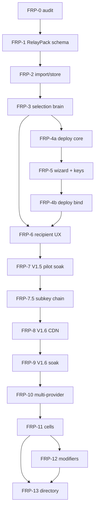

# FRP Track Spec v1 — implementation arm of the diaspora-helper supplement

**Locked surface:** **58** as of 2026-08-17. *(This invariant was written as "**48**, UNCHANGED from 3F / 3-Soak, preserved across the entire FRP track" and it did not hold: the release surface is now 58 — verified with `nm -D --defined-only` against the built `.so`. Ten symbols were added after the lock, chiefly the Phase-45 TUN triplet, the D-2 summary group, and `engine_route_delete` / `engine_publisher_delete`. The authoritative ledger, with each symbol and its signature, is at the end of `specs/engine-abi-v1.md`. The append-only rule itself was NOT broken — no existing signature or semantic changed — only the claim that the count was frozen.)*
**Locked engine `Version` constant (`core/abi/abi.go`):** `daal-core 0.9.0+v3-share` (UNCHANGED across the entire FRP track in this spec; V1.5 / V1.6 / V2 / V3 milestone ships are recorded in their respective closure specs and packaging tags, NOT in the engine `Version` constant. Any future bump requires an explicit supplement amendment outside the FRP-track phase docs).
**Supplement target:** v2.3.12 (text-lock-ready; version identifier is the durable pin, commit hash intentionally elided).
**Drafted:** May 2026.
**Companion phase doc (track entry):** `development-phases/28-phase-frp-0-roadmap-reconciliation.md`.

## 1. Track scope

The FRP / RelayPack track is the implementation arm of `development-phases/daal-roadmap-v3-supplement-diaspora-helper.md`. It turns supplement §21 (phase placement) and §22 (success metrics) into a phase queue inside `development-phases/`, using the same locked-spec / sub-task-table / handover discipline established by Phases 0A through 3-Soak.

The track sequence is `FRP-0, FRP-1, FRP-2, FRP-3, FRP-4a, FRP-5, FRP-4b, FRP-6, FRP-7, FRP-7.5, FRP-8, FRP-9, FRP-10, FRP-11, FRP-12, FRP-13` — 16 phases at folder prefixes `28..43` — plus **FRP-14** (`44-phase-frp-14-pack-to-person.md`), added after FRP-13 had been declared the terminator. See §1 and §4.16.

The track is a **continuation of the closed V3 surface**: ABI=48 stays for the whole track. `spec_version` bumps at FRP-1 (RelayPack schema land) and FRP-7.5 (sub-key cert chain). Engine `Version` constant in `core/abi/abi.go` stays `daal-core 0.9.0+v3-share` for the entire FRP track per supplement; milestone tagging (V1.5, V1.6, V2, V3) is recorded in closure specs and packaging tags, NOT in the engine constant.

## 2. Track sequence (locked)

| FRP-ID | Phase doc filename | Roadmap reference | Ship status | Locked invariants count | Gate-to-next | Exit artifact |
|---|---|---|---|---|---|---|
| FRP-0 | `28-phase-frp-0-roadmap-reconciliation.md` | supplement §21 (track entry) | SHIPPED | 16 | FRP-1 unblocked iff per-module matrix ≥ 15 rows AND `specs/frp-track-v1.md` filled AND README updated; **PASS after unlock pass** (`/usr/local/go/bin/go test ./...` green under `core/`, `nm`=48, supplement erratum patched) | `28-phase-frp-0-roadmap-reconciliation.handover.md` populated; `specs/frp-track-v1.md` populated end-to-end |
| FRP-1 | `29-phase-frp-1-relaypack-schema.md` | supplement §3.2, §12.2.2, §12.2.2.bis | SHIPPED | 27 (16 inherited + 11 specific) | FRP-2 PASS — `publisher/go.mod` created; `_relaypack` round-trips byte-identically; validator rejects post-V2 modifiers (RP013) and `serverless_external` (RP003); `spec_version` 2→3; asymmetric guard green | `specs/relaypack-v1.md` shipped; `Manifest.relay_pack` slot landed; `publisher/go.mod` created (module `daal/publisher`); validator moved to `bundle/go/relaypackvalidate/` at FRP-2; 16 vectors at `specs/test-vectors/relaypack/`; handover at `29-phase-frp-1-relaypack-schema.handover.md` |
| FRP-2 | `30-phase-frp-2-import-store-preservation.md` | supplement §13.6 | SHIPPED | 24 (16 inherited + 8 specific) | FRP-3 PASS — `_relaypack` survives importer → `StoreAdapter` → `RouteRow`; 9 RelayPack columns round-trip; neutral `bundle/go/relaypackvalidate/` validator shared by publisher + importer; 16 vectors at `specs/test-vectors/relaypack/` | Importer + `StoreAdapter` widening; `RouteRow` + netmem widening; `specs/test-vectors/relaypack/` corpus; handover at `30-phase-frp-2-import-store-preservation.handover.md` |
| FRP-3 | `31-phase-frp-3-selection-brain.md` | supplement §13.1, §13.3, §13.4, §15 | SHIPPED | 26 (16 inherited + 10 specific) | FRP-4a + FRP-6 PASS — `Explanation` JSON shape locked; mode-aware shortlist respects soft-diversity rule; network memory influences leader ranking; race policy controls visible shortlist size; `cdn_fronted` rules tested as V1.5 no-ops | `specs/selection-v1.md`; `Explanation` struct frozen; cooldown propagation per §13.4 wired; 7 explanation goldens; handover at `docs/handovers/frp-3-handover.md` |
| FRP-4a | `32-phase-frp-4a-publisher-deploy-core.md` | supplement §9, §11.7 | SHIPPED | 28 (16 inherited + 12 specific) | FRP-5 PASS — `publisher/go.mod` reused; `Provider` interface + Hetzner adapter compile under `daal/publisher`; cloud-init template signed + pinned; health endpoint hardened with config-file startup, Helper-IP check, and 300 s self-close; FRP-5 pricing CLI shape accepts provider/region/server-type | `publisher/deploy/` subpackages (provider, cloudinit, health, cli); provider interface; Hetzner adapter; pinned cloud-init; `daal-deploy`; `daal-relay-health`; handover at `docs/handovers/frp-4a-handover.md` |
| FRP-5 | `33-phase-frp-5-desktop-wizard.md` | supplement §9, §10, §14.5 | SHIPPED | 28 (16 inherited + 12 specific) | FRP-4b PASS — wizard screens 0-3 LIVE; screens 4-6 disabled shells; OperatorRecord SQLite schema with `pre-provision` status; two-layer key custody (OS-keystore + Argon2id + AES-256-GCM); 5/60s PIN lockout policy; publisher keygen/import verifies the cloud-token PIN before sealing; **[all PIN mechanics superseded by Device Custody v1 in `d80c638`: `pin_lockout.rs` deleted, `validatePin` gone — this row records what FRP-5 shipped, not current behaviour]**; schema xref test pins FRP-4a JSON parity; OPSEC test guards against FRP-4b symbol leak + analytics-vendor symbols; WizardCtx is Send+Sync for Tauri State | `client-desktop/daal-wizard/` workspace crate (operator_db, keystore, pin_lockout, publisher_key, cli_bridge, staging, commands); Tauri shims wired in `tauri/src-tauri/src/lib.rs`; frontend at `tauri/src/wizard/`; handover at `docs/handovers/frp-5-handover.md`; FA copy review remains a pilot-readiness follow-up |
| FRP-4b | `34-phase-frp-4b-direct-deploy-integration.md` | supplement §21.1 | SHIPPED | 25 (16 inherited + 9 specific) | FRP-6 PASS — direct-VPS RelayPack signed end-to-end via `publisher/deploy/relaypack/.BindAndSign` (33 unit tests + 2 E2E smokes); `daal-deploy bind-and-sign` + `qr-fountain` + `provision --progress-json` CLI live; wizard screens 4-6 LIVE (Helper-IP + provision + sign + animated QR fountain); `wizard_provision_run` / `wizard_sign_relaypack` / `wizard_qr_render` Tauri shims emit JSON-line events on `wizard://provision-event`, `wizard://sign-event`, `wizard://qr-frame`; OPSEC polarity flipped (FRP-4b symbols required); V002 migration adds signed-SBP metadata; privkey transport stdin-only with Zeroizing buffer | `publisher/deploy/relaypack/` subpackage (binder + relay_pack_id + risk_graph + candidate_render); `daal-deploy bind-and-sign` + `qr-fountain` subcommands + `--progress-json` flag; Rust wizard plumbing (cli_bridge BindResult/ProgressEvent/FountainFrame; commands::provision_run/sign_relaypack/qr_render); Tauri shims with `app.emit()`; LIVE Screen4Provision/Screen5Sign/Screen6Handoff with EN/FA i18n; V002 SQLite migration; handover at `docs/handovers/frp-4b-handover.md` |
| FRP-6 | `35-phase-frp-6-recipient-ux.md` | supplement §14.5; existing §"why this route" surface | SHIPPED | 25 (16 inherited + 9 specific) | FRP-7 PASS conditional on FA native-speaker review — Android + desktop bind to FRP-3 `Explanation` struct verbatim (Kotlin `data class Explanation` + TS `interface Explanation` + JSON-tag-preserving parser on each side); EN copy locked from phase doc §5.3; FA copy first-pass shipped (native-speaker review remains an FRP-7 readiness follow-up); iOS placeholder confirmed at `client-ios/DaalApp/Sources/ContentView.swift` Settings section + en.lproj/fa.lproj `frp6.placeholder`; route-health banner ≤1 s latency (Android lifecycle-scoped polling at 500 ms; desktop polling at 1 s); 5 new Tauri recipient_qr_* commands (session_new/feed_frame/status/cancel/finalize) + RecipientStateMgr, with feed_frame wrapping the existing core fountain decoder; Android `OPSecTest.kt` + Tauri `recipient_opsec_test.rs` enforce Position B with analytics-vendor + socket-symbol greps | Kotlin `Explanation` data class + parser + 7-golden round-trip; Android `RouteHealthBanner` + ViewModel polling Flow + `WhyThisRouteScreen` v2 + `RelayPackInfoSheet` + `OPSecTest`; desktop `recipient_qr_*` Tauri shims + `recipient.rs` session registry + `RouteHealthBanner.tsx` + `ExplanationView.tsx` + `RelayPackInfoSheet.tsx` + `QRImport.tsx` + TS `Explanation` types; iOS `frp6.placeholder` at `Settings → About`; `engine_diagnostics_explain` now carries FRP-3 `Explanation` keys while preserving legacy fields; `specs/android-client-v1.md` amended with §"RelayPack recipient UI"; handover at `docs/handovers/frp-6-handover.md` |
| FRP-7 | `36-phase-frp-7-direct-rotation-pilot-soak.md` | supplement §14.1, §14.2, §14.3, §22.1 | SHIPPED (engineering); V1.5 closure HOLD | 25 (16 inherited + 9 specific) | FRP-7.5 engineering unblocked iff L1-L6 direct ladder is live, synthetic `v1-5-superset` is green, and `specs/v1-5-closure-v1.md` exists with HOLD/SHIPPED status. The 5-FRP pilot gate controls V1.5 closure and V1.6 production rollout, not FRP-7.5 implementation start. | L1-L6 ladder wired; `specs/v1-5-closure-v1.md`; pilot soak ledger template |
| FRP-7.5 | `37-phase-frp-7-5-publisher-subkey-chain.md` | 1A handover deferred-followup | SHIPPED | 24 (16 inherited + 8 specific) | FRP-8 PASS — `bundle.VerifyBundle` accepts sub-key cert chain; staged guard at `publisher.Bundle` removed; `specs/sbp-v1.md` updated; `.sbp` `spec_version` 3→4; wizard signs subsequent RelayPacks with active sub-key + `--subkey-cert`; no-root-touch E2E green | Sub-key cert-chain verifier; `daal-publish subkey rotate`; V004 sub-key history; wizard Settings modal + lifetime banner; active sub-key bind path; handover at `docs/handovers/frp-7-5-handover.md` |
| FRP-8 | `38-phase-frp-8-v1-6-cdn-fronted.md` | supplement §11.7, §14.4, §21.2 | SHIPPED | 26 (16 inherited + 10 specific) | FRP-9 PASS — `cdn_fronted` candidates ship at `Phase: V16`; §11.7 hardening enforced by RP022/RP023; Cloudflare front provisioning + Hetzner edge-range firewall produce validator-ready `firewall_id`; freshness endpoint signed JSON validates and recipient same-publisher atomic swap path is wired | `publisher/deploy/cloudflare/`; live `daal-deploy cdn-provision`; R2 + GitHub freshness backends; `specs/v1-6-closure-v1.md` HOLD; handover at `docs/handovers/frp-8-handover.md` |
| FRP-9 | `39-phase-frp-9-v1-6-cdn-soak.md` | supplement §22.2 | engineering SHIPPED — closure HOLD pending live alpha pilot | 24 (16 inherited + 8 specific) | FRP-10 implementation unblocked by FRP-9 engineering ship; `specs/v1-6-closure-v1.md` remains the alpha-pass / production-readiness gate and flips only after the live 2-FRP × 14-day pilot. Supplement §21.2 production-scale V2 gate (20+ FRPs in production cdn_fronted) is OPERATIONAL, tracked outside this FRP track. | `specs/v1-6-closure-v1.md` (HOLD); v1-6-superset 7/7 synthetic selector + `internal/v16verifier`; CDN alpha soak ledger (live pilot, ops side pending); `docs/handovers/frp-9-handover.md` |
| FRP-10 | `40-phase-frp-10-v2-multi-provider.md` | supplement §21.3 | engineering SHIPPED — closure HOLD pending live alpha pilot | 30 (16 inherited + 14 specific) | FRP-11 unblocked iff Vultr + Stark adapters under `publisher/deploy/providers/` compile, V2 cloud-init installs `daal-relay-mgmt`, mgmt-plane API enforces pinned self-signed TLS + random per-deploy port + cloud-provider firewall on all three providers, and Android publisher wizard ships at FRP-5 parity with no rotate surface. | Vultr adapter; Stark adapter; `daal-relay-mgmt`; `publisher/deploy/mgmt`; V2 cloud-init; Android publisher wizard; `specs/v2-closure-v1.md` HOLD; handover at `docs/handovers/frp-10-handover.md` |
| FRP-11 | `41-phase-frp-11-trusted-cells.md` | supplement §16.2, §17.1, §21.3 | engineering SHIPPED — closure HOLD pending V2 cell alpha pilot | 36 (30 inherited through FRP-10 + 6 specific) | FRP-12 PASS — `specs/cell-v1.md` + `specs/federation-primitives-v1.md` shipped; M-of-N independent Ed25519 admin signatures over membership + delegation are green; cell aggregation emits VerifyBundle-clean archives with profile files + per-route `_inner_provenance`; recipient chain-walk enforces membership expiry, delegated bundle-signer byte match, and route provenance membership; module-boundary guard green. FRP-13 remains gated on `specs/cell-closure-v1.md` SHIPPED. | `specs/cell-v1.md`; `specs/federation-primitives-v1.md`; `specs/cell-closure-v1.md` HOLD; `publisher/cell/`; `core/trust/cell_verify.go`; `bundle/go/bundle/cellcanon.go`; desktop + Android cell-join surfaces; handover at `docs/handovers/frp-11-handover.md` |
| FRP-12 | `42-phase-frp-12-modifier-framework.md` | supplement §11.6, §12.2.2.bis, §17.5 | SHIPPED | 47 (36 inherited through FRP-11 + 11 specific) | FRP-13 PASS — per-modifier framework wired (per-kind feature flag + per-kind PASS-record gate + per-platform importer gate); zero PASS records shipped (framework-only); validator continues to hard-reject all PENDING / unknown kinds; `StoreAdapter.SaveImport` preflights modifier-bearing routes with `IMP_MODIFIER_PLATFORM` before persistence | `specs/modifiers/_template.md`; PENDING reserved-slot docs `client_desync.md` + `tls_fragment.md`; `publisher/deploy/modifiers/`; `core/internal/selection/candidate_platform.go`; `docs/modifier-review-process.md`; handover at `docs/handovers/frp-12-handover.md`; no PASS records (first concrete modifier ships in a separate follow-on phase) |
| FRP-13 | `43-phase-frp-13-public-directory.md` | supplement §17.2, §17.6, §21.4, §22.4 | SHIPPED — gate-evaluation framework only | 55 (47 inherited through FRP-12 + 8 specific) | FRP-track terminator. Post-track public-directory implementation phase starts iff the `cmd/daal-gate-eval` verdict flips from HOLD to PASS; an acceptable outcome is never. | `specs/public-directory-v1.md` (GATED); `specs/public-directory-closure-v1.md` (HOLD); `specs/public-directory-gate-v1.md` (six §17.2 conditions + five §22.4 thresholds); `cmd/daal-gate-eval/` CLI + 12 tests; `specs/public-directory-gate-history/2026-Q2.md` (first HOLD eval); `docs/public-directory-gate-evaluation.md`; handover at `docs/handovers/frp-13-handover.md` |
| FRP-14 | `44-phase-frp-14-pack-to-person.md` | out-of-band; user-driven, not a supplement line | SHIPPED | not re-counted | Per-recipient credentials + the encrypted `.sbpx` relay pack. Added AFTER FRP-13 was declared the track terminator, so it breaks the "terminates at FRP-13" statement in §4.15 — recorded here rather than silently. Retroactive handover written 2026-08-14. | `specs/per-recipient-credentials-v1.md`; `specs/sbpx-envelope-v1.md`; `specs/recipient-identity-v1.md`; `specs/recipient-address-v1.md`; `cmd/daal-relay-mgmt/` users endpoints + surgical sing-box rewriter; `publisher/deploy/cli/` users-* verbs; `client-shell/tauri/daal-wizard/` recipient book + `.sbpx`; handover at `docs/handovers/frp-14-handover.md` |

## 3. Track invariants

The 16 invariants from Phase 28 §3, restated as track-wide. They hold for the entire track:

1. ABI surface stays 48.
2. Engine `Version` constant in `core/abi/abi.go` stays `daal-core 0.9.0+v3-share` for the entire FRP track per supplement. Any future bump requires an explicit supplement amendment.
3. No new release symbols added at any FRP-N phase before FRP-1's `spec_version` bump.
4. v2-superset stays 26; v3-superset stays 31; 3-Soak unaffected.
5. Bundle format stays `.sbp`; RelayPack is a profile, not a new format.
6. Per-candidate metadata destination is `RouteManifestEntry.FamilySpecificConfig._relaypack`.
7. Bundle-level new top-level `Manifest` slot is update-required at FRP-1 (`spec_version` bump there).
8. `freshness_url` is additive in the same already-bumped slot at FRP-8 (no further `spec_version` bump).
9. Position B preserved; no telemetry across the entire track.
10. `udp_gated` field reused (no `udp_required`).
11. No new transport-family enum values.
12. Supplement v2.3.7 schema is the lock target.
13. `modifiers[]` validator-rejected at V1.5 and V1.6 (FRP-1 through FRP-9 inclusive).
14. FRP-12 modifier framework gates each modifier kind individually.
15. FRP-13 requires a closure record before it starts.
16. Phase 28 ships no executable code.

**Track-added invariant (NOT in Phase 28 §3 originally; added by this lock spec):**

17. **`daal/bundle-go` module independence preserved.** `bundle/go/go.mod` is its own Go module; the dependency direction is `core → bundle`, never the reverse. Any FRP-N phase touching `bundle/go/bundle/` MUST NOT introduce a `daal/core` import there. Verified by `! rg -n 'daal/core' bundle/go/bundle/` returning non-zero, mirroring the existing pattern at `bundle/go/bundle/sbp.go:251` (rendezvous-channel table mirrored locally because the bundle module deliberately cannot import the engine). Specifically applies to FRP-11 cell-aggregate work: bundle-local parse + canonicalisation + bundle-signer signature verification stay in `bundle/go/bundle/`; the recipient-side verification chain walk lives in `core/trust/cell_verify.go` and calls into `bundle.VerifyBundle`, never the reverse. This invariant is enforced phase-by-phase even though it is numbered outside the "16 inherited" list each FRP-N row references; per-FRP-N invariant counts in §2 retain their "16 inherited + N specific" form for continuity.

## 4. Per-FRP-N skeleton sections

### 4.0 FRP-0 — Roadmap reconciliation + code audit
- **Roadmap line:** supplement §21 (track entry).
- **Scope summary:** read everything; produce per-module status matrix + per-file gap detail; lock FRP-1..FRP-13 sequence; verify track invariants currently hold via command output.
- **Exit criteria:** §4 sub-tasks complete; FRP-1 gate verdict recorded.
- **What it locks for next phase:** the full FRP-1..FRP-13 sequence; the invariant-preservation baseline; the missing-specs list.

### 4.1 FRP-1 — RelayPack spec + bundle schema + new `daal/publisher` module
- **Roadmap line:** supplement §3.2, §12.2.2, §12.2.2.bis (RelayPack profile schema).
- **Scope summary:** lock `specs/relaypack-v1.md`; land `Manifest.relay_pack` slot (carrying `relay_pack_id` + `shared_risk_graph` + `freshness_url` — the last additive, populated at FRP-8); `_relaypack` parser inside `FamilySpecificConfig` opaque-JSON; **create the new Go module at `publisher/go.mod` (module path `daal/publisher`)** for publisher-side FRP tooling; validator's final shared package home after FRP-2 is `bundle/go/relaypackvalidate/`; bump `spec_version`.
- **Exit criteria:** `publisher/go.mod` created with replace directives for `daal/bundle-go` + `daal/core`; validator builds + tests green inside the new module; validator rejects post-V2 `modifiers[]`; canonical round-trip green; `spec_version` bumped; asymmetric-dependency guard green (`bundle/` and `core/` carry no `daal/publisher` import).
- **What it locks for next phase:** the RelayPack on-disk schema for FRP-2 to wire through importer/store, and the publisher module FRP-4a / FRP-11 / FRP-12 / FRP-13 will all reuse.

### 4.2 FRP-2 — Import + store preservation
- **Roadmap line:** supplement §13.6 (V1.5 code-side gaps).
- **Scope summary:** widen the importer (`bundle/go/importer/importer.go` + downstream consumers); widen `RouteRow` schema; widen `StoreAdapter`; produce `specs/test-vectors/relaypack/` corpus; round-trip test from `.sbp` → importer → store → readout.
- **Exit criteria:** `_relaypack` survives importer; `RouteRow` carries `exposure_mode`, `public_risk_tags[]`, `origin_risk_tags[]`, `probing_risk_class`, `family_class`, `modifiers[]`; test vectors green.
- **What it locks for next phase:** the contract test FRP-3 will consume.

### 4.3 FRP-3 — Selection brain + Explanation struct
- **Roadmap line:** supplement §13.1, §13.3, §13.4, §15 (selection pipeline + cooldown propagation + race).
- **Scope summary:** mode-aware shortlist (soft public-risk diversity; secondary axes); §13.3 selector rules; §13.4 cooldown propagation; per-network-memory key change to `family × exposure_mode × public_risk_tag_signature`; lock `Explanation` struct as the UI-binding contract; `cdn_fronted` rules tested as no-ops at V1.5; `specs/selection-v1.md` shipped.
- **Exit criteria:** soft-diversity rule respected; cooldown propagation per §13.4 (asymmetry preserved); `Explanation` struct frozen; selector tests green.
- **What it locks for next phase:** `Explanation` struct → FRP-6 UI binding; selector hooks → FRP-4b RelayPack-aware end-to-end run.

### 4.4 FRP-4a — Publisher deploy core
- **Roadmap line:** supplement §9 (FRP machine architecture), §11 (deployment templates), §11.7 (Cloudflare hardening template, structurally enforced even if V1.5 doesn't use it).
- **Scope summary:** `publisher/deploy/` package skeleton; `Provider` interface; Hetzner adapter; pinned + signed cloud-init template (§9.2); hardened health endpoint (§9.6); CLI wrapper at `publisher/deploy/cli/`. No publisher-key binding yet.
- **Exit criteria:** Hetzner provider end-to-end-deploys; cloud-init artefacts pinned; health endpoint hardened; CLI dry-run green.
- **What it locks for next phase:** the deploy surface FRP-4b will bind to once the wizard ships keys.

### 4.5 FRP-5 — Desktop FRP wizard + key/OperatorRecord model
- **Roadmap line:** supplement §9 (Helper architecture), §10 (key custody), §14.5 (wizard rotate-button copy adapts to mode).
- **Scope summary:** Tauri wizard screens 0–3 LIVE (welcome, mode pick, provider pick, key-gen); screens 4–6 ship as **disabled-shell static layouts** (no provision call site, no signing call site, no QR generator call site). Publisher keypair generation; SQLite OperatorRecord schema with `status` field (`pre-provision` → `provisioned` transition is FRP-4b's job); OS-keystore + PIN-derived AES-GCM defence-in-depth; rotation UI shell (rotation infrastructure lands at FRP-7); `freshness_url` slot reserved in the wizard's RelayPack output (empty string at V1.5; populated at FRP-8).
- **Exit criteria:** wizard generates publisher key; OperatorRecord schema migrations green; OperatorRecord row at end of screen 3 has `status = "pre-provision"`; screens 4–6 render but expose no live binders; `freshness_url` slot present (empty).
- **What it locks for next phase:** publisher key + OperatorRecord pre-provision shape + disabled-shell screens 4–6 ready to be wired live by FRP-4b.

### 4.6 FRP-4b — Direct-mode deploy integration
- **Roadmap line:** supplement §21.1 (V1.5 direct-VPS only).
- **Scope summary:** bind FRP-5's keys + OperatorRecord to FRP-4a's deploy-core; **wire wizard screens 4–6 LIVE** (provision via `Provider.Provision`, sign the direct RelayPack with the publisher key, generate the QR fountain over the signed `.sbp`); transition OperatorRecord `status` from `pre-provision` to `provisioned`; CLI surface for end-to-end dry-run; no V1.6 freshness service yet.
- **Exit criteria:** wizard screens 4–6 fully functional (live provision + sign + QR); wizard → deploy → signed direct RelayPack round-trip green; QR scan round-trips through `bundle/go/bundle.ParseSBP`; CLI replays the wizard's output deterministically.
- **What it locks for next phase:** end-to-end RelayPack production for FRP-6 recipient UX.

### 4.7 FRP-6 — Recipient UX + product readiness
- **Roadmap line:** supplement §14.5 (wizard copy); existing "why this route" diagnostics surface.
- **Scope summary:** Android recipient experience (import, trust prompt, route health, "why this route", RelayPack explanation, EN/FA copy); desktop equivalent; iOS confirmed as post-V3 placeholder. UI binds to FRP-3 `Explanation` struct.
- **Exit criteria:** Android JVM happy-path green; desktop happy-path green; EN copy locked; FA native-speaker review recorded as the FRP-7 readiness gate; iOS placeholder documented.
- **What it locks for next phase:** real-user flow ready for FRP-7 pilot.

### 4.8 FRP-7 — Direct-VPS rotation + V1.5 pilot soak
- **Roadmap line:** supplement §14.1, §14.2, §14.3 (L1-L6 ladder), §22.1 (V1.5 success metric).
- **Scope summary:** L1-L6 direct rotation ladder; Hetzner floating-IP fast path; censor-lab scenarios; 5-FRP closed pilot gate (per supplement §22.1).
- **Exit criteria:** engineering ship requires L1-L6 direct rotation live, V003 reversible history, synthetic `v1-5-superset` green, and `specs/v1-5-closure-v1.md` present. The live 5-FRP pilot keeps the V1.5 closure record in HOLD until it passes.
- **What it locks for next phase:** FRP-7.5 sub-key work may proceed after engineering ship; V1.5 closure gates V1.6 production rollout.

### 4.9 FRP-7.5 — Publisher sub-key cert chain
- **Roadmap line:** Phase 1A handover deferred-followup ("bundle-go cert chain (Phase 1.5 candidate)").
- **Scope summary:** teach `bundle.VerifyBundle` to accept a manifest signed by a sub-key whose cert is embedded in `trust/subkey-cert.json` and signed by the bundle's `publisher.pub`; remove the staged guard in `publisher.Bundle`; update `specs/sbp-v1.md`; make wizard-side `sign_relaypack` use the active V004 sub-key + cert when one exists.
- **Exit criteria:** sub-key signing round-trip verified; rotation without root-key touch tested; active sub-key bind path emits `spec_version=4` with `trust/subkey-cert.json`.
- **What it locks for next phase:** long-running FRP key hygiene before V1.6 expands deploy surface.

### 4.10 FRP-8 — V1.6 CDN-fronted mode + freshness endpoint
- **Roadmap line:** supplement §11.7, §14.4, §21.2.
- **Scope summary:** `publisher/deploy/cloudflare/` package; Cloudflare BYO-domain path; Origin CA; Authenticated Origin Pulls; provider firewall locked to CF edge ranges (refresh runs on Helper, never origin); Worker path rewrite; per-publisher signed freshness endpoint at FRP-controlled static URL; populate `freshness_url` slot.
- **Exit criteria:** `cdn_fronted` candidate validator green; §11.7 hardening enforced; freshness JSON signed by publisher key; recipient polls and atomically swaps RelayPack on same-publisher hit.
- **What it locks for next phase:** mixed-mode RelayPack ready for FRP-9 soak.

### 4.11 FRP-9 — V1.6 CDN alpha soak (NOT the V2 production gate)
- **Roadmap line:** supplement §22.2.
- **Scope summary:** **alpha** soak — 2 pilot RelayPacks × 14 days. Prove mixed `direct_vps` + `cdn_fronted` RelayPacks recover from CDN-wide and origin-leak events; meet §22.2 success metric (public-surface rotation < 30s via Cloudflare API alone, no QR re-scan, freshness endpoint delivers the swap; ≥1 origin-only rotation with zero family-visible event).
- **Exit criteria:** `specs/v1-6-closure-v1.md` shipped (alpha-pass) — alpha soak ledger green.
- **What it locks for next phase:** alpha-pass on FRP-9 unblocks V2 implementation work (FRP-10 onwards). The supplement §21.2 V2 **production-rollout** gate (20+ FRPs in production `cdn_fronted`) is operational and tracked outside this FRP track; that gate gates production rollout, NOT V2 implementation start.

### 4.12 FRP-10 — V2 multi-provider + mgmt API
- **Roadmap line:** supplement §21.3.
- **Scope summary:** Vultr provider adapter; Stark provider adapter; cloud-provider firewall API for all three providers; V2 fast L1/L2 mgmt path; Android publisher wizard at FRP-5 parity.
- **Exit criteria:** all three providers compile + dry-run green; V2 cloud-init installs `daal-relay-mgmt`; mgmt-plane API enforces pinned TLS + random per-deploy port + firewall gate on all three; Android no-rotate boundary is tested; `specs/v2-closure-v1.md` exists in HOLD.
- **What it locks for next phase:** multi-provider substrate for FRP-11 cells.

### 4.13 FRP-11 — Trusted cells + federation primitives
- **Roadmap line:** supplement §17.1, §21.3.
- **Scope summary:** `specs/cell-v1.md`; fresh per-admin cell keys; cell aggregation; recipient chain walk; trust labels; abuse-ticket + cell-internal revocation hooks; desktop cell management + Android cell-join only; no public directory yet.
- **Exit criteria:** engineering exit is shipped when aggregation emits VerifyBundle-clean archives with per-route inner provenance, recipient verification enforces membership expiry + signer binding + provenance membership, and module-boundary guards are green. `specs/cell-closure-v1.md` may remain HOLD until the V2 cell alpha pilot.
- **What it locks for next phase:** FRP-12 modifier framework can proceed; FRP-13 public directory remains gated by `specs/cell-closure-v1.md` SHIPPED plus supplement §17.2.

### 4.14 FRP-12 — Field-tech modifier framework (framework-only) — SHIPPED 2026-05-05
- **Roadmap line:** supplement §11.6, §12.2.2.bis, §17.5.
- **Scope summary:** per-modifier feature flag; per-kind censor-lab pass record format at `specs/modifiers/_template.md`; per-platform `platforms[]` importer gate at `core/internal/selection/candidate_platform.go`; PENDING reserved-slot docs at `specs/modifiers/client_desync.md` (Linux-desktop only) and `specs/modifiers/tls_fragment.md`. Build-time codegen at `publisher/deploy/modifiers/cmd/genregistry` reads the `.md` files into a Go literal map at `publisher/deploy/modifiers/registry_gen.go`. The relaypack binder populates `relaypackvalidate.ValidateOpts.AllowedModifierKinds` from `modifiers.AllowedKindsAt(phase)`. **Zero PASS records ship at FRP-12.** Validator continues to hard-reject all PENDING / unknown kinds; the first concrete modifier (lifting RP013 for one explicit kind) is a separate follow-on phase, NOT part of this FRP track.
- **Exit criteria:** framework SHIPPED (per-kind feature flag + per-kind PASS-record gate + per-platform importer gate wired); zero PASS records present in `specs/modifiers/`; `client_desync.md` and `tls_fragment.md` exist as PENDING reserved-slot docs; validator still rejects every modifier kind. Build-time `rg "status.*PASS" specs/modifiers/*.md | grep -v _template.md` returns empty.
- **What it locks for next phase:** modifier substrate available so a follow-on phase (post-track) can lift validator-reject for one explicit kind once its censor-lab review passes.

### 4.15 FRP-13 — Public directory gate-evaluation framework — SHIPPED 2026-05-05
- **Roadmap line:** supplement §17.2, §17.6, §21.4, §22.4.
- **Scope summary:** **gate-evaluation framework only**. Ships the canonical contract `specs/public-directory-v1.md` (Status: GATED), the closure-record template `specs/public-directory-closure-v1.md` (HOLD), the machine-readable gate spec `specs/public-directory-gate-v1.md` (six §17.2 conditions + five §22.4 thresholds, verbatim from supplement, all HOLD at ship), the `cmd/daal-gate-eval` CLI consuming the gate spec + cell-closure status, the per-quarter audit trail at `specs/public-directory-gate-history/` (first entry `2026-Q2.md` HOLD), and the operational process at `docs/public-directory-gate-evaluation.md`. **The public-directory implementation itself does NOT ship at FRP-13 and is post-track — gated on the CLI verdict flipping from HOLD to PASS.** No engine code change; no `core/` change; no `bundle/go/` change; no new validator code; ABI=48 unchanged.
- **Exit criteria:** framework SHIPPED (specs + CLI + 12 tests + history dir + process doc); CLI verdict at FRP-13 ship is HOLD (as designed); engine line + ABI unchanged; FRP-track terminator paragraph in this document.
- **What it locks for next phase:** **NONE** *(as written — but see §4.16: FRP-14 was subsequently added, so the track did not in fact terminate here)*. The FRP track terminates at FRP-13. The post-track public-directory implementation phase (if and only if the §17.2 gate flips to PASS) lives outside the FRP-NN naming scheme and is recorded at `development-phases/post-track/01-public-directory-impl.md` if and when it begins. Per locked invariant 49: an acceptable outcome is that the gate never flips and the public directory never ships; in that case the FRP track terminates cleanly at FRP-12 + FRP-11 + FRP-13's framework with V2 trusted cells as the architectural endpoint.

---

## FRP-track terminator

This document closes at FRP-13. Post-track work — including the public-directory implementation phase (only if the §17.2 gate flips), the V4 research-driven items (real-DPI burn classifier, HSM publisher hardening, iOS port), and any future federation primitives requiring a `specs/federation-primitives-v2.md` widening — lives **outside the FRP-NN naming scheme**. The phase-doc directory (`development-phases/`) gains no `44-…` file. The next implementation phase, if any, starts a new naming scheme (e.g. `development-phases/post-track/01-…`) when and if it begins. **The FRP track is closed.**

## 5. Appendix A — Dependency graph

Cross-edges:
- `frp2 → frp3` carries the contract test vector at `specs/test-vectors/relaypack/`.
- `frp3 → frp6` carries the `Explanation` struct (UI-binding contract).
- `frp5 → frp4b` carries the publisher key + `freshness_url` slot binding.
- `frp7 → frp75` is gated by FRP-7 engineering ship plus an existing `specs/v1-5-closure-v1.md` record. The live-pilot PASS flips V1.5 closure and gates V1.6 production rollout.
- `frp9 → frp10` was implementation-unblocked by FRP-9 engineering ship; `specs/v1-6-closure-v1.md` remains HOLD until the live alpha pilot flips it and gates production readiness, not FRP-10 code start.
- `frp11 → frp13` is gated by `specs/cell-closure-v1.md`.

## 6. Appendix B — Open-decisions log

Updated by FRP-0 execution on 2026-05-02:

| # | Question | Status | Target phase to resolve |
|---|---|---|---|
| 1 | `spec_version` target integer (current value? next value?) | locked by FRP-0 audit: current accepted/default value is 2; FRP-1 target is 3 | FRP-1 |
| 2 | Exact `Manifest`-slot field name (`relay_pack`? `relaypack`? `relay_pack_v1`?) | locked in FRP-1 doc as `relay_pack` | FRP-1 |
| 3 | Freshness JSON schema details (field names, signature format, max age) | resolved, then SUPERSEDED at Wave 3 / Step 8: `kind=daal/freshness-v2` (v1 is refused, not read best-effort), `relay_pack_id`, `supersedes[]`, `sequence`, `current_bundle_sha256`, `current_signed_url`, `last_modified`, `not_after`, `mirrors[]`, `publisher_pub_hex`, `pad`, optional structured `subkey_cert`, `signature_hex`; see `specs/relaypack-v1.md` | FRP-8, Wave 3 |
| 4 | FRP-7 pilot recruitment count and selection criteria (5 FRPs minimum per supplement §22.1; concrete recruitment plan?) | open | FRP-7 |
| 5 | First post-track modifier to lift validator-reject for (after FRP-12's framework-only ship; candidate kinds reserved as PENDING: `client_desync` Linux-desktop only, `tls_fragment`) | deferred; FRP-12 ships zero PASS records | post-FRP-12 follow-on phase (NOT in this track) |
| 6 | FRP-13 directory gate criteria — verbatim from supplement §17.2 | open | FRP-13 |
| 7 | iOS placeholder confirmation (post-V3 per supplement §21.5 — does FRP-6 owe anything to iOS, or strictly nothing?) | resolved for FRP-0: no V1.5/V1.6 iOS implementation owed beyond FRP-6 placeholder confirmation | FRP-6 |
| 8 | Where the import path actually lives (the supplement says "the importer drops several advanced V3 fields" — locate the file precisely) | resolved: `bundle/go/importer/importer.go` -> `core/trust/state.go` -> `core/routestore/{store,schema}.go` -> `core/netmem/` | FRP-2 |
| 9 | Whether FRP-7.5 cert-chain work bumps `spec_version` | resolved: FRP-7.5 bumps `.sbp` `spec_version` 3→4; verifier accepts `{1,2,3,4}` | FRP-7.5 |
| 10 | Whether public-surface rotation in FRP-8 requires re-signing the bundle (Cloudflare API alone? or RelayPack republish?) | resolved: Cloudflare public-path rotation is API-only for the front, but recipients learn the new route via signed RelayPack republish through the freshness document; no QR re-scan | FRP-8 |
| 11 | Supplement stale `RouteRow` references at lines 234 and 1107 | resolved in unlock pass: supplement now names `core/routestore/store.go:127` as `RouteRow` home and keeps `core/trust/state.go` as import boundary | FRP-1 unblocked |
| 12 | Local Go toolchain for FRP implementation | resolved in unlock pass: `/usr/local/go/bin/go` is Go 1.24+ and passes core tests/build checks | FRP-1 unblocked |

Downstream phases resolve the remaining open entries as they ship.

## 7. Appendix C — Cross-phase contracts

The artifacts that span phases:

| Artifact | Produced by | Consumed by | Shape |
|---|---|---|---|
| `specs/test-vectors/relaypack/` | FRP-2 | FRP-3 | Corpus of `.sbp` fixtures; importer round-trip baseline |
| `Explanation` struct | FRP-3 | FRP-6 | Selector's per-decision explanation; UI binds to it |
| Publisher keypair + `freshness_url` slot | FRP-5 | FRP-4b, FRP-8 | Wizard creates; deploy uses; freshness endpoint signs |
| `specs/v1-5-closure-v1.md` | FRP-7 | FRP-7.5, FRP-8 | Mirror of `specs/v3-closure-v1.md`; HOLD is acceptable for FRP-7.5 engineering, SHIPPED gates V1.6 production |
| `specs/v1-6-closure-v1.md` | FRP-9 | FRP-10 | Gate to V2 multi-provider |
| `specs/cell-v1.md` | FRP-11 | FRP-13 | Cell directory contract |
| `specs/cell-closure-v1.md` | FRP-11 | FRP-13 | Gate to public directory |
| Per-modifier censor-lab pass record | FRP-12 | FRP-12 (per kind) | Format for proving a modifier is safe to opt-in |

## 8. Closure record (filled phase-by-phase)

| FRP-ID | Status | Date shipped | Engine version at exit | ABI surface at exit | Closure spec |
|---|---|---|---|---|---|
| FRP-0 | SHIPPED | 2026-05-02 | `daal-core 0.9.0+v3-share` | 48 | (none) |
| FRP-1 | SHIPPED | 2026-05-02 | `daal-core 0.9.0+v3-share` | 48 | `specs/relaypack-v1.md` |
| FRP-2 | SHIPPED | 2026-05-02 | `daal-core 0.9.0+v3-share` | 48 | `specs/test-vectors/relaypack/` |
| FRP-3 | SHIPPED | 2026-05-03 | `daal-core 0.9.0+v3-share` | 48 | `specs/selection-v1.md` |
| FRP-4a | SHIPPED | 2026-05-03 | `daal-core 0.9.0+v3-share` | 48 | (none) |
| FRP-5 | SHIPPED | 2026-05-03 | `daal-core 0.9.0+v3-share` | 48 | (none) |
| FRP-4b | SHIPPED | 2026-05-03 | `daal-core 0.9.0+v3-share` | 48 | (none) |
| FRP-6 | SHIPPED | 2026-05-03 | `daal-core 0.9.0+v3-share` | 48 | (none) |
| FRP-7 | SHIPPED (engineering); closure HOLD | 2026-05-03 | `docs/handovers/frp-7-handover.md` | L1-L6 ladder + synthetic soak green; live pilot pending | `specs/v1-5-closure-v1.md` |
| FRP-7.5 | SHIPPED | 2026-05-03 | `daal-core 0.9.0+v3-share` | 48 | `specs/sbp-v1.md`; `docs/handovers/frp-7-5-handover.md` |
| FRP-8 | SHIPPED | 2026-05-03 | `daal-core 0.9.0+v3-share` | 48 | `specs/v1-6-closure-v1.md` HOLD; `docs/handovers/frp-8-handover.md` |
| FRP-9 | engineering SHIPPED — closure HOLD | 2026-05-04 | `daal-core 0.9.0+v3-share` | 48 | `specs/v1-6-closure-v1.md` (HOLD), `v1-6-superset` 7/7 synthetic gate, `docs/handovers/frp-9-handover.md` |
| FRP-10 | engineering SHIPPED — closure HOLD | 2026-05-04 | `daal-core 0.9.0+v3-share` | 48 | `specs/v2-closure-v1.md` HOLD; `specs/daal-relay-mgmt-v1.md`; `docs/handovers/frp-10-handover.md` |
| FRP-11 | engineering SHIPPED — closure HOLD | 2026-05-05 | `daal-core 0.9.0+v3-share` | 48 | `specs/cell-closure-v1.md` HOLD; `specs/cell-v1.md`; `docs/handovers/frp-11-handover.md` |
| FRP-12 | SHIPPED | 2026-05-05 | `daal-core 0.9.0+v3-share` | 48 | `specs/modifiers/`; `docs/modifier-review-process.md`; `docs/handovers/frp-12-handover.md` |
| FRP-13 | SHIPPED — gate-evaluation framework only | 2026-05-05 | `daal-core 0.9.0+v3-share` | 48 | `specs/public-directory-v1.md` (GATED); `specs/public-directory-{closure,gate}-v1.md`; `cmd/daal-gate-eval/`; `specs/public-directory-gate-history/2026-Q2.md`; `docs/public-directory-gate-evaluation.md`; `docs/handovers/frp-13-handover.md` |

End — locked at FRP-track kickoff. FRP-0's execution populates §6 to completeness and updates §8 as each phase ships. **FRP track closed at FRP-13 (2026-05-05).**

### 4.16 FRP-14 — Pack-to-Person: per-recipient credentials + encrypted relay packs — SHIPPED

- **Roadmap line:** none. FRP-14 was user-driven and added **after** §4.15
  declared FRP-13 the track terminator. That statement is therefore not
  accurate as a description of what happened; it is left in place as the
  intent at the time, and this entry records the exception.
- **Scope summary:** each recipient gets their own on-box credentials
  (VLESS UUID + Reality short_id + Hy2 / Naive passwords) instead of one
  shared set, minted and revoked through new `/users/{provision,revoke,list}`
  endpoints on the relay's mgmt service; a surgical sing-box `users[]`
  rewriter applies them without disturbing unrelated config; and the pack
  handed to a recipient is an age-encrypted `.sbpx` envelope addressed to
  that recipient's X25519 identity.
- **Deviations from plan** (see the retroactive handover, 2026-08-14):
  - The per-recipient `ws-r<id>` WS inbound design **did not work** — two
    inbounds cannot bind one port. Shipped instead as a single shared
    `ws-in` inbound whose `transport.path` every recipient shares. This is
    a real privacy weakening and is documented at
    `specs/per-recipient-credentials-v1.md` §2.1.
  - A sixth mgmt op, `whoami`, was added (`specs/daal-relay-mgmt-v1.md` §6).
  - The **default** share path is now a plaintext shared `.sbp` carrying
    `r0`'s live credentials, not a `.sbpx`. This inverts the threat model
    `specs/sbpx-envelope-v1.md` §16-31 gives as the reason `.sbpx` exists.
    **The shared-`.sbp` model has no spec.** That gap is open.
- **Exit criteria:** shipped in the v0.1.0 line; handover at
  `docs/handovers/frp-14-handover.md`.
- **What it locks for next phase:** nothing formally. The open items above
  (shared-`.sbp` spec, shared-WS-path privacy note) are carried in
  `docs/backlog-post-45.md`.
