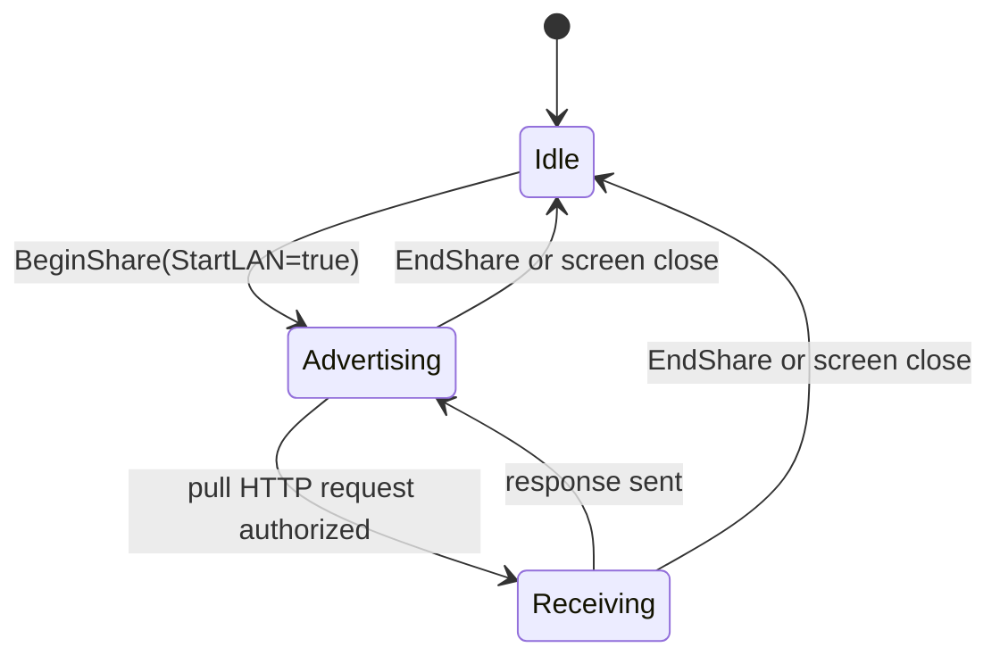

# LAN Share v1

## Status

Phase 1C deliverable. The transport for V1.4's "LAN sharing" item.

## Service

- mDNS service type: `_daalshare._tcp.local.`
- Instance name: a random 16-hex-character session id; **never** the device hostname.
- TXT record fields:
  - `v=1`
  - `name=share`
  - `spki=<base64url(sha256(SPKI))>`  — the receiver pins this and
    refuses any TLS handshake whose presented cert SPKI does not match.

## TLS

- Self-signed ECDSA P-256, generated fresh per session, valid for 1 hour.
- SAN list: every private address the sender bound to, plus the literal
  CommonName `daal-share`.
- Receiver: `InsecureSkipVerify=true` at the TLS layer; trust is
  established by SPKI pin from the TXT record. (When mDNS is filtered and
  the receiver is on the QR-URL fallback path, the SPKI is encoded into the
  fallback URL fragment.)

## HTTP surface

The sender exposes exactly one resource:

```
GET /bundle.sbp HTTP/1.1
Host: <addr>:<port>
Authorization: Bearer <hkdf(pin, session_id)>
```

- Any other path → 404.
- Wrong / missing Authorization → 401.
- Success → `200 OK` with `Content-Type: application/vnd.daal.sbp` and the
  signed bundle as the body.

## PIN derivation

`token = base64url(HMAC-SHA256("daal-share/v1", pin || 0x00 || session_id))`

This binds the bearer token to *both* the 6-digit PIN the user typed AND
the session id we publish via mDNS. An attacker on the LAN who only knows
the session id cannot derive the token without the PIN, and an attacker
who guesses 000000..999999 still has 1/2^64 chance of matching the
session id.

## Address binding

`core/share/lan_sender.go::DetectPrivateAddrs` enumerates non-loopback
interfaces and returns only addresses in:

- `10.0.0.0/8`
- `172.16.0.0/12`
- `192.168.0.0/16`
- `100.64.0.0/10` (CGNAT)
- `169.254.0.0/16` (link-local)
- `fc00::/7` (IPv6 ULA)
- `fe80::/10` (IPv6 link-local)

The HTTPS server binds to **each** of these in turn on a random high port.
It NEVER binds to `0.0.0.0` or `[::]` (enforced by an OPSEC source-grep
test).

## QR-URL fallback

When mDNS is filtered (some captive-portal Wi-Fi, some carrier networks),
the sender's UI also encodes one of its `lan_urls` plus a SPKI pin into a
QR code:

```
daalshare://lan?u=<urlencoded https url>&p=<spki b64url>&s=<session id>
```

The receiver scans this and calls `engine_share_pull_url` directly. The
URL form is what Phase 1C ships in code; the `daalshare://` scheme
wrapper is a Phase 1C-Polish addition that adds Android intent-filter
support.

## Lifecycle



`EndShare` MUST:

1. Stop the mDNS publisher.
2. Close every `tls.Listener` opened for this session.
3. Zero the bundle bytes in memory.
4. Zero the PIN and bearer-token strings.
5. Remove the session from the manager map.

## Privacy invariants

- mDNS instance name carries no device identifier.
- The HTTPS server logs nothing.
- The sender's TLS leaf cert has no `iPAddresses` or `dnsNames` that aren't
  one of the bound private addresses (so the cert itself is not a
  doxx-able artifact).
- Receiver uses `tls.DialWithDialer` and a literal IP; no DNS lookup of any
  kind happens during the pull.
