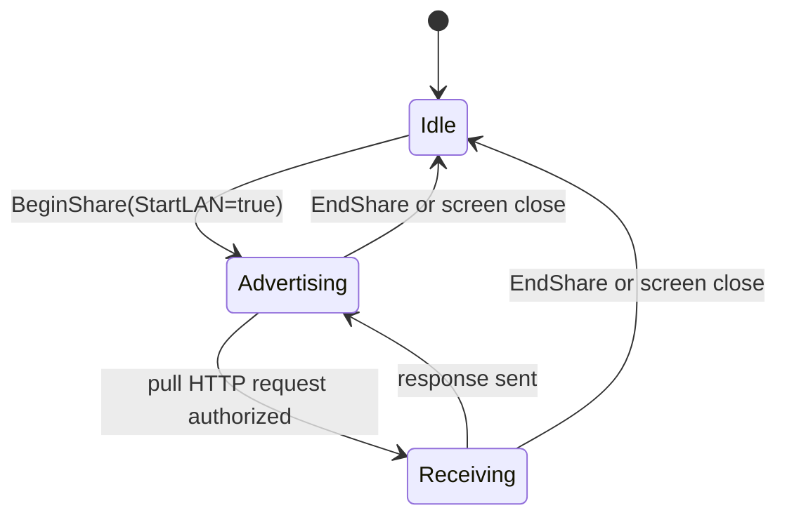

# LAN Share v1

## Status

Phase 1C deliverable. The transport for V1.4's "LAN sharing" item.

## Service

> **Implementation status (Wave 4 Step 11).** The Go-side mDNS publisher
> and browser do not exist. `core/share/lan_sender.go::defaultAdvertise`
> is a no-op and `core/abi/share.go::ShareBrowse` returns a hardcoded
> empty list, so on desktop/core builds nothing is broadcast and nothing
> is discovered; Android registers/browses the service itself via
> NsdManager. The working discovery path today is the QR-URL fallback
> below, which carries the same `spki` pin. This section describes the
> record's shape, which the publisher must emit when it lands — not
> behaviour you can observe today.

- mDNS service type: `_daalshare._tcp.local.`
- Instance name: a random 16-hex-character session id; **never** the device hostname.
- TXT record fields:
  - `v=1`
  - `name=share`
  - `spki=<base64url(sha256(SPKI))>`  — the receiver pins this and
    refuses any TLS handshake whose presented cert SPKI does not match.
    Emitted by `Manager.BeginShare` from the value `defaultListen`
    returns for the session's freshly generated cert. A receiver that did
    not read this field has not found a sender it can safely talk to and
    MUST NOT connect.

## TLS

- Self-signed ECDSA P-256, generated fresh per session, valid for 1 hour.
- SAN list: every private address the sender bound to, plus the literal
  CommonName `daal-share`.
- Receiver: `InsecureSkipVerify=true` at the TLS layer, because a
  per-session self-signed cert has no chain to build and no stable name to
  match. It does NOT mean the receiver skips verification. Trust is
  established by a SPKI pin, enforced in
  `core/share/spki.go::pinnedVerifier`, installed as
  `tls.Config.VerifyPeerCertificate` by `pinnedTLSConfig`, which is the
  only tls.Config any receiver-side dial in the package may use:

  1. The expected pin is decoded first. Empty, malformed, or not exactly
     32 bytes → the dial is REFUSED before a socket opens
     (`share.ErrNoPin`). "No pin" never degrades to "no check".
  2. During the handshake the leaf's `RawSubjectPublicKeyInfo` is hashed
     with SHA-256 and compared to the expected value with
     `crypto/subtle.ConstantTimeCompare`. A mismatch aborts the handshake
     (`share.ErrPinMismatch`), so the bearer token is never written to an
     unverified peer.
  3. Only the leaf is pinned. Anything the peer appends to its chain is
     ignored — an attacker chooses that freely.

  Sender and receiver compute the hash with the one shared helper
  `share.SPKIHashFromDER` / `SPKIHashFromCert`; there is no second copy.

  When mDNS is filtered and the receiver is on the QR-URL fallback path,
  the SPKI travels in the URL (see QR-URL fallback below).

### History

Before Wave 4 Step 11 this section described a defence that did not
exist. `lan_sender.go` computed the SPKI hash and threw it away, the TXT
record never carried an `spki=` field, and `lan_receiver.go` set
`InsecureSkipVerify: true` with the comment "we verify SPKI separately if
known" — while nothing, anywhere in the package, compared anything. See
`## Threat model` below for what that did and did not expose.

## HTTP surface

The sender exposes exactly one resource:

```
GET /bundle.sbp HTTP/1.1
Host: <addr>:<port>
Authorization: Bearer <hkdf(pin, session_id)>
```

- Any other path → 404.
- Wrong / missing Authorization → 401.
- Success → `200 OK` with `Content-Type: application/vnd.daal.sbp` and the
  signed bundle as the body.

## PIN derivation

`token = base64url(HMAC-SHA256("daal-share/v1", pin || 0x00 || session_id))`

This binds the bearer token to *both* the 6-digit PIN the user typed AND
the session id we publish via mDNS. An attacker on the LAN who only knows
the session id cannot derive the token without the PIN, and an attacker
who guesses 000000..999999 still has 1/2^64 chance of matching the
session id.

## Address binding

`core/share/lan_sender.go::DetectPrivateAddrs` enumerates non-loopback
interfaces and returns only addresses in:

- `10.0.0.0/8`
- `172.16.0.0/12`
- `192.168.0.0/16`
- `100.64.0.0/10` (CGNAT)
- `169.254.0.0/16` (link-local)
- `fc00::/7` (IPv6 ULA)
- `fe80::/10` (IPv6 link-local)

The HTTPS server binds to **each** of these in turn on a random high port.
It NEVER binds to `0.0.0.0` or `[::]`.

This is enforced at the bind, not by reading the source:
`defaultListen` re-checks every address it is handed and returns
`share.ErrPublicBindRefused` for anything that is not a private IP
literal, failing the WHOLE session rather than quietly skipping the
offending address — a sender that thinks it is serving on five interfaces
and is actually serving on four has a bug worth surfacing.
`TestSenderRefusesPublicBind` covers `0.0.0.0`, `::`, a public v4
address, a hostname, the empty string, a multicast address, and a mixed
private/public list.

The receiver enforces an independent — and deliberately STRICTER — rule
in `requirePrivateHost`: a host must be an IP literal (never a name — a
name would emit a DNS query and break the privacy invariant below) and
must fall in the ranges above **except `100.64.0.0/10`**, plus
`127.0.0.0/8`.

The two lists differ because they answer different questions. Binding
asks "is this one of MY OWN interfaces?", for which the device's CGNAT
address on mobile data is a perfectly good answer. Dialling asks "may I
open a connection to a stranger's address on the strength of a scanned
QR?" — and `100.64.0.0/10` spans an entire carrier's subscriber pool, so
a doctored QR naming a CGNAT host is an off-LAN connection to an
attacker-chosen machine. The SPKI pin cannot undo that: the TCP connect
and the TLS ClientHello are already on the wire before the pin is
evaluated, so the beacon has fired whether or not the pin then fails.
CGNAT is therefore refused BEFORE the dial. `127.0.0.0/8` is dialable
because it cannot leave the machine, which is what the guarantee
actually requires, and the in-process round-trip test binds there when
the host has no other private NIC.

This is what stops a crafted TXT record or a doctored QR from pointing a
receiver at a public — or carrier-wide — address. `isDialableLANHost` is
the receiver-side predicate; `isPrivateIP` remains the sender-side one.
`TestHostileTXTCannotSteerReceiverOffLAN` covers both directions,
including three CGNAT addresses that must be refused.

### Response size

A pinned peer is authenticated, not trusted. `PullURL` reads the response
through an `io.LimitReader` bounded by `bundle.MaxArchiveTotalBytes` and
returns `share.ErrShareBodyTooLarge` past it, so a correctly-pinned but
hostile sender cannot stream for the whole deadline into the receiver's
memory. The parser it feeds is bounded separately (see
`bundle.MaxArchiveEntryBytes`), because a small compressed body can still
decompress to an unbounded one.

## QR-URL fallback

When mDNS is filtered (some captive-portal Wi-Fi, some carrier networks),
the sender's UI also encodes one of its `lan_urls` plus a SPKI pin into a
QR code:

```
daalshare://lan?u=<urlencoded https url>&p=<spki b64url>&s=<session id>
```

The receiver scans this and calls `engine_share_pull_url` directly.
`core/share/lan_target.go::ParseShareTarget` accepts both this wrapper and
the bare form

```
https://<private-ip>:<port>/bundle.sbp#spki=<spki b64url>
```

and refuses, at parse time, anything that is not `https`, does not name an
explicit port, carries userinfo, names a host that is not a private IP
literal, or does not carry a well-formed 32-byte pin. A `share.Target`
therefore cannot be constructed without a pin, and `PullTarget` has no
unpinned mode to reach.

`share.ShareURI(lanURL, spki, sessionID)` renders the wrapper; the sender
also returns one per bound address as `lan_uris` from
`engine_share_begin`, so the UI never assembles this string by hand.

## Threat model — what the missing pin actually cost

State honestly, so the fix is not oversold:

**What an attacker on the same Wi-Fi could do before the pin landed.**
Answer the mDNS query (or hand over a doctored QR) and complete a TLS
handshake with a certificate of their own. The receiver accepted it
without question. That let the attacker:

- **Confirm and locate a Daal receiver.** The receiver dialled them and
  spoke the protocol. On a monitored network this is the finding that
  matters — not the bytes, the fact that this device is running this app
  and is trying to receive a route right now.
- **Harvest the bearer token** `HMAC(pin ‖ 0x00 ‖ session_id)`, which the
  receiver wrote to them in the clear-inside-TLS request. With the session
  id (public, in the TXT record) that reduces the sender's 6-digit PIN to
  an offline brute force over 10^6 candidates — seconds of CPU. The
  attacker can then pull the real bundle from the real sender.
- **Serve a response of their choosing**, including a very large one, or
  stall the transfer so the share silently fails.
- **Deny the transfer** by racing the real sender's advertisement.

**What the attacker could NOT do, then or now.** Get a forged route
installed. The `.sbp` carries the sender's Ed25519 signature, and
`bundle-go/importer` verifies it before anything is persisted; an attacker
who cannot sign as the sender produces a bundle that fails verification,
and a bundle re-served verbatim from a real sender is just the bundle the
user was already trying to receive. So this was **not** remote route
injection — the severity is impersonation, LAN-local presence disclosure,
PIN/token capture, and denial of service, not compromise of route
contents.

**What the pin changes.** The handshake now aborts on a cert the sender
did not publish, so the impostor never receives the request line and
never sees the bearer token; and the private-address gate means a hostile
TXT record or QR cannot steer the receiver into dialling an off-LAN
address at all.

Both gates fail closed and fail independently:
`core/share/lan_pin_test.go` proves the pin accepts the sender's real
generated certificate and refuses a second, independently generated one
over real local TLS listeners; that empty / whitespace / non-base64 /
truncated / over-long pins are all refused rather than skipped; and that
public, unspecified, multicast, zoned and name-shaped hosts are all
refused before a dial.

## Lifecycle



`EndShare` MUST:

1. Stop the mDNS publisher.
2. Close every `tls.Listener` opened for this session.
3. Zero the bundle bytes in memory.
4. Zero the PIN and bearer-token strings.
5. Remove the session from the manager map.

## Privacy invariants

- mDNS instance name carries no device identifier.
- The HTTPS server logs nothing.
- The sender's TLS leaf cert has no `iPAddresses` or `dnsNames` that aren't
  one of the bound private addresses (so the cert itself is not a
  doxx-able artifact).
- Receiver uses `tls.DialWithDialer` and a literal IP; no DNS lookup of any
  kind happens during the pull.
