# Scheduler v1

## Status

**Frozen at the end of Phase 2F (V2 entry).** The scheduler MAY add
new kinds of scheduled actions in later V2 sub-phases (route-budget
maintenance, network-memory expiry); the existing kinds (subscription,
revocation, bootstrap) and their cadence policy MAY NOT change without
a roadmap-level decision because they form the V2 entry-criterion
parity contract.

## Roadmap coverage

V1.5.1 (subscription refresh through tunnel), V1.5.2 (revocation),
V1.5.5 (pointer rotation, which piggybacks on bootstrap refresh), and
the V2 entry-criterion: the in-engine scheduler must reproduce the
1.5C 30-day soak's invariant ledger.

## Goal

Drive subscription refresh, revocation refresh, and bootstrap-directory
refresh on a fixed cadence, deterministically, from inside the engine
process. Replace the rig-side scheduling code that the Phase 1.5C
blackout-soak driver carries in its day loop.

## Architecture

```mermaid
flowchart LR
  Source[(routestore)]
  Plan[Plan&#40;src, cad, now&#41;]
  Tick[Scheduler.Tick&#40;now&#41;]
  Exe[Executor]
  Refresh[refresh.Refresher /<br/>RevocationRefresher /<br/>bootstrap.Provider]
  Status[engine_scheduler_status]

  Source --> Plan
  Plan --> Tick
  Tick --> Exe
  Exe --> Refresh
  Plan --> Status
```



The planner is a **pure function**: given the same `Source` snapshot,
the same `Cadence`, and the same `now`, `Plan` returns the same
ordered list of actions. This is what the V2 parity test asserts.

The executor performs the side-effecting refreshes and is host-bound
(the production binding lives in `core/abi/scheduler.go` and delegates
to the existing `refresh.Refresher`, `RevocationRefresher`, and
`bootstrap.Provider`). Tests inject a recording executor.

## Cadences

| Kind | Interval | Source |
|---|---|---|
| Subscription | per-row `profile_update_min`, clamped to `[60, 10080]` minutes (1 h … 7 d) | `subscriptions` table |
| Revocation | every 6 h per publisher with a revocation URL | `Cadence.Revocation` |
| Bootstrap | every 24 h | `Cadence.Bootstrap` |
| BudgetReset *(Phase 2A)* | every 1 h | `Cadence.BudgetReset` |
| Freshness *(Wave 3 / Step 8)* | **not a duration** — the FRP-8 trigger policy | `Cadence.Freshness` (`selection.FreshnessPolicy`) |

`Freshness` is the odd one out and deliberately so. Every other kind
is "last + interval"; this one delegates to
`core/internal/selection/freshness.go`
(`MinInterval` 15 min floor, `MaxStaleness` 6 h ceiling that FORCES
an attempt, `RetryBackoff` 5 min base **doubling per consecutive
failure**, `MaxJitter` 4 min). Reusing that policy rather than
adding a second cadence constant is a hard requirement: two policies
that must agree and live in different files is how this codebase
acquires code that exists and does nothing.

Two consequences the planner MUST honour, because the policy is pure
(Position B) and therefore cannot derive them itself:

- `ConsecutiveFailures` and `JitterOffset` are PERSISTED per pack by
  `core/refresh` and passed through `Source.RelayPacks()`
  **verbatim**. The planner's projection and the policy's own
  decision are two gates that must compute the same instant; a
  `Source` that drops either makes the planner render a due time the
  policy then refuses, which reads as a stuck device. (This is not
  hypothetical — `core/abi`'s adapter dropped both, and
  `TestRelayPacksCarriesTheEscalationAndTheJitter` now pins it.)
- A pack with **no** freshness endpoint MUST NOT be returned by
  `Source.RelayPacks()` at all. There is nothing to fetch, and
  emitting it would make the status JSON promise remote replacement
  to recipients of a publisher who never enabled it.

The clamp on subscription cadence already lives in
`routestore.clampInterval`; the planner re-applies it in case the
caller hands it an unclamped row, so Plan is bit-for-bit safe.

## Determinism rules

1. `Plan` does NOT call `time.Now`. The `now` parameter is the only
   clock input.
2. `Plan` returns actions sorted by `(kind, ref)`. Two actions with
   the same kind+ref are not possible (each subscription_id is unique;
   each publisher_id is unique).
3. Actions that have never fired (`LastGoodRefresh.IsZero() ==
   true`) are returned with `next_due = now − 1 ns` so the action is
   considered due NOW. This is the "first-tick" behavior.
4. Actions whose `last + interval > now` are NOT in the due list.
   `AllNextDues` returns ALL items including future ones, for the
   `engine_scheduler_status` snapshot.

## ABI surface

One new release function lands at Phase 2F (count 34 → 35):

```c
int engine_scheduler_status(char* out, int out_len);
```

Returns:

```json
{
  "cadence": {
    "revocation_sec": 21600,
    "bootstrap_sec":  86400,
    "freshness_min_interval_sec":  900,
    "freshness_max_staleness_sec": 21600
  },
  "last_tick": "2026-04-26T12:00:00Z",
  "ticks": 17,
  "next_due": [
    {"kind":"bootstrap",    "next_due":"2026-04-27T12:00:00Z"},
    {"kind":"freshness","ref":"rp-abc123","next_due":"2026-04-26T12:15:00Z"},
    {"kind":"revocation","ref":"pub-A","next_due":"2026-04-26T18:00:00Z"},
    {"kind":"subscription","ref":"sub-A","next_due":"2026-04-26T13:00:00Z"}
  ]
}
```

The `kind` discriminator is
`subscription | revocation | bootstrap | budget-reset` *(2A)*
` | freshness` *(Wave 3)*. `ref`
carries the subscription_id (subscription), the publisher_id
(revocation) or the relay_pack_id (freshness), or is omitted
(bootstrap and budget-reset are process-global).

The two `freshness_*` cadence fields are the floor and the ceiling of
the trigger policy, exported so a diagnostics screen can say "next
freshness poll no sooner than X" without hard-coding the policy a
second time. They are NOT the interval: the actual next-due instant
per pack is in `next_due` and already includes the escalated backoff
and the per-device jitter.

`budget-reset` (Phase 2A) sweeps every route's hourly byte counter via
`core/budget.Engine.HourRollover`. The executor binding lives in
`core/abi/scheduler.go::refreshExecutor.RefreshBudgetReset` and stamps
`secrets_kv["scheduler:last-budget-reset"]` so the next plan call
gates on the cadence.

`freshness` (Wave 3 / Step 8) polls one RelayPack's freshness
endpoints and is what turns a publisher-side rotation into something
recipients pick up over the network instead of by courier. The
executor binding is
`core/abi/refresh_freshness.go::refreshExecutor.RefreshFreshness`,
driving `core/refresh.RelayPackRefresher`; the per-pack state
(timestamps, consecutive failures, jitter) is persisted in
`secrets_kv["freshness:<relay_pack_id>"]` so the floor survives the
process being killed and relaunched, which on a phone is constant.

It is dispatched on **both** platforms and neither driver is the UI:
desktop ticks from a 60 s thread spawned in
`client-shell/tauri/src-tauri/src/lib.rs`'s `setup()`, and Android
additionally ticks from `DaalVpnService.startSchedulerPump` through
`DaalCoreBridge.schedulerTick` while the tunnel is up. A
UI-driven scheduler would stop the moment the window closed.

## Lifecycle

The host calls `abi.StartScheduler(ctx, every)` once after `engine_init`
to spawn the background ticker (default `every = 1 minute`). The
scheduler uses the existing `nowUTC()` clock so soak builds with
`-tags soak` automatically see the simulated clock through the
existing `engine_set_now_unix` plumbing. Hosts that prefer to drive
the scheduler manually call `abi.SchedulerTick(now)`.

`engine_shutdown` calls `resetSchedulerForShutdown` which Stops the
background goroutine before tearing the engine down.

## Parity test

Two parity surfaces:

1. **Unit-level** (`core/scheduler/parity_test.go::TestParity30DayLedger`) —
   replays a synthetic 30-day source-state series through `Plan` and
   asserts byte-identical action sequences across two independent
   runs and across re-instantiation. Runs in milliseconds.

2. **Soak-level** (`soak-driver run-30d --mode in-engine`) —
   the soak driver drives the in-engine scheduler via
   `scheduler-tick` instead of the rig-side command sweep. The
   resulting invariant ledger must be PASS on every scenario × day
   combination. This is the published V2 entry-criterion.

Both have shipped green at Phase 2F.

## Privacy invariants

- The scheduler never logs subscription URLs, publisher fingerprints
  beyond `publisher_id`, or refresh response bodies. `next_due` is the
  only timestamp it surfaces; that timestamp is a clamped multiple of
  the cadence and reveals nothing about user behavior.
- `engine_scheduler_status` is read-only. The action a user takes by
  reading it cannot trigger any refresh.
- Background ticking does not change the privacy posture of the
  refreshers it drives — those are already the ones the user could
  trigger manually from the GUI.

## Stability

The cadence constants are part of the V2 entry-criterion parity
contract. A change to `Cadence.Revocation` or `Cadence.Bootstrap`
breaks the soak-driver `--mode in-engine` parity output and must be
treated as a roadmap-level decision, not a refactor.

## Files

- `core/scheduler/doc.go`
- `core/scheduler/plan.go` — pure planner
- `core/scheduler/scheduler.go` — Tick / Start / Stop / StatusJSON
- `core/scheduler/plan_test.go`
- `core/scheduler/scheduler_test.go`
- `core/scheduler/parity_test.go` — V2 entry-criterion (unit-level)
- `core/abi/scheduler.go` — host binding
- `core/abi/scheduler_export.go` — `engine_scheduler_status` (cshared)
- `core/abi/scheduler_gomobile.go` — gomobile facade
- `cmd/daal-soak-engine/main.go` — adds `scheduler-status` and
  `scheduler-tick` commands so the rig can drive the scheduler
- `test-rigs/distribution-failure/soak-driver/internal/soak/soak.go` —
  `--mode in-engine` flag
